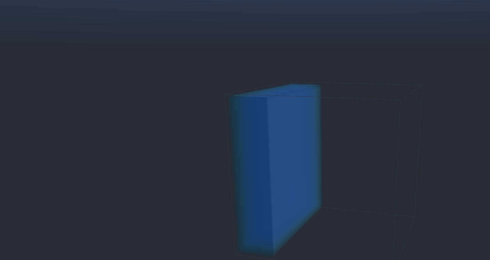

# HOME-Free Viewer Baseline V1

> 冻结日期：2026-08-03  
> 状态：阶段性可交付基线；后续实验不得覆盖 `viewer-default` profile

## 1. 阶段结论

当前版本已经贯通一条完整的三维 GPU 自由表面路径：D3Q27 HOME 矩状态、闭槽固壁、link-wise 质量交换、气压缺失链重构、重力碰撞、动态液体/界面/气体拓扑，以及 Newton OpenGL Viewer 体渲染。`128^3` 溃坝能够显示水柱坍塌、铺展、回流、壁面液膜、液滴分离、重力下落、撞击液面和局部波动。

该结果固定为 **Viewer Baseline V1**。它是后续 PLIC、表面张力、润湿和 FSI 的视觉、稳定性与性能对照，不因新候选功能更多而被直接替换。




## 2. 固定入口与参数

运行入口：

```bash
PYTHONPATH=. python -m \
  wanphys.examples.lbm.home_rebuild.home_free_fsl.gravity_column_3d_viewer \
  --viewer gl --device cuda:0 --profile viewer-default \
  --substeps-per-frame 5 --print-every 100
```

固定配置：

| 项目 | Baseline V1 |
|---|---:|
| 网格 | `128 x 128 x 128` |
| 固壁 | 六面闭槽，halfway bounce-back |
| 初始水柱 | 约四分之一槽长，接近槽高，覆盖内部深度 |
| HOME 物理格长 | `0.1` |
| 渲染格长 | `0.02`，仅影响显示范围 |
| 物理运动黏度 | `2e-4` |
| 格子运动黏度 | `0.02` |
| 等效松弛时间 | `0.56` |
| 物理重力 | `-5e-6`，HOME 的 Y 方向 |
| 格子重力 | `-5e-5` |
| 最大允许格子速度 | `0.2` |
| 气体参考密度 | `1.0` |
| Viewer fill 阈值 | `0.5` |
| Ray-march 上限 | `1600` |

`viewer-high-gravity` 只保留为失稳实验档，不属于 Baseline V1。它把格子重力改为 `-5e-3`，即使采用 60 步渐增，也会在约 70 步后接近低 Mach 极限。

## 3. 当前实际实现

每个完整求解事务依次执行：

1. 按 D3Q27 的 26 条非静止链交换自由表面质量；
2. 对液体和界面节点执行 only-missing pull stream；
3. 对气体缺失链使用统一气压边界重构，对固壁链执行反弹；
4. 在 HOME 十矩状态上碰撞并加入重力；
5. 根据输运后质量完成 interface-to-liquid、interface-to-gas、gas-to-interface 和 liquid-to-interface 转换；
6. 重分配 excess mass，初始化新界面格，并检查非法液气直连；
7. 只有流、碰撞、质量和拓扑诊断全部通过后才提交候选状态。

因此 Viewer 中的液滴不是渲染粒子。它们是携带 `mass`、`fill_level`、HOME 密度/动量矩和拓扑标记的独立液体区域；再次撞击主体液面时，会通过同一套链路输运和碰撞把质量与动量传回液池。

Viewer 适配层只把 Y-up 的 `fill_level/flags` 转成 Z-up 的只读密度副本，不修改求解状态。

## 4. 阶段验收数据

RTX 5090、Warp 1.12.0、`128^3` 的短程门禁与交互长程运行：

| 指标 | 结果 |
|---|---:|
| 自动短程门禁 | `500` 步 |
| Viewer 连续长程运行 | `260500` 步后人工暂停 |
| 长程累计最大格子速度 | `0.191831`，低于 `0.2` 门禁 |
| 短程单步耗时 | 约 `2.26 ms/step` |
| 长程 Viewer 批耗时 | 约 `10.1 ms/5 steps` |
| 短程折算吞吐 | 约 `927 MLUPS` |
| NaN/Inf | `0` |
| 速度门禁 | 通过 |
| Viewer 适配/配置/相机测试 | `7 passed` |

该吞吐包含当前严格事务、GPU 同步和诊断开销，不应与不同网格、不同计时范围的参考库数值直接排名。

## 5. 与参考代码的能力位置

### 5.1 OpenHOMELBM

OpenHOMELBM 的强项是 D2Q9/D3Q27 单相 HOME、Karman 绕流、MuJoCo-Warp 浸入几何耦合、实时控制和强化学习。其 RTX 5090 三维 Karman 官方稳态计时约 `1588 MLUPS`，但它不是自由表面场景。

本项目当前基线在单相 HOME 峰值吞吐上尚未证明超过 OpenHOMELBM；在三维自由表面、动态拓扑、闭域质量事务和 Newton Viewer 联动方面，则覆盖了 OpenHOMELBM 默认示例没有提供的能力。

### 5.2 Home-FSLBM

Home-FSLBM 提供原生 CUDA 的二维泡沫和三维浇注/气泡自由表面参考。RTX 5090 已记录 `448.66 MLUPS` 的三维可视样本，以及 `1210.22 MLUPS` 的 5400 万格、20 步短测；其官方输出主要是二维 PPM 切片。

本项目当前基线已经具备同类 HOME + link-wise 自由表面核心，并增加了模块化 Warp 实现、CPU/CUDA 对照、事务式失败保护、Newton 三维交互渲染和可复用的溃坝全过程。Home-FSLBM 的泡沫连通域、气泡压力演化等专门能力尚未在 Baseline V1 中复现。

综合判断：当前实现已经不逊于两个参考库的交集，并在自由表面工程完整性和三维观察工作流上形成自己的优势；但尚不能声称全面超过 OpenHOMELBM 的单相/FSI 生态或 Home-FSLBM 的泡沫模型和原生 CUDA 峰值性能。

## 6. 已实现但未进入本基线的模块

以下模块在 `home_lbm/` 路径中已有代码和隔离测试，但此前组合实验暴露过重复动量推进、动态场稳定性或性能成本问题，因此不属于本次成功画面的算法组成：

- 几何 VOF 与 PLIC 重建/输运；
- face Courant 构造与 Hodge/PCG 投影；
- 曲率、Laplace 压差和表面张力；
- 静态接触角与润湿修正；
- excess momentum 账本；
- moving cut-link、刚体受力、保守切格和双向 FSI；
- 低精度矩量化与完整 kernel 融合。

这些能力必须以 Baseline V1 为对照逐项接入，不能再次一次性组合。

## 7. 后续正常完善顺序

1. **固定 VNC 验收工作流**：以 Newton Viewer 作为正式视觉入口，固定 `viewer-default` profile、默认相机和操作方式；质量、速度和拓扑指标继续写入日志，用于辅助解释 VNC 中观察到的现象。
2. **时间尺度和稳定域扫描**：保持黏度不变，扫描 `g_lattice=-1e-4/-2e-4/-5e-4`；随后单独扫描低黏度，建立 Reynolds、Mach 和稳定边界。
3. **壁面与润湿**：优先解决左壁/顶壁液膜和接触线，区分真实附着、halfway bounce-back 误差和一格拓扑残留。
4. **表面张力**：用静态 Laplace 球、落滴和并滴验收曲率、寄生流和液滴尺度，再接入溃坝。
5. **PLIC A/B**：只替换质量几何输运，避免重复推进 HOME 动量；必须同时改善界面、守恒或网格收敛才保留。
6. **物理对照**：加入 Martin-Moyce 类前沿位置、撞墙时间、爬高和回落曲线，以及至少两级网格收敛。
7. **FSI**：在自由表面模式稳定后接入 Newton 刚体，按静态受力、沉降、单向耦合、双向耦合逐级验收。
8. **性能优化**：减少逐步主机同步，融合 stream/collision/topology kernel，评估 CUDA Graph、显存布局和量化；用同场景、同计时范围与两个参考库复测。

最终产品可以长期保留两档：快速稳定的 link-wise Baseline V1，以及只有在 VNC 视觉效果、数值和性能综合收益明确后才启用的高质量几何自由表面模式。离线图片或视频只在汇报确有需要时从 Viewer 画面补充导出，不作为日常研发前置条件。
