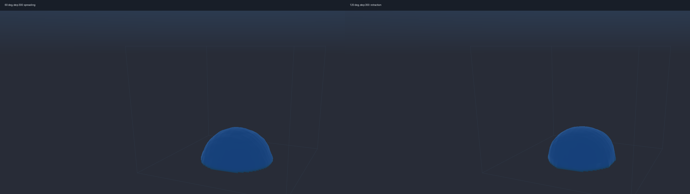
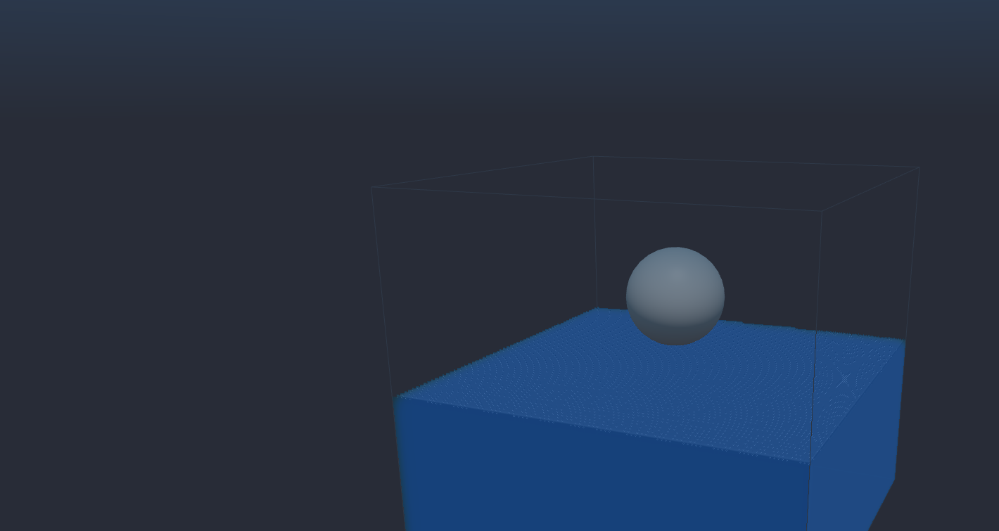
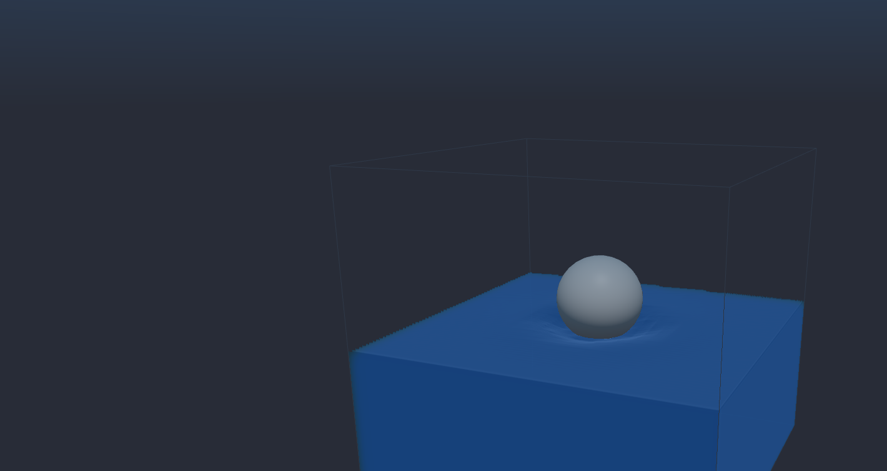

# HOME-Free 重构 R8-R12 最终组合审计

> 审计日期：2026-08-03  
> 远端设备：NVIDIA GeForce RTX 5090，Warp 1.12.0  
> 范围：仅说明 `home_lbm/` 与 `home_rebuild/` 新实现，不改写旧 LBM 项目的结论。

## 1. 结论

R8-R12 已形成三个明确档位，而不是把全部修正永久叠加：

| 档位 | 自由表面 | Courant 投影 | 适用范围 | 5090 FSI 耗时 |
|---|---|---:|---|---:|
| `fast` | link-wise HOME-Free | 否 | 实时 Viewer、长程大形变基线 | `6.092 ms/step` |
| `balanced` | 几何 VOF + PLIC | 否 | 润湿、毛细、几何 FSI、最终视觉候选 | `18.359 ms/step` |
| `strict` | 几何 VOF + PLIC | 是 | 散度和守恒专项审计 | `60.959 ms/step` |

`balanced` 是当前最终效果候选，`fast` 继续作为性能和长程稳定性基线，`strict`
不作为默认演示。这样保留了 HOME、几何 VOF、PLIC、表面张力和 FSI 的综合能力，
同时避免为每一帧无条件支付约十倍于 link-wise 的严格投影成本。

## 2. R8：PLIC 曲率

曲率实现先通过平面、圆球和 Laplace 压差门槛，再进入动态场景。非周期壁面曾有
两个独立问题：越界邻居被错误索引，以及贴壁半球的单边 `3x3x3` 样本秩不足。
当前实现会跳过非周期越界样本，并只对接触域边界的曲率拟合扩展到 `5x5x5`；
内部界面仍保持原 `3x3x3` 路径。

该修复保持闭球 NumPy 点值参考不变，并使 90 度贴壁半球获得有限、可用的壁面
曲率。无效法向、病态拟合和缺失邻居仍会计数或失败，不使用静默曲率夹紧。

## 3. R9：表面张力与静态润湿

表面张力通过 PLIC 曲率形成 Laplace 气相压力，并保留可选的 PLIC 毛细动量修正。
三维贴壁液滴对 `60/90/120` 度完成 300 步 CUDA 对照：

| 接触角 | 初始底部 RMS 半径 | 最终底部 RMS 半径 | 最大速度 | 最终体积漂移 |
|---:|---:|---:|---:|---:|
| `60 deg` | `4.4895` | `4.6786` | `0.004920` | `0.0462%` |
| `90 deg` | `4.4895` | `4.6665` | `0.004939` | `0.0189%` |
| `120 deg` | `4.4895` | `4.3638` | `0.005442` | `0.1742%` |

60 度液滴更宽，120 度液滴更窄，方向与静态润湿预期一致。验收采用硬失败与效果
排序并行：无 NaN、非法拓扑或速度爆炸；最大瞬态体积漂移小于 1%，最终小于
0.2%。原始数据见 `data/wetting/wetting-sessile-visual-300.json`。



### 动态接触角决策

当前没有把局部流体切向速度直接代入 Cox-Voinov 公式。移动接触线模型至少还需
显式滑移长度、宏观观测尺度、接触线速度历史和网格收敛。VOF 文献也指出，依赖
隐式数值滑移的动态角度会随网格间距变化；LBM 中观察到的表观滑移同样不是一个
可随意固定的材料参数。参考：

- [Afkhami, Zaleski and Bussmann, JCP 2009](https://doi.org/10.1016/j.jcp.2009.04.027)
- [Latva-Kokko and Rothman, PRL 2007](https://doi.org/10.1103/PhysRevLett.98.254503)

因此动态接触角保持研究项，不进入当前 `balanced` 主路径。静态接触角、壁面
曲率和表面张力已经可用，但不能据此宣称任意材料的接触线滞后已经完成。

## 4. R10：低黏度门槛

`128^3` 重力柱在同一 3000 步门槛下得到：

| 格子黏度 `nu` | 结果 | 说明 |
|---:|---|---|
| `0.02000` | 通过 3000 步 | 最大速度 `0.191831`，质量漂移 `-2.774e-6` |
| `0.01875` | step 2128 失败 | 最大速度越过 `0.2` 稳定边界 |
| `0.01750` | step 2102 失败 | 最大速度越过 `0.2` 稳定边界 |
| `0.01500` | 约 step 2000 后失败 | 最大速度继续增长 |

当前自由表面组合的可信下限是 `nu=0.02`，不是纯 HOME 周期核心能够达到的更低
黏度。失败候选没有保留为 Viewer profile。原始数据见
`data/low-viscosity/viewer-128cube-extended-3000.json`。

## 5. R11：双向 FSI

FSI 覆盖固定体、移动切格、fresh/dead cell、入水、出水、柱体冲击和动量账本。
完整回归发现并修正了两个验收契约：出水球体在 32 步只抬升并拖拽界面，延长到
48 步后才真实出现 dry link；link-wise 生产态采用 `mass * HOME velocity`，其
近似账本误差预算为 1.25%，而逐链精确替换账本仍保持 `3e-5` 的跨后端硬门槛。

`balanced` 几何 FSI 的 RTX 5090 20 步门槛结果：

- 球心高度：`14.8 -> 12.2964`；
- wet links：`0 -> 300`；
- fresh/dead cell 均发生；
- 最大相对质量漂移约 `1.57e-8`；
- 稳态步主要为 `46-76 ms`。





## 6. R12：性能审计

统一场景为 `54x54x86`、250,776 格、10 步预热、50 步计时、半径 4 格球体和
两个刚体子步：

| 档位 | 平均步时 | p95 | MLUPS | 峰值 Warp 显存 |
|---|---:|---:|---:|---:|
| `fast` | `6.092 ms` | `9.407 ms` | `41.168` | `108.31 MiB` |
| `balanced` | `18.359 ms` | `39.452 ms` | `13.660` | `354.59 MiB` |
| `strict` | `60.959 ms` | `81.855 ms` | `4.114` | `375.79 MiB` |

严格投影平均迭代 `405.92` 次、最多 `432` 次，将最大投影散度压到
`2.794e-9`。它的数值收益真实，但成本也真实，因此只用于 strict 审计。原始
报告位于 `data/final-audit/fsi-*.json`。

## 7. 回归与 VNC

RTX 5090 完整命令：

```bash
PYTHONPATH=. .venv/bin/python -m pytest -q \
  newton/tests/test_home_free_*.py \
  newton/tests/test_home_lbm_*.py \
  newton/tests/home_rebuild
```

结果为 `520 passed`、`185 subtests passed`，耗时 `475.59 s`。随后新增 Viewer
profile 专项为 `4 passed`，balanced CUDA 场景完整 20 步通过。完整终端摘要见
`data/final-audit/full-home-regression.txt`。

当前 VNC 使用：

```bash
PYTHONPATH=. python -m \
  wanphys.examples.lbm.home_rebuild.fsi.sphere_entry_3d_viewer \
  --viewer gl --device cuda:0 --profile balanced
```

窗口默认暂停；`Space` 播放，`R` 重置，鼠标旋转，滚轮缩放。`--profile fast`
用于 link-wise 性能对照，`--profile strict` 用于投影审计。

## 8. 最终边界

当前已经完成 HOME 核心、link-wise HOME-Free、几何 VOF/PLIC、Courant 投影、
静态润湿、表面张力、移动切格和双向 FSI 的隔离测试及组合路径。仍未完成的是：

- 具有材料尺度和网格收敛证据的动态接触角/滞后模型；
- `nu < 0.02` 的强变形自由表面稳定性；
- 将 strict 投影迭代降到可作为默认实时模式的性能优化；
- 与真实实验压力、前沿位置和接触线曲线的定量标定。

这些边界不会阻止当前三档交付，但必须保留在后续论文级物理标定范围内。
