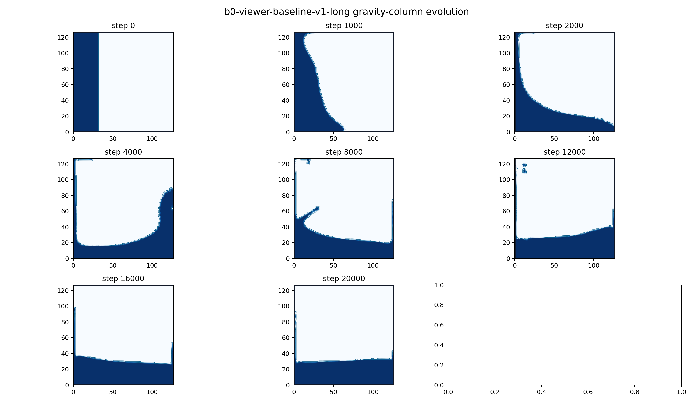

# HOME-Free 单变量增量 A/B 验收

> 启动日期：2026-08-10  
> 当前最佳候选：`B0 / Viewer Baseline V1`  
> 原则：每轮只改变一个机制；只有数值、视觉和性能综合收益成立，候选才可替代当前最佳版本。

## 1. 固定工作流

1. 当前最佳版本始终保留独立入口和配置，不允许实验代码覆盖。
2. 新候选先完成 `200` 步冒烟、`1000-4000` 步中程门禁，再进入 VNC。
3. VNC 固定使用 `128 x 128 x 128` 网格、同一初始水柱、物理参数、相机和 SSFR 设置。
4. 视觉验收覆盖坍塌、铺展、撞墙、上冲、回流和趋稳；不能只看早期画面。
5. 每轮记录质量漂移、最大速度、前缘、质心、界面规模、壁膜、耗时和显存。
6. 下一轮从最近一次被接受的最佳候选继续；被拒绝的机制不累加到后续版本。
7. 动量只由 HOME 推进。独立动量账本没有端到端成功证据，不进入默认路线。

## 2. 实验阶梯

| 阶段 | 唯一变量 | VNC 对照 | 状态 |
|---|---|---|---|
| B0 | 冻结 link-wise HOME-Free 基线 | 固定全过程 | 已完成 |
| B1 | PLIC 只读重建与通量诊断，不反馈状态 | 基线液面/PLIC 诊断切换 | 已接受 |
| B2 | 影子 PLIC-VOF 独立推进，不反馈 HOME/FSL | link-wise/影子 VOF切换 | 原始与投影方案均拒绝 |
| B3 | 仅用 PLIC-VOF 替换质量输运 | 基线/候选全过程 | 前置条件失败，跳过 |
| B4 | 仅在 B3 有必要时加入 Courant 投影 | 未投影/投影 | 投影影子实验拒绝 |
| B5 | 曲率只读诊断，不施加表面力 | 液面/曲率显示 | 仅接受为诊断工具 |
| B6 | 只加入表面张力外力 | 无/有表面张力 | 1876 步失稳，拒绝 |
| B7 | 只加入润湿与接触角边界 | 基线/接触角候选 | 391 步失稳，拒绝 |
| B8 | 在最佳自由表面候选上加入 FSI | 单向/双向耦合 | 已接受（从 B0 开始） |
| B9 | 汇总接受与拒绝项，冻结最佳组合 | 最终候选/基线 | 已完成 |

## 3. B0 当前机器复测

运行环境：RTX 5090、Warp 1.12.0、CUDA 设备 `cuda:0`。求解配置与
`viewer-default` 相同；无窗口运行不计 OpenGL/VNC 时间。

| 项目 | B0 结果 |
|---|---:|
| 网格 | `128 x 128 x 128` |
| 总步数 | `20000` |
| 求解耗时 | `47.3614 s` |
| 平均耗时 | `2.3681 ms/step` |
| 折算吞吐 | `885.58 MLUPS` |
| 最大格子速度 | `0.1918306` |
| 最大绝对质量漂移 | `1.06418e-3` |
| 首个采样撞墙时刻 | `step 2000` |
| 撞墙后质心反射位移 | `25.0376 cells` |
| 固体穿透 | 未发现 |
| 专项回归 | `5 passed` |

关键检查点：

| Step | 质量漂移 | 前缘 x | 湿润高度 | 质心 x | 界面格 | 右壁湿格 |
|---:|---:|---:|---:|---:|---:|---:|
| 0 | `0` | 32 | 126 | 16.2550 | 19782 | 0 |
| 1000 | `1.126e-5` | 64 | 126 | 19.2317 | 26108 | 0 |
| 2000 | `8.479e-6` | 126 | 126 | 41.7056 | 40963 | 7 |
| 4000 | `-2.106e-5` | 126 | 126 | 77.3077 | 54731 | 84 |
| 8000 | `-2.121e-4` | 126 | 126 | 52.2701 | 52860 | 74 |
| 12000 | `-4.763e-4` | 126 | 120 | 67.4683 | 43695 | 63 |
| 16000 | `-7.396e-4` | 126 | 98 | 59.1138 | 35485 | 53 |
| 20000 | `-1.064e-3` | 126 | 93 | 63.8673 | 32024 | 43 |

原始数据：[B0 manifest](data/home-rebuild-ab/b0-baseline-128-manifest.json)

### B0 结论

B0 能稳定完成坍塌、撞墙和反射，速度门禁与固壁拓扑正常，继续作为当前最佳版本。
它也留下了清晰的改进空间：`20000` 步质量漂移略高于 `1e-3`，后期存在明显壁膜，
界面格在撞击阶段增长较多。后续候选必须与这些同场景数据比较，不能仅凭局部画面替换基线。

## 4. B1 只读 PLIC 诊断

B1 在独立入口中读取当前 FSL `fill_level/flags`，重建 PLIC 法向、平面偏移和界面面积。
它不推进 VOF，不写回 HOME moments、质量、体积分数、excess 或拓扑标记。Viewer 以稀疏
红色法向线显示重建结果，`P` 键可在同一仿真状态下开关诊断层。

| 项目 | 200 steps | 1000 steps | 4000 steps |
|---|---:|---:|---:|
| 状态指纹保持不变 | 是 | 是 | 是 |
| 非法 PLIC 界面 | 0 | 0 | 0 |
| 最大 PLIC 界面格 | 16698 | 26108 | 54916 |
| 最大界面面积 | 1.92571 | 1.92571 | 1.92571 |
| 最大格子速度 | 0.021530 | 0.066507 | 0.191831 |
| 质量漂移 | `1.788e-6` | `1.126e-5` | `-2.106e-5` |
| PLIC 平均观察耗时 | 2.798 ms | 2.710 ms | 2.705 ms |
| 每 10 步观察的组合耗时 | 5.487 ms/step* | 2.622 ms/step | 2.709 ms/step |
| 组合吞吐 | 382.23 MLUPS* | 799.83 MLUPS | 774.12 MLUPS |

`*` 200 步数据来自修正计时拆分前的文件，包含状态指纹验证成本，只用于冒烟，不用于性能结论。
1000/4000 步已经将首尾指纹复制时间单列。B1 在每 10 步观察一次时，相比 B0 4000 步
约增加 5.8% 平均耗时；物理数据与 B0 对应检查点一致。

原始数据：[200 steps](data/home-rebuild-ab/b1-plic-readonly-200.json)、
[1000 steps](data/home-rebuild-ab/b1-plic-readonly-1000.json)、
[4000 steps](data/home-rebuild-ab/b1-plic-readonly-4000.json)。

B1 当前只证明 PLIC 能无侵入地观察完整三维 link-wise 界面。是否进入 B2，需在 VNC 中
确认法向随坍塌、撞墙和液滴拓扑连续变化，并确认诊断层不会妨碍正常观察。

VNC 已确认法向显示正常，B1 接受为后续实验的只读诊断能力。它不替代 B0 物理解算。

## 5. B2 raw-Courant 影子 PLIC-VOF

B2 使用当前 HOME moments 构造三轴面 Courant 数，在独立 `fill_level` 上交替执行
`(x,y,z)` 与 `(z,y,x)` PLIC 分裂输运。影子场不写回基线；即使严格体积门槛失败，
也只在 B2 观察模式中保留有界候选场并显式累计违规，生产算法的 `4e-6` 门槛未放宽。

| 项目 | 20 steps | 200 steps |
|---|---:|---:|
| 基线状态未被影子修改 | 是 | 是 |
| 影子完成步数 | 20 | 200 |
| 体积漂移违规步数 | 20 | 199 |
| 最大活动区面散度 | `4.702e-3` | `4.702e-3` |
| 最大单步体积漂移 | `1.715e-4` | `1.715e-4` |
| 最终累计体积漂移 | `3.320e-3` | `4.878e-3` |
| 影子 VOF 范围 | `[0,1]` | `[0,1]` |
| 基线耗时 | `2.763 ms/step` | `2.399 ms/step` |
| 影子 PLIC 耗时 | `67.878 ms/step` | `68.408 ms/step` |
| 组合耗时 | `70.641 ms/step` | `70.806 ms/step` |

原始数据：[20 steps](data/home-rebuild-ab/b2-shadow-vof-20.json)、
[200 steps](data/home-rebuild-ab/b2-shadow-vof-200.json)。

数值结论已经明确：PLIC 几何本身可运行且保持 VOF 有界，但原始 HOME 面通量不能直接
驱动封闭域 PLIC-VOF。它从第 1 步产生 `9.886e-5` 相对增水，远高于门槛，并带来约
24-28 倍于基线的当前未优化开销。因此 raw-Courant B2 不具备进入反馈式 B3 的资格。
VNC 对照没有显示可辨识的正向变化，用户判定该效果不可接受。原始 B2 因此在数值与
视觉两方面都被拒绝。

### B2P Courant 投影复核

影子层随后加入严格 Courant 投影，仍不写回基线。640 次最大迭代时，20 步实验把最大
活动区散度压到 `2.423e-7`，累计体积漂移压到 `-1.034e-7`；但 200 步实验在第 36 步
因散度 `7.044e-7` 超过 `5e-7` 门槛终止。已完成影子步平均约 `194.73 ms`，约为
基线的 80 倍。该方案证明体积误差来源可由投影控制，但稳定长度与成本都不具备替换资格。

原始数据：[20 steps / 320 iterations](data/home-rebuild-ab/b2p-shadow-vof-20.json)、
[20 steps / 640 iterations](data/home-rebuild-ab/b2p-shadow-vof-20-iter640.json)、
[200 requested / 640 iterations](data/home-rebuild-ab/b2p-shadow-vof-200-iter640.json)。

B2/B2P 前置门槛失败，因此不执行反馈式 B3，也不把质量输运失败与后续表面张力实验混在
一起。B5 改为继续使用冻结的 link-wise 基线，只读验证独立的三维曲率能力。

## 6. B5 三维曲率只读诊断

重构目录原有曲率估计器只支持 `nz=1` 的挤出二维。本阶段新增真正的三维二次曲面拟合：
在局部法向坐标系内，以相邻 PLIC 平面拟合五参数曲面，再计算平均曲率。壁面接触线在没有
配置接触角时显式计为 `wall_contact_skipped`，不会借用偏置法线勉强求值；这部分留给 B7。

| 项目 | 200 steps | 1000 steps |
|---|---:|---:|
| 状态指纹保持不变 | 是 | 是 |
| 观察次数 | 20 | 50 |
| 最大需曲率格 | 16698 | 26012 |
| 最大有效曲率格 | 16142 | 25385 |
| 最大壁面跳过格 | 556 | 639 |
| 最小体相完整率 | 100% | 100% |
| 邻居不足 / 病态 / 非有限 | 0 / 0 / 0 | 0 / 0 / 0 |
| 最大曲率绝对值 | 0.47626 | 3.03060 |
| 曲率平均观察耗时 | 含首次编译，不采信 | 1.605 ms |
| 组合吞吐 | 含首次编译，不采信 | 772.34 MLUPS |

球面、解析斜平面、壁面隔离和 CUDA 对齐测试均通过。1000 步动态实验中每 20 步观察一次，
曲率诊断相对估算求解时间增加约 8.8%，但它仍不反馈任何表面力。VNC 使用蓝色显示负曲率、
橙色显示正曲率、灰色显示近零曲率，线长表示曲率绝对值，视觉结论待人工确认。

原始数据：[200 steps](data/home-rebuild-ab/b5-curvature-200.json)、
[1000 steps](data/home-rebuild-ab/b5-curvature-1000.json)。

## 7. B6 曲率驱动的 Laplace 压力

B6 保留 B0 的 link-wise 质量输运、碰撞和拓扑，只把 pressure boundary 的常量气相
密度替换为逐界面格的 `rho_g = rho_ambient - 6 gamma kappa`。常量字段与旧标量路径通过
逐位相等测试。无接触角模型时，壁面接触格继续使用环境压力并显式计数，不把 B7 的润湿
边界提前混入本轮。

静态球在 `48^3`、`nu=1/6`、无重力下运行 500 步：

| lattice gamma | 最大寄生速度 | 质量漂移 | 最终形状各向异性 | 结果 |
|---:|---:|---:|---:|---|
| 0 | `6.42e-7` | `-4.396e-5` | `1.17e-6` | 基线 |
| 0.00025 | `2.80e-4` | `3.510e-6` | `6.02e-7` | 通过 |
| 0.0005 | `5.60e-4` | `2.713e-6` | `2.69e-7` | 通过 |
| 0.001 | `1.14e-3` | `3.250e-8` | `4.54e-7` | 通过 |

寄生速度随 `gamma` 近线性增长，球形对称性保持；中间档 `gamma=0.0005` 用于溃坝：

| 项目 | 200 steps | 1000 steps | 2000 requested |
|---|---:|---:|---:|
| 最后有效步 | 200 | 1000 | 1875 |
| 最大速度 | `0.021057` | `0.064815` | `0.089904` |
| 质量漂移 | `1.811e-6` | `1.209e-5` | `7.864e-6` |
| 界面气相密度范围 | `[0.99872,1.00112]` | `[0.99083,1.00465]` | 仍为有限值 |
| 最大壁面曲率跳过格 | 4406 | 4406 | 4406 |
| 平均耗时 | `6.353 ms/step` | `6.113 ms/step` | 约 `6 ms/step` |

与 B0 的 1000 步最大速度 `0.066507` 相比，中间档短程没有引入速度失稳；成本约为 B0 的
2.5 倍。但 2000 步门禁在推进第 1876 步时出现 1 个无法重建的体相曲率格，Viewer 复现了
同一停止位置。故 B6 不能替换 B0，只保留静态 Laplace 压力和曲率研究代码。

原始数据：[sphere gamma=0](data/home-rebuild-ab/b6-sphere-gamma0-500.json)、
[gamma=0.00025](data/home-rebuild-ab/b6-sphere-gamma00025-500.json)、
[gamma=0.0005](data/home-rebuild-ab/b6-sphere-gamma0005-500.json)、
[gamma=0.001](data/home-rebuild-ab/b6-sphere-gamma001-500.json)、
[dam break 200](data/home-rebuild-ab/b6-dambreak-gamma0005-200.json)、
[dam break 1000](data/home-rebuild-ab/b6-dambreak-gamma0005-1000.json)、
[dam break 2000 requested](data/home-rebuild-ab/b6-dambreak-gamma0005-2000.json)。

## 8. B7 壁面润湿与接触角

B7 只在 B6 上增加接触角边界。接触角被用于修正壁面附近的 PLIC 法向，并允许曲率估计器
使用单边 `5 x 5 x 5` 邻域拟合；没有引入新的 VOF 输运或拓扑算法。`48^3` 静态壁面液滴
分别测试 `60/90/120` 度，均完成 500 步，壁面曲率跳过数为 0、最大拟合格数为 92。

| 接触角 | 最大寄生速度 | 质量漂移 | 最终 y 质心 | 形状各向异性 |
|---:|---:|---:|---:|---:|
| 60° | `7.451e-4` | `3.090e-6` | `4.49721` | `2.08011` |
| 90° | `7.449e-4` | `2.970e-6` | `4.49749` | `2.08019` |
| 120° | `7.422e-4` | `3.535e-6` | `4.49541` | `2.08250` |

三档最终质心仅相差约 `0.0021` 格，说明当前 link-wise 质量输运没有几何接触线推进能力；
接触角只改变局部法向和 Laplace 压力，无法形成应有的宏观润湿形态差异。

90° 溃坝的 2000 步门禁在第 391 步前停止：最后有效步 390，下一步出现 2 个无法重建的
体相曲率格。此前壁面跳过数始终为 0，最大壁面拟合格为 4404，说明壁面拟合本身确实工作，
但它扰动界面后更早暴露了稀疏体相拓扑问题。最大速度为 `0.031599`，质量漂移为
`4.420e-6`，平均耗时 `6.466 ms/step`。B7 明确拒绝，不进入最佳组合。

原始数据：[60° wall droplet](data/home-rebuild-ab/b7-wall-droplet-angle60-500.json)、
[90° wall droplet](data/home-rebuild-ab/b7-wall-droplet-angle90-500.json)、
[120° wall droplet](data/home-rebuild-ab/b7-wall-droplet-angle120-500.json)、
[90° dam break](data/home-rebuild-ab/b7-dambreak-angle90-2000.json)。

## 9. B8 link-wise HOME-Free + 双向 FSI

B6/B7 均被拒绝，因此 B8 回到当前最佳 B0，只加入移动刚体边界与 FSI。入水球体通过
移动 cut-link 与液体交换动量；切格产生的 fresh/dead 流体格在同一事务内迁移质量和状态。
专项测试覆盖 CUDA 强耦合收敛、作用反作用、线/角动量守恒、失败回滚和 Viewer 单步，
结果为 `12 passed`。

RTX 5090 上以同一 `54 x 54 x 86` 球体入水场景运行 1000 个计时步：

| 项目 | 显式顺序耦合 | 强双向耦合 |
|---|---:|---:|
| 最大迭代数 | 1 | 10 |
| 平均实际迭代数 | 1 | 1.713 |
| 最大耦合残差 | 0 | `1.996e-6` |
| 平均耗时 | `5.187 ms/step` | `7.517 ms/step` |
| 吞吐 | `48.35 MLUPS` | `33.36 MLUPS` |
| 最大质量漂移 | `9.361e-6` | `1.004e-5` |
| 球体 z 位移 | `-2.4377 cells` | `-2.4651 cells` |
| fresh / dead 累计 | 112 / 120 | 112 / 120 |
| 最大湿 cut-link | 424 | 436 |
| 峰值显存池 | `108.3 MiB` | `144.7 MiB` |

两种路径均稳定完成，质量漂移低于 `2e-5`。强耦合改变了收敛后的界面载荷与球体轨迹，
但当前温和入水案例的轨迹差仅约 `0.027` 格，计算成本增加约 45%。因此暂不凭数值直接
指定默认档：`fast` Viewer 使用 B0 + 强耦合进行视觉门禁，再结合更强冲击案例决定是否
保留强耦合作为默认，或将显式路径作为实时档。

初版 Viewer 只给球体 `-0.15` 初速度、没有重力，并在 20 步自动暂停，因此视觉上会在
球体刚进入液面时停止。修正版同时给 HOME 流体和刚体施加 Z 向下 `-2e-4` 加速度，以
同一重力初始化静水，并把终点延长到 200 步。CUDA 全程结果如下：

| Step | 球心 z | 最大湿 cut-link | 相对质量漂移 |
|---:|---:|---:|---:|
| 20 | 12.2480 | 236 | `5.35e-8` |
| 60 | 10.0077 | 436 | `1.10e-7` |
| 100 | 9.2608 | 400 | `4.05e-7` |
| 140 | 8.9471 | 520 | `1.19e-6` |
| 180 | 8.8633 | 520 | `2.07e-6` |
| 200 | 8.8085 | 520 | `2.10e-6` |

液面位于 `z=10`，球心从 `14.8` 持续下降至 `8.81`，第 180 至 200 步仍继续下沉。
Viewer 的 `R` 重置也已修复：重置只重建数值域，不再第二次调用仅允许绑定一次的
`set_model()`；对应 Viewer 回归为 `5 passed`。B8 因此接受为独立 FSI 档。

原始数据：[explicit 1000](data/home-rebuild-ab/b8-fsi-legacy-explicit-1000.json)、
[strong 1000](data/home-rebuild-ab/b8-fsi-legacy-strong10-1000.json)。

## 10. B9 最终冻结组合

最终不再追求把所有模块同时打开，而按证据冻结三条明确路径：

| 档位 | 组成 | 用途 | 结论 |
|---|---|---|---|
| 默认自由表面 | B0 link-wise HOME-Free | 溃坝、全过程展示、稳定生产基线 | 接受 |
| FSI | B0 + moving cut-link + strong coupling | 刚体入水、作用反作用、移动切格 | 接受 |
| 诊断 | B0 + B1 PLIC / B5 curvature read-only | 法向、面积、曲率分析 | 接受，但不反馈状态 |

明确不进入最终组合的机制：

| 模块 | 拒绝依据 | 保留方式 |
|---|---|---|
| raw PLIC-VOF | 200 步累计体积漂移 `4.878e-3`，约 24-28 倍成本 | 独立影子实验 |
| Courant 投影 PLIC-VOF | 第 36 步失败，约 80 倍成本 | 独立投影研究 |
| 曲率表面张力反馈 | 第 1876 步出现未解析体相曲率 | 静态 Laplace/曲率实验 |
| 接触角反馈 | 第 391 步失败，且 60/90/120° 宏观差异不足 | 静态润湿实验 |
| 独立动量账本 | 没有优于 HOME 原生动量推进的端到端证据 | 不进入默认路线 |

该冻结结果的核心 trade-off 是：优先保留已经完成长程视觉与数值门禁的 HOME link-wise
自由表面，并把可靠的双向 FSI 作为可选能力；尚不成熟的几何输运和毛细反馈保持隔离，
避免为了功能数量牺牲当前已经成立的稳定性、速度和可视效果。

## 11. 每轮决策模板

| 维度 | 与当前最佳候选相比 |
|---|---|
| 稳定性 | 最后有效步、最大速度、NaN/拓扑错误 |
| 守恒 | 总质量/体积漂移、VOF 越界、queued excess |
| 运动 | 前缘、撞墙时刻、质心反射、趋稳时间 |
| 界面 | 壁膜、挂壁、液滴、水花、波纹、界面格数量 |
| 性能 | ms/step、MLUPS、显存、Viewer 流畅度 |
| VNC 结论 | 接受 / 拒绝 / 仅保留为实验模式 |
