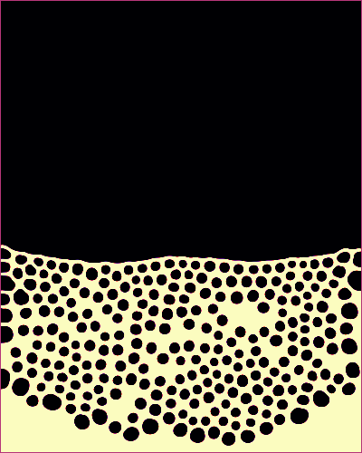
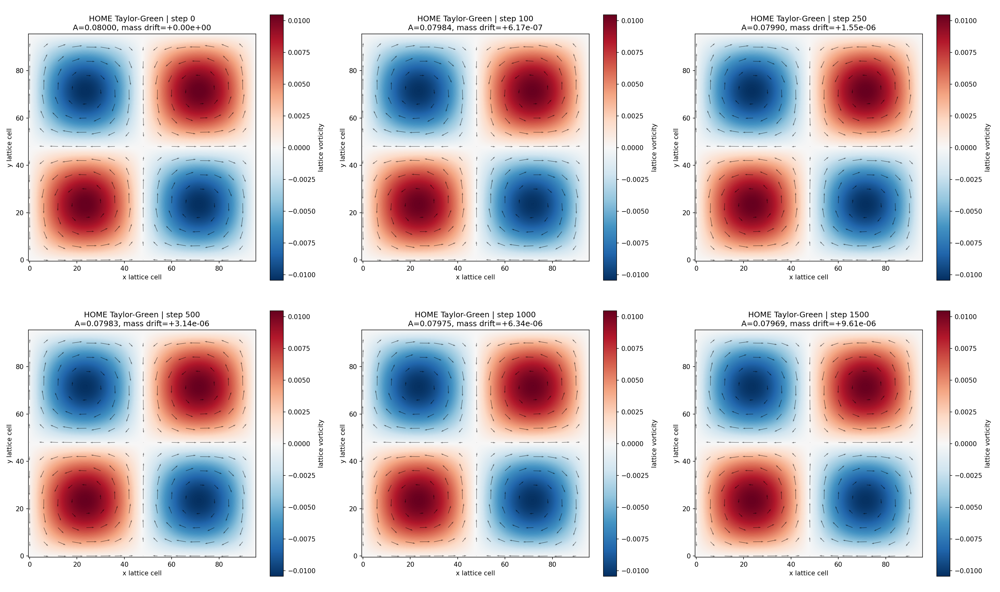
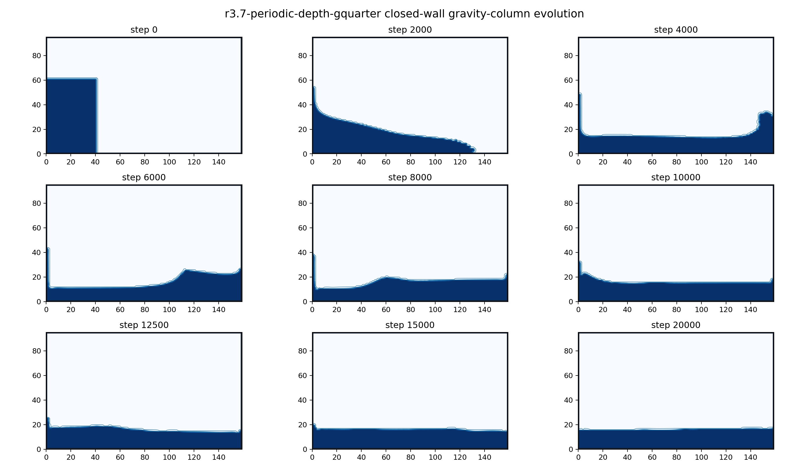
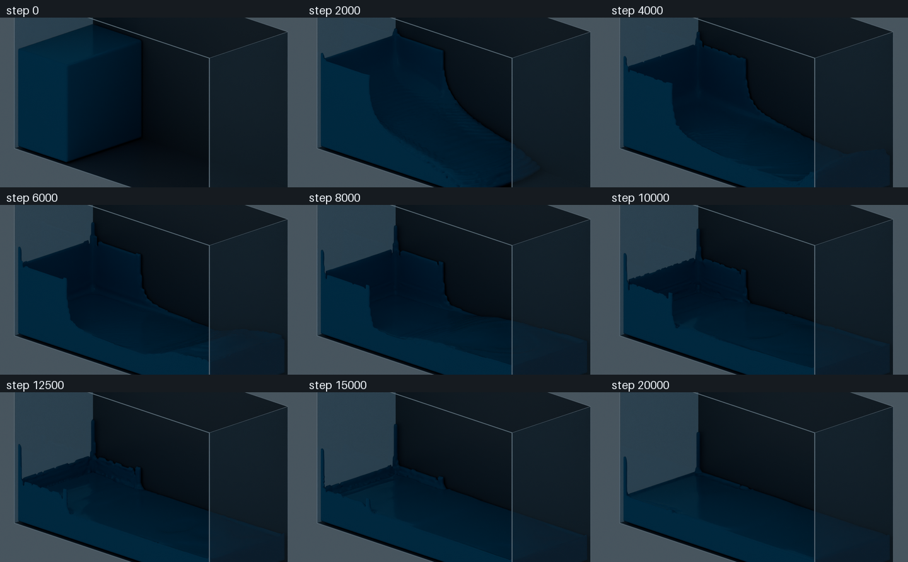
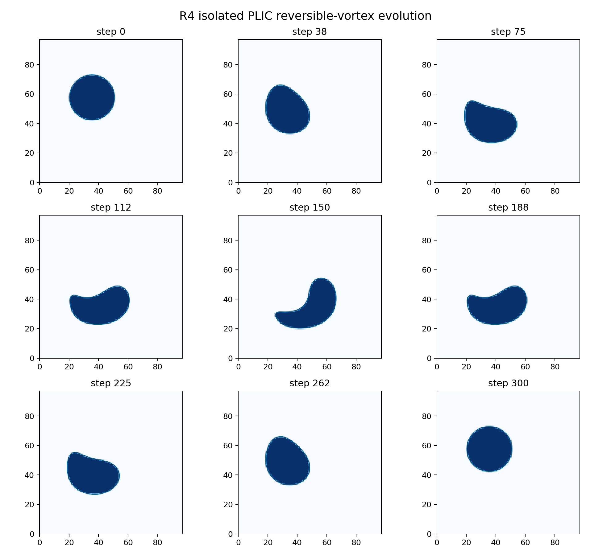
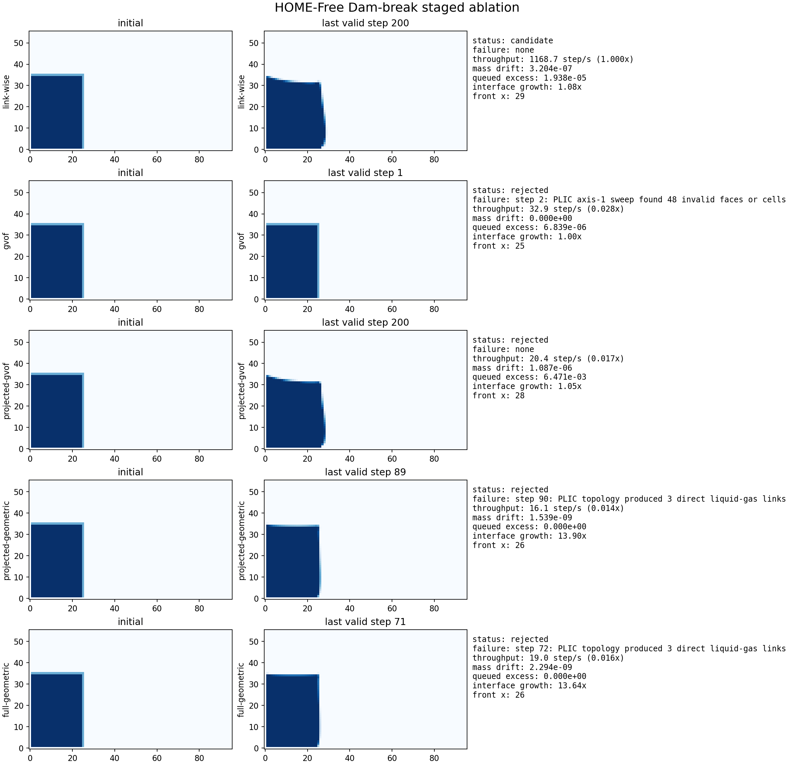
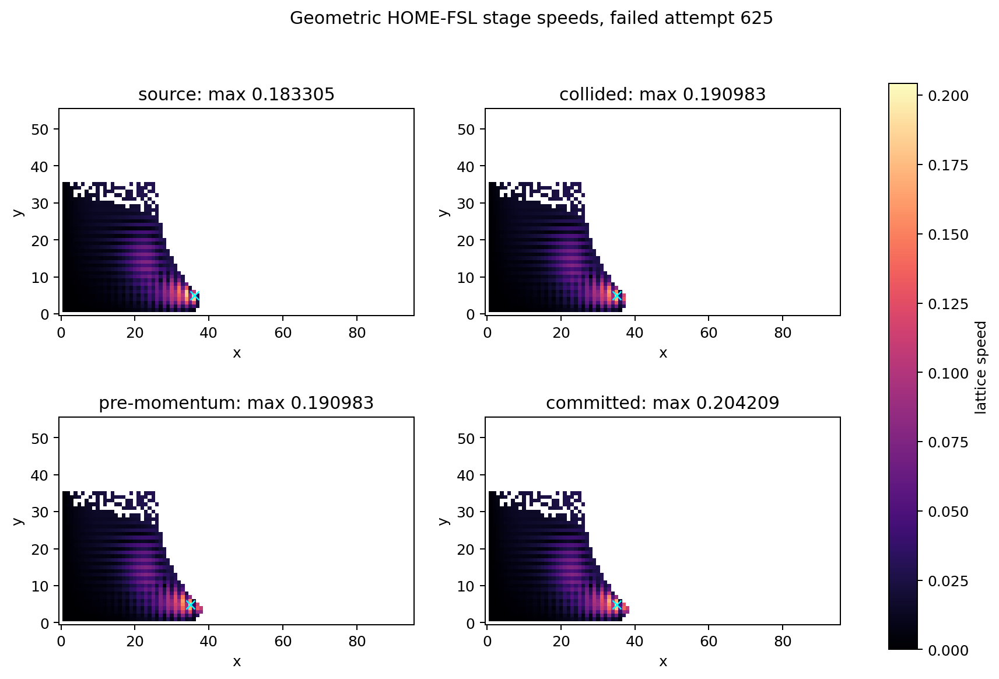
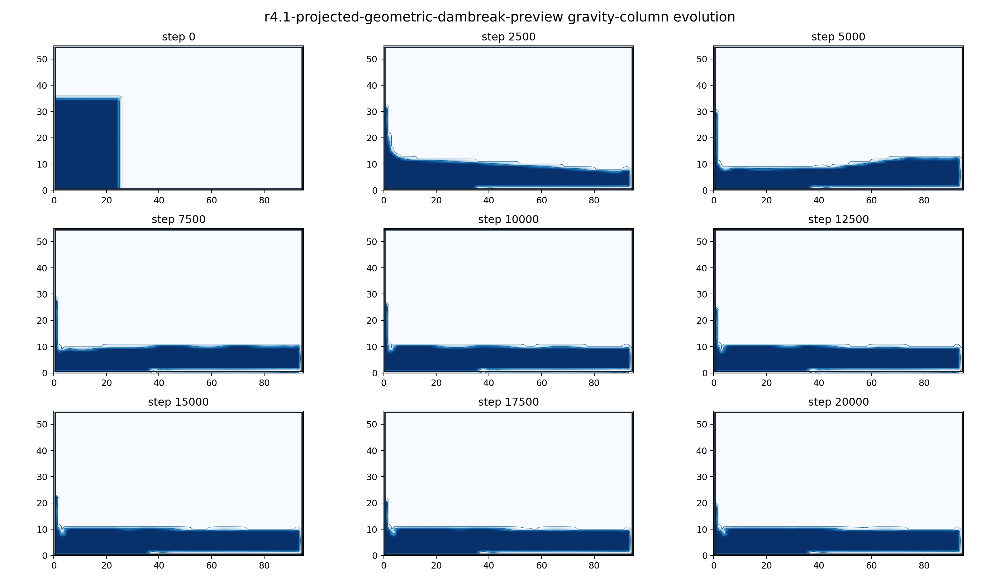
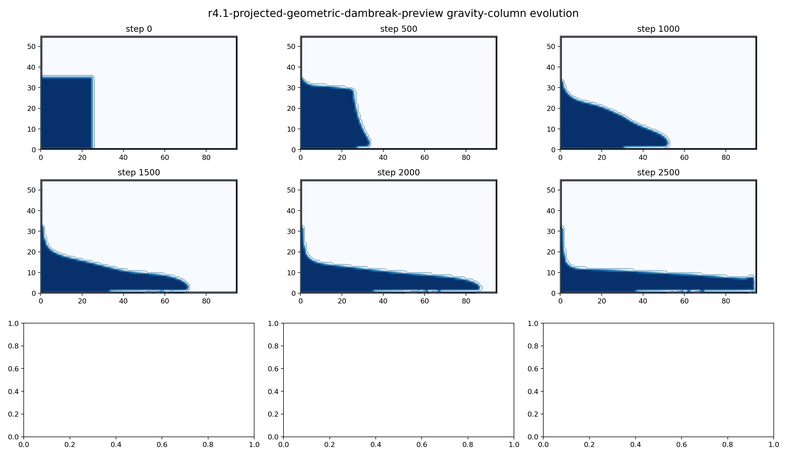

# HOME-LBM / HOME-Free 重构中期实验报告

> 报告日期：2026-07-30  
> 实验阶段：R0-R7  
> 代码分支：`codex/code-editing`  
> 计算平台：本地 macOS 开发与文档整理，AutoDL RTX 5090 远程计算  
> 报告性质：中期答辩材料；所有“完成”均限定在本文列出的测试范围内

## 摘要

本项目最初以 WanPhys 中已有的 D3Q19 TRT 格子玻尔兹曼流体、Shan-Chen 多相流和近似刚体耦合为起点。旧实现能够形成可视化结果，但在自由表面精度、低黏度稳定性、物理量换算、动量守恒、流固双向耦合以及运行效率方面均存在明显限制。为避免继续在旧路径上叠加修补，本阶段保留原实现，新建 `wanphys/_src/fluid/fluid_grid/home_rebuild/`，按“单模块隔离验证、组合后再验证”的方式重建 HOME-LBM 与 HOME-Free 管线。

截至本报告日期，已完成：

1. 冻结旧实现的高黏度稳定基线与低黏度失败基线；
2. 在 RTX 5090 上原样编译并运行论文参考实现 Home-FSLBM；
3. 实现独立 D3Q27 HOME 十矩核心，并验证低黏度周期流；
4. 实现 link-wise HOME-Free 的质量交换、气压边界、动态拓扑和多余质量重分配；
5. 完成二维与真三维 link-wise 溃坝全过程，观察到撞墙和回流；
6. 独立实现并验证 PLIC 几何重构与分裂输运；
7. 实现面 Courant 投影、几何拓扑闭合、质量输运和受控端点回退；
8. 将投影 PLIC 溃坝推进到 20000 步，最大相对质量漂移为 `4.3511e-6`；
9. 完成静态接触角 `60/90/120/150 deg` 的实现与 A/B 实验。

当前最重要的结论不是“全部完成”，而是已经把问题定位清楚：HOME 核心和 link-wise HOME-Free 可以稳定运行，PLIC 在孤立输运中具有约 `1.73-1.75` 阶的观测收敛；组合管线在修正单位、动量所有权和端点拓扑后也可长时间运行。但壁面挂液仍明显，静态接触角单独只能带来约 1% 改善。曲率、表面张力、动态接触线、低黏度自由表面和最终 FSI 尚未完成，因此当前结果是可信的中期候选，不是最终物理验收版本。

## 1. 项目背景与研究问题

### 1.1 原始实现

项目原始流体路径位于 WanPhys 的网格流体模块中，主要特征为：

- D3Q19 格子；
- TRT 碰撞；
- Shan-Chen 伪势多相模型；
- Guo forcing；
- SDF/格点边界处理；
- 由流体边界动量近似回写刚体力和力矩。

该路径的优点是功能集中、容易运行，早期适合打通 Newton/WanPhys 的流体和刚体接口。其主要局限是：

- 自由表面由扩散界面或经验阈值表达，界面厚且形状易受网格影响；
- 高 Reynolds 数、低黏度和撞墙阶段容易触发速度/Courant 失稳；
- 初始液柱、容器和可视化表面之间存在半格偏移、圆角和悬空等视觉问题；
- 流固耦合包含插值、单位换算和力回写近似，缺少严格的动量账本；
- 多种修正同时存在时，难以判断稳定性来自算法还是数值耗散；
- 原路径不适合继续承担 HOME、VOF/PLIC、表面张力和 FSI 的综合研究。

### 1.2 重构目标

本阶段采取四项原则：

1. **不修改旧实现语义。** 新算法放入独立目录，旧场景保留作回归和视觉对照。
2. **先隔离、后组合。** HOME、HOME-Free、PLIC、投影、拓扑、润湿和 FSI 分别验证。
3. **数值与效果并重。** 既记录守恒、稳定性和收敛，也输出覆盖全程的图片组。
4. **失败必须可诊断。** 非有限值、负密度、超 Mach、液-气直连、非法 PLIC 面和投影残差均显式失败，禁止用无记录的全局回填掩盖问题。

研究问题可归纳为：

- HOME 十矩存储能否在保持精度的同时减少状态和提高吞吐？
- 论文 link-wise HOME-Free 能否独立复现并形成完整溃坝过程？
- PLIC 是否能比 link-wise 标量界面提供更清晰、可收敛的自由表面？
- Courant 投影、拓扑修正和质量/动量输运组合后是否仍然守恒、稳定？
- 壁面挂液来自接触角缺失，还是更深层的曲率、表面张力和接触线缺失？
- 最终如何在效果、性能、守恒和 FSI 之间形成可解释的折中？

## 2. 实现架构

### 2.1 仓库分层

```text
newton/
  官方 Newton 刚体/粒子/碰撞框架

wanphys/
  Newton 上层扩展、Domain 编排、流体与耦合

wanphys/_src/fluid/fluid_grid/
  旧 LBM 路径                         # 保留，不作为本轮重构落点
  home_lbm/                           # 早期综合候选，现作为历史实现
  home_rebuild/                       # 当前隔离重构
    core/                             # D3Q27 HOME 十矩核心
    free_surface_fsl/                 # link-wise HOME-Free
    free_surface_plic/                # PLIC、投影、几何拓扑、润湿

wanphys/examples/lbm/home_rebuild/
  数值实验和无窗口可视化入口

newton/tests/home_rebuild/
  当前隔离重构的 CPU/CUDA/oracle 回归
```

Newton 在本阶段仍提供 Warp 数组、设备执行和未来刚体状态/力接口，但 HOME 流体数学不写入 Newton 官方源码。WanPhys 负责新流体模块及其后续耦合，因此实现所有权保持清晰。

### 2.2 当前数据流

```mermaid
flowchart LR
    A["HOME moments: rho, j, second moments"] --> B["HOME collision"]
    B --> C["D3Q27 filtered populations"]
    C --> D["only-missing gas pressure stream"]
    C --> E["link-wise mass exchange"]
    D --> F["HOME state candidate"]
    E --> G["FSL mass/fill candidate"]
    F --> H["topology transaction"]
    G --> H
    H --> I["committed HOME-Free state"]

    I --> J["face Courant reconstruction"]
    J --> K["PCG Courant projection"]
    K --> L["PLIC reconstruction"]
    L --> M["split geometric transport"]
    M --> N["endpoint/topology closure"]
    N --> O["projected PLIC candidate"]
```



link-wise 和 PLIC 不是简单前后串联的两个滤镜，而是两条可比较的界面方案。当前 PLIC 候选复用 HOME 碰撞产生的速度/动量，但体积分数、质量和动量通过同一组几何面通量提交，避免一个物理量被推进两次。

### 2.3 核心状态

| 模块 | 主要状态 | 说明 |
|---|---|---|
| HOME core | 十矩 SoA、双缓冲 moments | 不持久化 27 个分布函数 |
| FSL | `flag/mass/fill_level/excess_mass` | `GAS/INTERFACE/LIQUID` 三态 |
| PLIC geometry | `normal/plane_offset/interface_area/valid` | Parker-Youngs 法向与单位格平面 |
| Courant projection | 三组面 Courant、压力、残差、PCG 工作区 | 将离散面通量投影到近似无散 |
| PLIC transport | fill、mass、momentum、面通量 | 三者共享同一几何切割 |
| Diagnostics | 速度、质量漂移、投影残差、端点事件、壁膜 | 每次正式运行写入 manifest/CSV |

## 3. 算法与实现思路

### 3.1 HOME 十矩 LBM

传统 D3Q27 LBM 持久化全部分布函数 \(f_i\)。HOME 路径只保存密度、动量和二阶矩：

\[
\rho=\sum_i f_i,\qquad
\rho\mathbf{u}=\sum_i f_i\mathbf{c}_i,\qquad
\Pi_{\alpha\beta}=\sum_i f_i c_{i\alpha}c_{i\beta}.
\]

需要迁移时，再用三阶 Hermite 展开重构过滤后的 \(f_i\)。碰撞只松弛非平衡二阶矩：

\[
\Pi^{neq}_{post}=(1-\omega)\Pi^{neq}_{pre},
\qquad
\omega=\frac{1}{3\nu+1/2}.
\]

实现采用 D3Q27、结构化数组和双缓冲状态。其价值不仅是“换一种碰撞”，还包括减少持久化状态、降低显存流量，并为低黏度下的非平衡矩诊断提供直接入口。

### 3.2 link-wise HOME-Free

自由表面状态满足：

\[
\varepsilon=\frac{m}{\rho},\qquad
\varepsilon=0\Rightarrow GAS,\quad
0<\varepsilon<1\Rightarrow INTERFACE,\quad
\varepsilon=1\Rightarrow LIQUID.
\]

界面质量按 D3Q27 链路交换。液-液和液-界面使用完整通量，界面-界面使用两端 fill 的平均权重，气体链不参与内部质量交换。来自 GAS 的缺失分布只在界面处用气压边界补齐：

\[
f_i^*
=f_i^{eq}(\rho_g,\mathbf{u}_I)
+f_{\bar{i}}^{eq}(\rho_g,\mathbf{u}_I)
-f_{\bar{i}}(\mathbf{x},t).
\]

拓扑更新负责 `INTERFACE -> LIQUID/GAS`、新界面初始化、禁止液-气直连，并把转换产生的多余质量沿界面邻域重分配。整个步骤以候选态执行，所有诊断通过后才提交，因此失败不会污染已提交状态。

### 3.3 PLIC 几何界面

PLIC 在每个界面格中用平面

\[
\mathbf{n}\cdot\mathbf{x}=\alpha
\]

切割单位立方体。法向 \(\mathbf{n}\) 由 Parker-Youngs 加权梯度得到，\(\alpha\) 通过“切割体积等于 fill”单调反求。每个方向的几何通量是该平面与 Courant 扫掠棱柱的交体积，而不是对 fill 做普通线性插值。

三方向采用交替顺序的分裂输运。fill、质量和动量必须使用完全相同的面切割系数：

\[
\Delta V_f=V_{\text{PLIC slab}},\quad
\Delta m_f=\rho_{\text{donor}}\Delta V_f,\quad
\Delta\mathbf{p}_f=(\rho\mathbf{u})_{\text{donor}}\Delta V_f.
\]

### 3.4 Courant 投影

直接由 HOME 速度构造的面 Courant 数不严格满足离散无散条件，分裂 PLIC 会因此产生系统性体积误差。当前实现求解离散压力修正：

\[
\nabla_h^2 p=\nabla_h\cdot\mathbf{C},\qquad
\mathbf{C}'=\mathbf{C}-\nabla_h p,
\]

使用预条件共轭梯度、warm start 和设备端工作区。正式 20000 步实验中，最大原始散度为 `2.0816e-2`，投影后最大散度为 `3.8650e-8`。

### 3.5 端点闭合和润湿

浮点输运会产生极接近 0 或 1、但法向不可定义的界面格。当前使用两级处理：

- 在 `5e-6` 场景 roundoff 范围内，将端点归入严格拓扑事务；
- 仅在更小且有界的 fallback 范围内允许使用供体体积分数通量，并记录触发面数和重分配量。

该回退不是普遍数值钳制。20000 步中总共只触发 3 个面，单步最多 1 个面。

静态接触角通过壁面法向修正界面法向。接近平行壁面的界面不伪造切向，而是保留原法向并单独审计。它解决几何边界条件，但不等价于表面张力或动态接触线模型。

## 4. 实验环境与验收方法

### 4.1 环境

| 项目 | 配置 |
|---|---|
| 远程 GPU | NVIDIA GeForce RTX 5090，32607 MiB |
| 官方冒烟环境 | CUDA 12.8.93，Driver 580.105.08，`sm_120` |
| Python 重构环境 | Python 3.12.3，Warp 1.12.0，`cuda:0` |
| 官方 C++ 编译器 | GCC 11.4.0，CMake 3.22.1，OpenCV 4.5.4 |
| 工作流 | 本地编辑/文档，代码同步到远端，远端测试和出图，结果回传本地 |

### 4.2 验收层次

1. **解析/oracle：** 单格公式、静止界面、平移界面、CPU NumPy 参考。
2. **后端一致性：** Warp CPU 与 CUDA 逐格对齐。
3. **数值场景：** Taylor-Green、双剪切层、压力波、可逆涡。
4. **组合事务：** 失败回滚、质量与拓扑闭合、无液-气直连。
5. **视觉全过程：** 固定采样步输出图片组，检查铺展、撞墙、反射、平静和壁膜。
6. **性能：** 预热、多次交替计时、报告中位数和 MLUPS。

本项目不把“绝对质量误差越小”作为唯一目标。面向游戏/视觉仿真时，稳定、界面质量和吞吐同样重要；但任何视觉折中都必须有诊断记录，不能以隐藏误差换取表面正常。

## 5. 分阶段实验过程与结果

### 5.1 R0：冻结旧实现基线

旧几何候选保留两组结果：

| 配置 | 结果 | 作用 |
|---|---|---|
| `nu=0.10`，3200 步 | 完成，界面过度耗散 | 高黏度稳定基线 |
| `nu=0.04`，计划 12800 步 | step 4053 失败 | 低黏度失稳基线 |

`nu=0.04` 失败时有 8 个 z 面 Courant 达到约 `1.097716`，超过几何输运 CFL。该结果说明问题并非只来自渲染：在液体尚未完成撞墙全过程前，组合算法已经产生不可接受的局部速度。

### 5.2 R1：官方 Home-FSLBM 冒烟复现

参考仓库提交 `431156032e480e2791eeedefecca7c4ed744f0c1` 未修改源码，在 RTX 5090 上以 `sm_120` 编译。官方程序没有帧数参数，因此运行 30 秒后外部停止：

- 网格 `400x500`；
- `nu=0.0001`；
- 生成 260 组 mass/velocity PPM；
- 约推进 25900 步；
- 峰值记录速度 `0.077806`；
- 质量相对变化 `-5.06093e-3`；
- 无 NaN、Inf 或 CUDA fault。



官方输出是按格点标量着色的 PPM 科学可视化，不是论文视频中的离线真实感水面。这个实验只证明参考代码、编译链和核心算例可运行，不能把视频渲染质量归因于求解器本身。

### 5.3 R2：独立 HOME 核心

#### 低黏度精度

`96x96x1` Taylor-Green 在 1500 步的扫描结果：

| `nu` | 相对质量漂移 | 解析振幅误差 | 最终最大速度 | 密度范围 |
|---:|---:|---:|---:|---:|
| 0.04 | `8.711e-6` | `-1.051e-3` | 0.047716 | `[0.997693, 1.002311]` |
| 0.01 | `8.886e-6` | `-2.030e-3` | 0.070161 | `[0.994492, 1.005514]` |
| 0.001 | `9.561e-6` | `-2.492e-3` | 0.078822 | `[0.992915, 1.007116]` |
| 0.0001 | `9.609e-6` | `-2.547e-3` | 0.079750 | `[0.992736, 1.007299]` |

所有配置非法单元均为 0。结果证明 HOME 核心可在光滑、周期、低 Mach 条件下运行到 `nu=1e-4`，但不提前代表自由表面同样稳定。



`256^2, nu=0.0001` 双剪切层运行 10000 步，最终最大速度 `0.123142`、密度范围 `[0.944669, 1.012159]`、质量漂移 `8.106e-5`，形成清晰 Kelvin-Helmholtz 卷起且无棋盘噪声。

#### 性能

`256x256x1`、200 步预热、10000 步计时、5 次中位数：

| 路径 | 耗时 | 吞吐 | 估算状态 |
|---|---:|---:|---:|
| 旧通用 HOME solver | 0.89685 s | 730.74 MLUPS | 124 B/cell |
| 新独立周期核心 | 0.63433 s | 1033.15 MLUPS | 80 B/cell |

新核心加速 `1.414x`，估算每格内存减少 `35.5%`。10200 步后最大十矩绝对差 `1.194e-5`，相对 L2 差 `1.667e-6`，相对质量差 `2.181e-7`。

### 5.4 R3：link-wise HOME-Free

R3 按质量交换、气压边界、固定拓扑事务、动态拓扑依次实现，而不是直接运行溃坝。

关键中间证据：

- 静止平面界面逐格质量变化为 0；
- `u_x=0.05` 平移界面左右平均变化为 `-0.05/+0.05`；
- NumPy/Warp CPU/CUDA 逐格对齐；
- 仅 GAS 来源的缺失链使用气压边界；
- 固定拓扑 100 步质量漂移 `1.742e-8`；
- 失败事务不修改调用方状态；
- 动态拓扑维持 26 邻域无液-气直连。

性能上，`256^2` 的质量交换单核为 `1992.07 MLUPS`，HOME core 为 `1174.66 MLUPS`，两者顺序提交为 `708.99 MLUPS`。百万格三维的严格 fixed-topology 事务达到 `869.74 MLUPS`。小二维网格更容易被每步同步和 Python 固定成本支配。

#### 二维溃坝全过程

`160x96x1`、格子 `nu=0.02`、`g_y=-5e-5` 运行 20000 步，耗时 `18.974 s`，最大活动速度 `0.076774`。液柱坍塌、撞击对侧墙、回流并逐渐趋于平静。



#### 真三维溃坝

`160x96x64`、相同格子参数运行 20000 步：

- 耗时 `25.936 s`；
- 最大速度 `0.078273`；
- 首次采样到对侧墙接触：step 4000；
- 前向质心峰值：step 6000；
- 反射位移：`10.3186` cells；
- 最大相对质量漂移：`1.8831e-4`；
- 无固体穿透，观察到反射。



该版本运行快、全过程完整，是当前可靠视觉基线。但其界面精度有限，壁面可见挂液；边界仍为 halfway bounce-back，且不含 PLIC、曲率、表面张力和 FSI。

### 5.5 R4：隔离 PLIC

为避免 HOME 速度、拓扑和投影互相干扰，首先使用解析、离散无散的可逆涡速度场单独测试 PLIC。圆形界面在半周期被拉伸，完整周期后恢复。



分辨率 `32/48/64/96`、Courant 上限 `0.175/0.35` 的结果：

- 所有 fill 有界且有限；
- 最大单步相对体积漂移约 `1.6e-9` 至 `7.9e-9`；
- 中点形状各向异性约 `1.93`，证明场景确实产生强变形；
- 最终 L1 形状误差随分辨率单调下降；
- 拟合 L1 收敛阶分别为 `1.7477` 和 `1.7337`。

该实验确认 PLIC 几何和输运本身成立，后续组合失败不能简单归因于“PLIC 公式错误”。

### 5.6 R5：第一次组合消融与失败

首次组合比较了 link-wise、GVOF、投影 GVOF、投影 PLIC 和完整几何路径。200 步结果曾显示：

| 变体 | 最后一步 | 相对速度 | 质量漂移 | 结果 |
|---|---:|---:|---:|---|
| link-wise | 200 | 1.000x | `3.204e-7` | 完成 |
| GVOF | 1 | 0.028x | 0 | PLIC 非法面 |
| projected GVOF | 200 | 0.017x | `1.087e-6` | excess 过大 |
| projected geometric | 89 | 0.014x | `1.539e-9` | 液-气直连 |
| full geometric | 71 | 0.016x | `2.294e-9` | 液-气直连 |



**这张表不能作为最终算法排名。** 后续审计发现配置中的“物理黏度/重力”经过 `dx=0.1, dt=1` 换算后，几何组实际使用了格子 `nu=2.0`、`g=-5e-4`，而期望比较值是 `nu=0.02`、`g=-5e-5`。因此 R5 的价值是暴露单位和组合边界问题，而不是证明 link-wise 必然优于 PLIC。

### 5.7 R6：单位、动量所有权与端点闭合修正

#### 单位对齐

将场景物理参数修正为 `nu_phys=2e-4`、`g_phys=-5e-6`，对应格子 `nu=0.02`、`g=-5e-5`。此后所有对比均以格子参数为验收依据。

#### 动量重复推进

组合动量路径在 step 625 失败。诊断显示碰撞后最大速度 `0.190983`，提交态却升至 `0.204209`。分阶段速度图确认：HOME 已推进一次动量，PLIC 又对同一动量做第二次平流，造成局部加速。



修正后明确唯一所有权：

- HOME collision/stream 负责流体动量推进；
- PLIC 负责体积和与几何通量一致的质量转移；
- 未经完整守恒证明，不再额外平流已推进的 HOME 动量。

#### 端点拓扑

去掉重复动量后，投影几何路径在 step 1306 遇到 `1.63e-9` 量级的极小 fill；整个连续界面中 fill 大于 `5e-6` 的部分仍小于 `0.04982`，说明不是宏观界面爆炸，而是浮点端点无法构造法向。

处理过程依次为：

1. 增加场景 roundoff 闭合；
2. 将接近 0/1 的端点纳入拓扑提交；
3. 保留每步端点移除、提升和重分配账本；
4. 最后只为更窄范围增加有界 fallback。

#### 20000 步正式结果

`96x56x1`、格子 `nu=0.02`、`g_y=-5e-5`：

| 指标 | 结果 |
|---|---:|
| 完成步数 | 20000 |
| 耗时 | 390.122 s |
| 吞吐 | 51.266 step/s |
| 最大速度 | 0.048904 |
| 最大原始/投影后散度 | `2.0816e-2 / 3.8650e-8` |
| 最大 PCG 迭代 | 320 |
| 最大相对质量漂移 | `4.3511e-6` |
| fallback 总面数 | 3 |
| 反射质心位移 | 5.0495 cells |
| 固体穿透 | 无 |



结果已经形成坍塌、撞墙、反射和趋稳全过程，但仍有两个明显问题：

- 性能比 link-wise 慢约一个数量级以上，主要成本来自每步投影、同步和多次网格遍历；
- 左壁最终半满高度 18，而主体参考液面高度 10，壁面上方仍有 `7.7014` cell-volume 的挂液。

### 5.8 R7：静态接触角 A/B

实现静态接触角后测试 `90/120/150 deg`，并与关闭接触角的 2500 步基线比较：

| 接触角 | 左壁半满高度 | 主体高度 | 壁膜体积 | 右壁半满高度 |
|---:|---:|---:|---:|---:|
| 关闭 | 31 | 12 | 17.863 | 0 |
| 90 deg | 31 | 12 | 17.754 | 5 |
| 120 deg | 31 | 12 | 17.684 | 0 |
| 150 deg | 31 | 12 | 17.819 | 0 |

120 deg 相比基线仅减少约 1% 壁膜体积，左壁挂液高度没有下降。

平面壁法向的 `60/90/120 deg` CPU/CUDA 几何测试、平行壁审计和完整 PLIC 联合回归均通过；当时测试结果为 `62 passed`，另含 6 个参数化子测试。



结论是：挂壁不是一个“改法向角度”即可解决的问题。缺少曲率压力、表面张力恢复力和动态接触线时，已经留在壁面上的薄膜没有足够的退润湿机制。静态接触角实现可保留，但必须与后续毛细模型共同验收。

## 6. 优化过程总结

### 6.1 从综合修补改为隔离复现

早期候选同时加入 HOME、VOF、PLIC、投影、拓扑、动量账本和 FSI，结果是每个模块看似合理，组合后却难以定位误差。本阶段重新分解为 R0-R7，每一步都要求独立 oracle、后端一致性和图片证据。最直接的收益是确认：

- HOME 核心不是低黏度失败源；
- PLIC 孤立输运不是拓扑失败源；
- 第一次组合失败分别来自单位错配、动量重复推进和端点闭合缺失。

### 6.2 内存与吞吐

HOME 十矩状态使核心估算从 124 B/cell 降至 80 B/cell，周期核心加速 `1.414x`。但自由表面组合增加了质量、flag、投影和几何缓冲，最终性能由最慢的投影/同步路径决定。当前优化重点已经从“单核更快”转为：

- 减少每步主机同步；
- 合并 stream/collision 与诊断归约；
- 对 PCG 使用 warm start/CUDA graph；
- 只在活动界面区域更新几何和拓扑；
- 保留严格验收模式，同时提供有审计的生产模式。

### 6.3 从全局修正改为局部账本

项目不使用无来源的全局质量回填。拓扑转换、端点提升/移除、fallback 和 excess mass 都记录数量与累计体积/质量。这样即使视觉结果可接受，也可以回答“质量从哪里来、到哪里去”。

### 6.4 可视化工作流

实验入口采用无窗口运行，固定步长输出 PNG、CSV 和 JSON manifest。图片覆盖初始坍塌、接地铺展、撞墙、反射和趋稳，不依赖 VNC 实时帧率。三维阶段使用固定对角相机和显式容器线框，使液体与水槽的空间关系可检查。

## 7. 当前完成度

| 能力 | 状态 | 当前证据 |
|---|---|---|
| 官方 Home-FSLBM 可运行性 | 完成 | 未改源码，约 25900 步冒烟 |
| 独立 HOME D3Q27 十矩核心 | 完成 | 低黏度周期流、CPU/CUDA、性能 |
| link-wise HOME-Free | 完成基线 | 二维/真三维 20000 步 |
| PLIC 几何与输运 | 完成隔离验收 | 可逆涡、约 1.73-1.75 阶 |
| Courant 投影 | 完成候选 | 散度降至 `3.865e-8` |
| 几何拓扑与端点闭合 | 完成候选 | 20000 步、3 个 fallback 面 |
| 静态接触角 | 完成实现 | 60/90/120/150 deg 后端测试与 A/B |
| 曲率 | 未完成 | 当前仅有未验证原型，不计入成果 |
| 表面张力/动态接触线 | 未完成 | 挂壁问题的下一主线 |
| 低黏度 PLIC 溃坝 | 未完成 | HOME 低黏度成立不代表组合成立 |
| PLIC 真三维全过程 | 未完成 | 当前真三维基线仍是 link-wise |
| 新路径 FSI | 未重新接入 | 等自由表面候选冻结后再做 |
| 最终真实感渲染 | 未开始 | 当前为科学可视化和诊断渲染 |

## 8. 局限性与风险

1. **壁面挂液明显。** 静态接触角不能替代表面张力和动态退润湿。
2. **PLIC 组合性能偏低。** 20000 步二维运行约 390 秒，而 link-wise 二维约 19 秒；两者实现复杂度和诊断强度不同，但差距仍必须优化。
3. **低黏度自由表面未验收。** `nu=1e-4` 只在周期单相 HOME 中通过。
4. **真三维 PLIC 未运行。** 当前 3D 图证明 link-wise 管线，不证明几何管线。
5. **曲率原型尚未验证。** 不能把未运行的代码描述为已有表面张力能力。
6. **FSI 尚未接回。** 旧耦合可参考接口，但最终需要基于新动量所有权重新建立力/矩账本。
7. **物理标定仍不足。** 当前主要使用格子单位和算法基准，尚未与标准溃坝实验的前沿位置、液面高度和冲击压力曲线系统对齐。
8. **渲染不代表物理。** 表面平滑、透明度和相机可以改善观感，但不能掩盖薄膜、悬空或质量误差。

## 9. 下一阶段计划

### R8：曲率隔离验证

- 实现二维高度函数/几何曲率参考；
- 平面界面要求曲率接近 0；
- 不同半径圆/球要求 \(\kappa\approx 1/R\) 或 \(2/R\)；
- CPU/CUDA 对齐并输出误差随分辨率收敛图；
- 当前未验证的曲率草稿通过上述门禁前不接入主步进。

### R9：表面张力与润湿

- 采用一致的连续表面力或压力跳跃形式；
- 静态液滴 Laplace 压差测试；
- 寄生流最大速度测试；
- 接触角 `60/90/120/150 deg` 静态液滴测试；
- 在同一 2500/20000 步溃坝中复测壁膜体积与高度。

### R10：低黏度与真三维

- 逐级扫描格子 `nu=0.02 -> 0.01 -> 0.005`；
- 保持最大 Mach、Courant、投影残差和质量账本可解释；
- 先中分辨率二维，再运行 `160x96x64` 真三维；
- 与 link-wise 基线按物理时间、相机和网格对齐。

### R11：FSI 重新接入

- 从 Newton 刚体状态读取边界位置和速度；
- 采用统一格子/世界单位换算；
- 由边界链路动量交换形成力和力矩；
- 流体和刚体共享一份动量账本；
- 先固定体、受迫运动体，再做自由刚体双向耦合；
- 最终场景才考虑漂浮、沉降和溃坝冲击刚体。

### R12：性能和最终展示

- 减少投影同步、局部化界面计算、尝试 kernel 融合；
- 记录 raw、严格诊断、生产配置三类吞吐；
- 在 RTX 5090 生成固定间隔图片序列；
- 必要时离线重建表面并渲染视频，但数值 manifest 与视觉帧保持一一对应。

## 10. 中期结论

本阶段已经从“旧实现能出图但难以解释”推进到“核心模块可隔离证明、组合失败可定位、修正后可长时间运行”。最成熟的成果是：

- 快速稳定的 link-wise HOME-Free 二维/三维基线；
- 低存储、高吞吐的独立 HOME 十矩核心；
- 具有明确收敛证据的 PLIC 几何输运；
- 可运行 20000 步、质量漂移 `4.3511e-6` 的投影 PLIC 候选；
- 对壁面挂液原因的实验性排除：静态接触角单独不足。

距离最终项目验收仍有实质工作，重点不是继续堆叠修正，而是按 R8-R12 继续隔离曲率、表面张力、低黏度、真三维和 FSI。若后续几何组合无法在效果与性能上超过 link-wise，项目仍保留 link-wise 作为可交付基线；若 PLIC 与毛细模型通过验收，则将其作为高质量模式，并根据场景提供可解释的性能/效果折中。

## 11. 证据与复现入口

主要记录：

- `docs/implementation/home-rebuild-validation-plan.md`
- `docs/implementation/home-rebuild-progress.md`
- `tmp/home-rebuild/*/manifest.json`
- `tmp/home-rebuild/*/metrics.csv`

代表性命令：

```bash
# HOME Taylor-Green
PYTHONPATH=. python -m wanphys.examples.lbm.home_rebuild.home_core.taylor_green \
  --output /path/to/run --resolution 96 --viscosity 0.0001 \
  --steps 0 100 250 500 1000 1500 --device cuda:0

# link-wise HOME-Free 溃坝
PYTHONPATH=. python -m wanphys.examples.lbm.home_rebuild.home_free_fsl.gravity_column_3d \
  --output /path/to/run --profile formal \
  --device cuda:0

# 独立 PLIC 可逆涡
PYTHONPATH=. python -m wanphys.examples.lbm.home_rebuild.geometric_vof.plic_vortex_convergence \
  --output /path/to/run --device cuda:0

# 投影 PLIC 溃坝
PYTHONPATH=. python -m wanphys.examples.lbm.home_rebuild.home_free_plic.geometric_dambreak_preview \
  --output /path/to/run --mode projected-geometric \
  --interface-tolerance 5e-6 \
  --sample-steps 0 2500 5000 7500 10000 12500 15000 17500 20000 \
  --allow-incomplete --device cuda:0
```

具体参数和实际执行结果应以对应运行目录的 `manifest.json` 为准；命令行入口随研究阶段可能调整。
