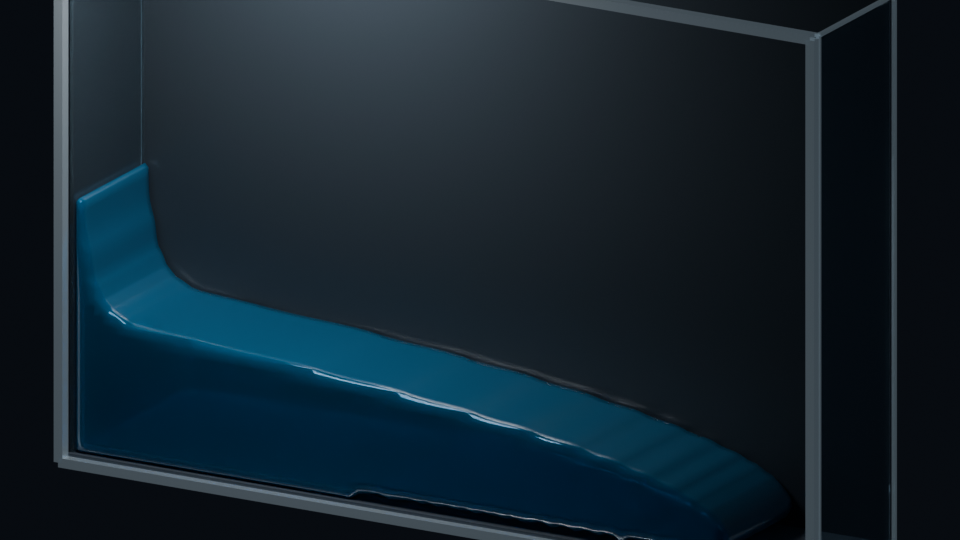
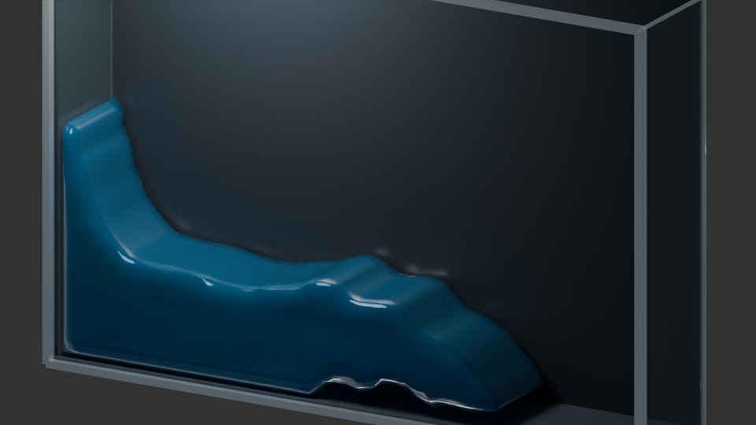

# HOME-LBM 项目中期答辩口述稿

> 建议时长：完整讲述约 10-12 分钟；答辩时间较短时可略去各模块的具体数值。  
> 讲述原则：重点说明“为什么这样做、遇到了什么问题、为什么改变路线”，数字只保留能支撑结论的部分。

## 开场

我的项目是基于 Newton 和 WanPhys 框架研究格子玻尔兹曼流体，也就是 LBM，并进一步考虑自由表面和流固耦合。整个研究到目前为止可以分成三个阶段：第一阶段是理解原项目和论文；第二阶段是第一次综合实现；第三阶段是发现组合方案的问题以后，重新采用隔离验证的方式实现。

## 第一阶段：理解原项目和论文

第一阶段的主要工作不是立即写新算法，而是先弄清楚原项目已经实现了什么。

原项目中的流体采用 D3Q19 格子、TRT 碰撞和 Shan-Chen 多相模型。简单理解，TRT 决定每个格子内部的流体怎样重新分配方向，Shan-Chen 则通过一种虚拟的分子吸引力让液体和气体自动分开。项目中还实现了刚体边界和流体力回写，因此已经能够运行液滴、溃坝和流固耦合场景。

但是原实现更适合演示和早期验证。它的液气界面比较厚，低黏度时容易不稳定，流体和刚体之间也存在一些近似处理。随着场景规模和 Reynolds 数提高，这些问题会更加明显。

在理解代码以后，我又阅读和整理了 5 篇相关论文。它们主要涉及五个方向：

1. HOME-LBM 的十矩存储与高效碰撞；
2. HOME-Free 的自由表面质量交换；
3. VOF 对每个格子中液体体积的记录；
4. PLIC 对格子内部液面的几何重建；
5. 自由表面动量守恒与流固耦合。

这一阶段得到的基本思路是：保留 Newton 的刚体框架和 WanPhys 的扩展方式，但在新的目录中重新实现更高效的 HOME-LBM，并用 VOF/PLIC 改善自由表面。

## 第二阶段：第一次综合实现

第二阶段进行了第一次完整重构。当时的想法比较直接：既然各篇论文中的方法都有价值，就把 HOME 核心、VOF、PLIC、Courant 投影、拓扑修正、动量账本和 FSI 一起加入新管线。

其中，HOME 用十个宏观矩代替长期保存 27 个粒子分布，从而减少内存；VOF 记录每个格子中有多少水；PLIC 根据体积分数在格子中重建一条线或一个平面；Courant 投影负责调整格子面上的流量，使每个格子的流入和流出尽量平衡；拓扑模块则处理液体格、界面格和空气格之间的转换。

这个版本完成了基础代码、测试和三维溃坝离线输出，说明整个计算和渲染管线已经可以连通。下面这张图是当时 `nu=0.10`、`96x16x64` 网格运行到 51200 步的最终三维结果。

从这张图可以看出，液体确实发生了坍塌和铺展，计算也能够长时间运行。但是效果存在明显问题：液面没有恢复到水平状态，左侧壁面有明显挂液，水体过于平滑和黏稠，缺少真实溃坝中的波纹、撞击和回流。

为了降低耗散，我又把黏度从 `0.10` 降到 `0.04`。低黏度下运动更快，视觉上也更接近真实水体，但运行到 step 4053 时发生失败。下面是崩溃前 step 4000 的图像。

失败时有 8 个格子面的 Courant 数达到约 `1.10`。它表示一个时间步内液体跨越了超过一个格子，几何输运已经无法可靠追踪液体经过了哪些单元。

进一步分析后发现，困难不只是参数没有调好，而是一次加入了太多模块。HOME、PLIC、投影、拓扑、动量输运和 FSI 都会改变速度或界面。当结果出错时，很难判断究竟是哪一个环节造成的；继续增加限速或经验修正，只会让系统更复杂，而且可能依靠额外耗散掩盖问题。

因此第二阶段最后选择暂停。它的成果是打通了完整三维管线，也暴露了组合实现的瓶颈；它没有达到最终的数值和视觉验收。

## 第三阶段：按顺序隔离验证

第三阶段是目前正在进行的实现。新的原则是：不再同时加入全部算法，而是按照“先复现、再单测、后组合”的顺序进行。每一步不仅检查数值，还要输出完整过程图片。只有当前模块能够单独解释，才进入下一步。

### 第一步：运行官方参考代码

首先原样编译并运行论文公开的 Home-FSLBM 代码，没有修改它的算法源码。它在 RTX 5090 上约运行 25900 步，生成 260 帧，没有出现 NaN 或 CUDA 错误。

这一步的目的不是直接得到最终效果，而是确认论文参考实现、编译环境和低黏度 HOME 路线本身可以运行。官方程序输出的是 PPM 科学可视化，论文视频中的真实感效果还包含后续表面重建和离线渲染。

### 第二步：只实现 HOME 流体核心

接下来只迁移 D3Q27 HOME 十矩核心，不加入自由表面、PLIC、拓扑或 FSI。首先使用 Taylor-Green 涡测试，因为这个场景有明确的速度衰减规律，适合检查流体核心是否正确。

在 `nu=0.04、0.01、0.001、0.0001` 四种黏度下都运行了 1500 步，没有非法单元。最低黏度 `nu=0.0001` 的质量漂移约为 `9.6e-6`。之后又运行了 10000 步双剪切层，能够看到 Kelvin-Helmholtz 涡卷起，也没有数值爆炸。

性能测试中，新 HOME 核心从约 `730.7 MLUPS` 提高到 `1033.2 MLUPS`，加速约 `1.41` 倍；估算每格状态从 124 字节减少到 80 字节。

这一步说明：纯 HOME 核心在低黏度下可以成立，所以第二阶段的低黏度失败不能简单归因于 HOME 碰撞本身。

### 第三步：复现 link-wise HOME-Free

然后按照论文和官方代码复现 link-wise HOME-Free。它不在格子内部重建精确液面，而是沿 D3Q27 的格子连接逐条计算质量交换，同时处理空气侧气压边界、液体/界面/空气转换和多余质量重分配。

实现过程不是直接运行溃坝，而是依次完成：

1. 静止界面质量不变化；
2. 平移界面的流入和流出相等；
3. 空气侧缺失分布只在界面处补齐；
4. 固定拓扑连续运行；
5. 动态拓扑和多余质量重分配；
6. 最后才运行二维和三维溃坝。

二维场景使用 `160x96x1` 网格运行 20000 步，能够看到液柱坍塌、撞击右侧墙面、反射并逐渐趋于平静。

随后运行 `160x96x64` 的真三维场景，同样完成 20000 步。计算耗时约 25.9 秒，最大速度约 `0.0783`，最大质量漂移约 `1.88e-4`。

这条路径速度快、能够完整运行，目前是可靠的自由表面基线。但是它的界面精度有限，三维图中仍然可以看到壁面挂液和格子化薄膜。

### 第四步：单独验证 PLIC

link-wise 可以运行以后，没有立即把 PLIC 接入溃坝，而是先用一个可逆涡场单独测试 PLIC。实验让一个圆形液滴先被涡流拉长，再反向流动回到初始位置。

分辨率从 32 提高到 96 后，最终形状误差持续下降，观测收敛阶约为 `1.73-1.75`；单步体积漂移约为 `1e-9` 量级。这说明 PLIC 的几何重建和体积输运本身是成立的。

### 第五步：逐项组合并定位失败

之后才把 HOME、PLIC、Courant 投影和拓扑逐步组合。第一次组合实验中，部分方案只能运行几十步，部分方案虽然完成 200 步，但速度只有 link-wise 的约 2%。

这里没有直接认定 PLIC 不可用，而是继续回查每个阶段。最终发现了三个具体问题。

第一个问题是单位换算。原配置中的物理黏度和重力换算到格子单位以后，并不是预期的 `nu=0.02、g=-5e-5`，因此第一次消融不能作为算法排名。

第二个问题是动量被推进了两次。HOME 已经完成了一次流体动量推进，PLIC 又使用几何通量对同一份动量进行平流，导致局部速度逐步放大。

第三个问题是体积分数接近 0 或 1 时，浮点误差会留下极小界面格。这些格子几乎没有体积，却仍被要求计算 PLIC 法向，最终造成拓扑失败。现在将这些端点纳入显式拓扑闭合，并对更小范围设置有记录、受限制的 fallback，而不是做全局质量修正。

### 第六步：修正后完成 20000 步 PLIC 溃坝

完成单位、动量所有权和端点闭合修正后，投影 PLIC 场景终于能够运行完整 20000 步。

该实验使用 `96x56x1` 网格、格子黏度 `0.02` 和重力 `-5e-5`：

- 最大速度约 `0.0489`；
- 投影前最大散度约 `2.08e-2`；
- 投影后降低到约 `3.87e-8`；
- 最大相对质量漂移约 `4.35e-6`；
- 20000 步中端点 fallback 只触发了 3 个面。

这说明组合管线已经从“几十步失败”推进到可以完成坍塌、撞墙、反射和趋稳全过程。不过计算耗时约 390 秒，明显慢于 link-wise，而且左壁仍然存在挂液。

### 第七步：测试静态接触角

为了判断挂液是否只是壁面角度条件缺失，又加入了 `90、120、150` 度静态接触角进行对照。

结果显示，120 度时壁膜体积只比关闭接触角减少约 1%，挂液高度基本没有变化。这说明问题不只是界面法向，而是当前还缺少曲率、表面张力和动态接触线。液体一旦留在墙上，没有足够的毛细恢复力使它退回主体液面。

## 当前结论

目前第三阶段已经得到几个比较明确的结论。

第一，HOME 核心能够在低黏度周期流中稳定运行，并且相比旧通用实现具有约 1.41 倍的核心性能提升。

第二，link-wise HOME-Free 已经完成二维和三维溃坝全过程，是目前速度快、稳定性较好的基线。

第三，PLIC 在独立实验中具有明确的体积守恒和收敛证据；修正单位、动量和拓扑后，组合场景也能够运行 20000 步。

第四，当前主要瓶颈已经从“算法会不会立即崩溃”转变为“如何解决壁面挂液、表面张力、低黏度三维稳定性和计算成本”。

下一步将先隔离验证曲率和 Laplace 压差，再加入表面张力，重新进行接触角与溃坝对照。只有自由表面方案稳定以后，才重新接入 Newton 刚体和双向 FSI。这样可以保证后面即使出现问题，也能够明确判断问题来自流体、界面还是耦合，而不会再次回到第二阶段多个模块相互干扰的状态。

## 结尾

所以，这个项目目前最重要的进展，不只是又实现了一套 LBM，而是建立了一套更可靠的研究流程：先理解原实现和论文，再通过第一次综合实现暴露问题，最后将复杂系统拆开，用数据和图片逐项证明后再组合。第二阶段证明了完整管线能够打通，第三阶段则正在把它变成一个可以解释、可以比较、也可以继续优化的实现。
