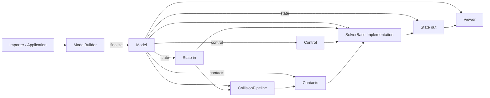

# Newton 官方库架构与实现

## 1. 文档范围

本章说明仓库中 `newton/` 官方库的当前架构和实现原理。优先依据随源码提供的官方文档：

- [`docs/guide/overview.rst`](../guide/overview.rst)
- [`docs/guide/key-concepts.rst`](../guide/key-concepts.rst)
- [`docs/concepts/conventions.rst`](../concepts/conventions.rst)
- [`docs/concepts/articulations.rst`](../concepts/articulations.rst)
- [`docs/concepts/collisions.rst`](../concepts/collisions.rst)
- [`docs/api/`](../api/newton.rst)

Newton 官方将其定义为基于 NVIDIA Warp 的 GPU 加速、可扩展、可微物理仿真引擎，主要面向机器人、研究和高级仿真工作流。当前仓库包含 XPBD、VBD、MuJoCo、Featherstone、Semi-Implicit、Style3D、Implicit MPM 和 Kamino 等求解器或后端。

## 2. 总体架构

### 2.1 分层

```text
newton/
├── __init__.py               # 顶层稳定 API 汇总
├── geometry.py               # 几何公共 API
├── solvers.py                # 求解器公共 API
├── viewer.py                 # Viewer 公共 API
├── sensors.py / ik.py / usd.py / utils.py
├── _src/
│   ├── core/                 # Axis、基础类型
│   ├── math/                 # 空间代数
│   ├── sim/                  # ModelBuilder、Model、State、Control、Contacts
│   ├── geometry/             # broad/narrow phase、SDF、接触约简、射线等
│   ├── solvers/              # 各物理解算后端
│   ├── sensors/              # 接触、IMU、相机、射线传感器
│   ├── viewer/               # GL、USD、Rerun、Viser、Null viewer
│   ├── usd/                  # USD schema 和解析辅助
│   └── utils/                # 导入器、mesh、渲染和拓扑工具
├── examples/                 # 官方示例
└── tests/                    # 单元、集成和示例测试
```

顶层模块负责公开 API，真正实现位于 `_src/`。应用代码通常应从 `newton`、`newton.solvers`、`newton.viewer` 等公共入口导入，避免依赖 `_src` 内部路径。

### 2.2 核心对象关系



这套设计把数据按变化频率分开：

| 对象 | 角色 | 典型数据 |
|---|---|---|
| `ModelBuilder` | 主机侧场景装配器 | Python list、导入数据、临时索引、默认配置 |
| `Model` | 仿真期基本不变的设备数据 | 质量、惯量、几何、关节拓扑、材料、world 索引 |
| `State` | 随时间变化的状态 | 粒子/刚体位置、速度、力，关节坐标和速度 |
| `Control` | 每步外部输入 | 关节目标、驱动、广义力、肌肉/单元激活 |
| `Contacts` | 碰撞输出和接触工作集 | 接触对、点、法向、间隙以及可选扩展属性 |
| `Solver` | 时间推进策略 | 约束、力、积分和后端内部缓冲 |

## 3. ModelBuilder：从场景描述到设备模型

### 3.1 为什么需要 Builder

`Model` 不是面向逐项手工赋值的对象。官方建议用 [`newton/_src/sim/builder.py`](../../newton/_src/sim/builder.py) 中的 `ModelBuilder`：

1. `add_body` / `add_link` 建立刚体或 articulation link。
2. `add_shape_*` 绑定碰撞/可视几何并累计质量和惯量属性。
3. `add_joint_*` 建立父子关系、自由度、限制和驱动参数。
4. `add_articulation` 将连续关节声明为 articulation。
5. 也可添加粒子、弹簧、三角形、四面体、肌肉和约束。
6. `finalize()` 验证结构并一次性转成目标设备上的 Warp 数组。

`add_body()` 会建立自由刚体所需的 free joint；`add_link()` 只建立 link，适合随后显式添加 articulation joint。

### 3.2 finalize 的实际职责

`ModelBuilder.finalize()` 位于 `builder.py` 约 9032 行。当前实现不是简单构造函数，而是一次完整的“编译”过程：

- 规范化 world 数量并验证 world 数据连续性。
- 验证关节归属、shape margin 和结构引用。
- 可选检查 articulation 内关节的 DFS 拓扑顺序。
- 封闭 `*_start` 前缀索引数组，加入尾端 sentinel。
- 从质量计算逆质量，对静态实体保持逆质量为 0。
- 校正刚体质量和惯量。
- 将主机侧列表转为指定 `cpu`/`cuda` 设备上的 `wp.array`。
- 建立粒子 HashGrid、shape 映射、碰撞过滤和求解器所需元数据。
- 记录用户请求的扩展 State/Contacts 属性。
- 根据 `requires_grad` 决定数组是否进入 Warp 自动微分图。

因此 `finalize()` 之后，`Model` 代表可直接进入 kernel 的结构化 SoA 数据，而不是可任意增删拓扑的编辑器。

### 3.3 导入器

URDF、MJCF、USD 等导入器最终都将外部格式转换为 `ModelBuilder` 内容。这使导入模型和程序化模型共享后续验证、设备分配、碰撞和求解路径。

## 4. Model：静态定义和多 world 数据布局

[`newton/_src/sim/model.py`](../../newton/_src/sim/model.py) 中的 `Model` 持有：

- particles：初始位置/速度、质量、半径、flags、world。
- bodies：初始位姿/速度、质量、质心、惯量、flags、world。
- shapes：body 归属、局部变换、类型、尺度、材料、接触参数、过滤组。
- joints/articulations：父子 body、锚点、轴、自由度范围、限制、驱动参数和索引。
- deformables：spring、edge、triangle、tet、muscle 等静态参数。
- gravity、up axis、world 划分、属性频率和自定义属性元数据。

### 4.1 多 world

Newton 用 world index 在一个模型内并行放置多个独立仿真实例：

- `-1`：全局实体，可与所有 world 相互作用。
- `0, 1, ...`：仅与同 world 或全局实体相互作用。

`particle_world`、`body_world`、`shape_world` 等数组参与碰撞过滤和并行组织；`*_world_start` 提供每个 world 的连续索引范围。这种布局适合批量机器人环境和强化学习。

### 4.2 运行时工厂

`Model` 提供：

- `state()`：克隆初始动态量，并把力缓冲初始化为 0。
- `control()`：克隆或引用模型中的控制初值。
- `contacts()`：按模型容量和已请求属性分配接触对象。
- `collide()`：调用碰撞管线填充 Contacts。
- `set_gravity()` 等有限的运行时修改接口；修改后可能需要 `solver.notify_model_changed()`。

## 5. State、Control 和 Contacts

### 5.1 State

[`newton/_src/sim/state.py`](../../newton/_src/sim/state.py) 的关键字段：

| 字段 | 形状/类型 | 含义 |
|---|---|---|
| `particle_q` | `vec3[particle_count]` | 粒子位置，m |
| `particle_qd` | `vec3[...]` | 粒子速度，m/s |
| `particle_f` | `vec3[...]` | 粒子累积力，N |
| `body_q` | `transform[body_count]` | body 位姿，平移 + 四元数 |
| `body_qd` | `spatial_vector[...]` | COM 线速度 + 角速度，均为世界坐标 |
| `body_f` | `spatial_vector[...]` | body 外部力与力矩 |
| `joint_q` | flat float array | 广义位置坐标 |
| `joint_qd` | flat float array | 广义速度坐标 |

每个仿真子步通常先 `state.clear_forces()`，再累积用户力、viewer 交互力和耦合力。求解器读取 `state_in` 并写 `state_out`，应用交换两个引用；这样避免原位覆盖造成的数据依赖。

可选字段如 `body_qdd`、`body_parent_f` 和 `mujoco:qfrc_actuator` 必须在 `finalize()` 前通过 `request_state_attributes()` 请求。

### 5.2 坐标约定

官方 conventions 文档明确：

- `body_qd` 前 3 个分量是 COM 世界线速度，后 3 个分量是世界角速度。
- Warp/Newton 四元数内存顺序为 `(x, y, z, w)`。
- 默认 Z-up、右手系，但 up axis 可配置。
- MuJoCo 后端负责在 Newton 世界表示和 MuJoCo 混合坐标表示间转换。

这也是 WanPhys 刚体-LBM 耦合计算 `v_surface = v_com + omega x r` 的依据。

### 5.3 Control

[`newton/_src/sim/control.py`](../../newton/_src/sim/control.py) 把外部命令与状态分开，包括：

- `joint_target_pos`、`joint_target_vel`
- `joint_act`、`joint_f`
- triangle/tet/muscle activations

控制可以每步修改，而无需改动静态 Model。

### 5.4 Contacts

Contacts 是碰撞检测和动力学求解器之间的契约。碰撞模块填充几何接触信息，部分求解器在求解后通过 `update_contacts()` 回写接触力等后端结果。扩展接触属性也遵循 finalize 前请求、运行期分配的模式。

## 6. 碰撞实现

### 6.1 管线阶段

[`newton/_src/geometry/__init__.py`](../../newton/_src/geometry/__init__.py) 和 [`newton/_src/sim/collide.py`](../../newton/_src/sim/collide.py) 所在模块实现典型碰撞管线：

```text
shape/world/group filtering
        -> broad phase AABB candidate pairs
        -> narrow phase geometric contacts
        -> optional contact reduction
        -> Contacts arrays
```

官方文档区分：

- `CollisionPipeline`：使用 finalize 时预计算的 shape pair，适合潜在配对集合静态的场景。
- `CollisionPipelineUnified`：支持 NxN、SAP、EXPLICIT broad phase，但当前仍是工作进行中，并非所有软体接触都完整覆盖。

几何实现包括 primitive、convex、MPR/simplex、SDF、hydroelastic、heightfield、raycast 和接触约简等模块。world index 与 collision group 在 broad/narrow phase 前过滤不应相互作用的实体。

### 6.2 碰撞与求解分离

`model.collide(state, contacts)` 只生成/更新接触工作集；接触约束如何产生冲量或位置修正由具体 Solver 决定。这允许同一 Model 和碰撞结果交给 XPBD、MuJoCo 或其他后端。

## 7. Solver 抽象和时间推进

### 7.1 SolverBase

[`newton/_src/solvers/solver.py`](../../newton/_src/solvers/solver.py) 的 `SolverBase` 定义统一接口：

```python
step(state_in, state_out, control, contacts, dt)
```

并提供通用 `integrate_bodies()`、`integrate_particles()` GPU kernel 启动辅助。派生求解器必须实现 `step()`；模型静态属性在运行时变化时，可实现 `notify_model_changed(flags)` 刷新缓存。

### 7.2 后端选择

当前 `newton/_src/solvers/` 的主要后端：

| 后端 | 主要用途/特征 |
|---|---|
| XPBD | 基于位置的约束求解；稳健，适合刚体、粒子和部分软体 |
| VBD | 速度/变分式动力学路径，适合软体和高质量约束求解 |
| Semi-Implicit | 半隐式积分，路径直接，适合基础刚体/粒子动力学 |
| Featherstone | articulated-body / reduced-coordinate 动力学 |
| MuJoCo | 通过 MuJoCo Warp 后端求解机器人系统 |
| Style3D | 服装/布料和专用自碰撞 |
| Implicit MPM | 隐式 Material Point Method |
| Kamino | 新的多体碰撞和约束求解体系 |

不同求解器不保证支持完全相同的实体、接触和自定义属性。选择后端时应以对应 API/docstring 和测试为准。

### 7.3 官方仿真循环

[`newton/examples/basic/example_basic_pendulum.py`](../../newton/examples/basic/example_basic_pendulum.py) 展示了标准执行顺序：

```python
state_0.clear_forces()
viewer.apply_forces(state_0)
model.collide(state_0, contacts)
solver.step(state_0, state_1, control, contacts, sim_dt)
state_0, state_1 = state_1, state_0
```

通常一个显示帧包含多个 `sim_substeps`。CUDA 设备上可用 Warp graph capture 记录固定 kernel 序列，之后通过 `wp.capture_launch` 降低 Python 和 kernel launch 调度开销。

## 8. Articulation、FK 和状态表示

Newton 同时维护：

- maximal coordinates：`State.body_q/body_qd`。
- reduced/generalized coordinates：`State.joint_q/joint_qd`。

Featherstone、MuJoCo 等 reduced-coordinate 求解器以关节坐标为核心；XPBD、Semi-Implicit 等路径更依赖 maximal coordinates。碰撞检测要求 body maximal pose 当前有效。

`eval_fk(model, joint_q, joint_qd, state)` 按关节拓扑更新 body pose/velocity。对 parent body 世界变换 `x_wp`、关节两端锚点 `x_pj/x_cj` 和关节变换 `x_j`：

```text
x_wc = x_wp * x_pj * x_j * inverse(x_cj)
```

free joint 的 `joint_q` 为 7 个位置坐标（3D 平移 + 四元数），`joint_qd` 为 6 个速度自由度；revolute/prismatic 各为 1 个位置和 1 个速度自由度。

## 9. Viewer、传感器和可微分

Viewer 层只消费 Model/State/Contacts，不负责物理推进。当前实现支持 GL、USD、Rerun、Viser、file 和 null viewer。Null viewer 对无头测试和 CI 很重要。

传感器模块使用同一仿真状态生成接触、IMU、frame transform、raycast 和 tiled camera 输出。几何/光线部分也通过 Warp kernel 加速。

当 Model/State/Control 数组以 `requires_grad=True` 分配，并且所选 solver/kernel 支持自动微分时，Warp Tape 可记录计算图。可微能力是按后端和操作提供的，不意味着所有碰撞分支和 viewer 都可微。

## 10. 官方扩展方式

### 10.1 新求解器

推荐继承 `SolverBase`，复用 Model/State/Control/Contacts 协议，实现 `step()`；需要缓存模型数据时实现 `notify_model_changed()`，需要暴露额外数组时在 finalize 前注册自定义或扩展属性。

### 10.2 自定义属性

Newton 按 `MODEL / STATE / CONTROL / CONTACT` assignment 和实体 frequency 管理扩展属性。Builder 在 finalize 前注册，Model 工厂在创建对应对象时分配或挂接。这比运行中随意给对象添加数组更适合 GPU、graph capture 和批量 world。

### 10.3 新碰撞或几何

扩展通常要覆盖几何类型表示、broad-phase AABB、narrow-phase contact、过滤和 Contacts 写入，并确认目标 solver 能处理生成的接触类型。

## 11. 对 WanPhys 开发最重要的 Newton 契约

WanPhys 当前依赖以下契约：

1. `ModelBuilder.finalize()` 能生成完整 Newton Model，作为 WanPhys 刚体模型初始化来源。
2. Newton Model/State 的 Warp 数组可以被兼容壳按引用挂接，供 Newton solver/viewer 零拷贝使用。
3. `SolverBase.step(state_in, state_out, control, contacts, dt)` 接受结构兼容的对象。
4. `body_q`、`body_qd`、`body_f` 的类型、坐标系和 spatial-vector 分量顺序保持稳定。
5. `body_com` 是 body-local COM；表面速度需要先变换到世界坐标。
6. Contacts 和碰撞 shape 数据字段保持当前布局。

Newton 上游升级时，应优先检查这些边界，而不是只看导入是否成功。

## 12. 当前限制和使用建议

- Newton 官方明确提示 API 仍可能发生不兼容变化。
- `_src` 是内部实现路径；业务代码不宜直接依赖。WanPhys 中现存 `_src` 导入属于迁移期技术债，应在升级时重点验证。
- Solver 功能矩阵并不完全一致，不能假定一个后端支持的 contact/attribute 在另一个后端也支持。
- 修改 Model 的设备数组后，求解器缓存和碰撞加速结构可能需要显式通知或重建。
- reduced/maximal coordinate 必须保持同步，尤其在手工修改关节状态后、碰撞前。
- 多 world 的实体顺序和 `*_world_start` 是结构不变量，不应在 finalize 后任意重排。

## 13. 源码阅读顺序

建议按以下顺序继续深入：

1. `docs/guide/overview.rst` 和 `docs/guide/key-concepts.rst`。
2. `newton/examples/basic/example_basic_pendulum.py`。
3. `newton/_src/sim/builder.py` 的 `ModelBuilder.finalize()`。
4. `newton/_src/sim/model.py` 的 `state/control/collide`。
5. `newton/_src/sim/state.py`、`control.py`、`contacts.py`。
6. `newton/_src/solvers/solver.py` 和目标后端的 `step()`。
7. `docs/concepts/collisions.rst` 与 `newton/_src/geometry/`。
8. `docs/concepts/articulations.rst` 与 `newton/_src/sim/articulation.py`。
