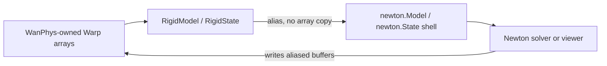
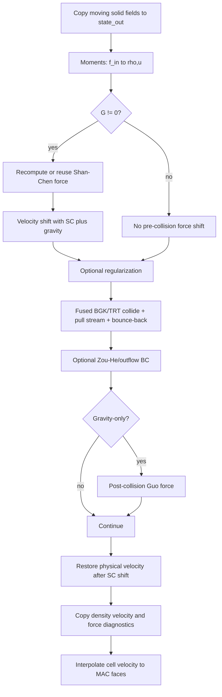
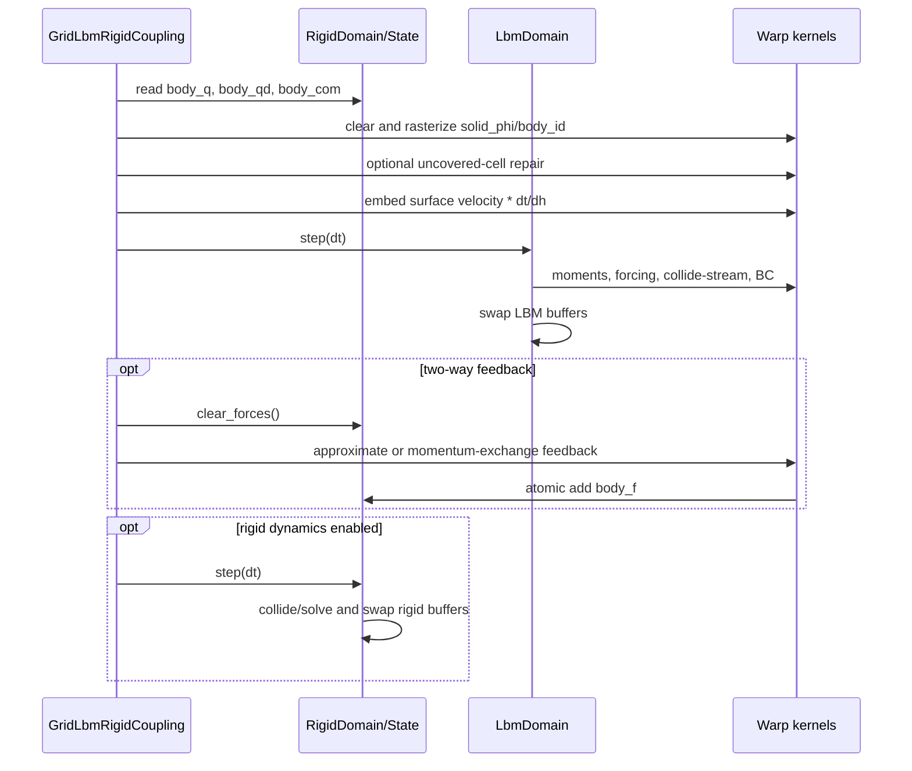

# WanPhys 扩展、LBM 与流固耦合实现

## 1. 文档范围和结论

仓库实际包名为 `wanphys/`。它不是简单复制 Newton，而是在 Warp 数据和 kernel 基础上增加了：

- 统一的 Domain/Composite 生命周期。
- 对 Newton 刚体构建、状态和求解器的隔离层。
- WanPhys 原生或改编的刚体、碰撞、粒子流体和网格流体实现。
- D3Q19 LBM、多相 Shan-Chen、TRT/正则化和刚体-LBM 耦合。
- 面向流体的 viewer、示例和诊断工具。

当前架构中，Newton 和 WanPhys 的关系必须分三类理解：

| 关系 | 当前做法 | 示例 |
|---|---|---|
| 直接委托 | WanPhys API 内部调用 Newton 实现 | `RigidModelBuilder` 委托 `newton.ModelBuilder` |
| 兼容桥 | WanPhys 拥有数组，构造零拷贝 Newton shell 给 solver/viewer | `RigidModel.as_newton_model()`、`RigidState.as_newton_state()` |
| WanPhys 原生 | 不走 Newton 求解核心，由 WanPhys Warp kernel 推进 | LBM、MAC liquid/smoke、部分 XPBD/SI/SemiImplicit、原生 collision pipeline |

LBM 本身不是从 Newton 官方库继承来的求解器。它遵循与 Newton 类似的 `Model / State / Solver + 双缓冲` 思路，但实际类、状态布局、碰撞/迁移 kernel 和耦合逻辑都位于 `wanphys/`。

## 2. 总体架构

```text
wanphys/
├── core.py / _src/core/
│   ├── domain.py                 # DomainModel/State/Solver/Domain 协议
│   └── composite.py              # 多 Domain 编排基类
├── rigid.py / _src/rigid/
│   ├── builder.py                # Newton builder 包装
│   ├── model.py                  # WanPhys-owned 刚体模型 + Newton shell
│   ├── state.py                  # WanPhys-owned 状态 + Newton state view
│   ├── solver.py                 # 统一 solver 接口和后端适配
│   └── domain.py                 # 刚体双缓冲生命周期
├── collision.py / _src/collision/
│   ├── rigid/                    # 原生刚体碰撞
│   ├── rigid_fluid/              # 原生刚体-粒子流体碰撞
│   └── pipeline.py               # 统一入口、缓存与 legacy bridge
├── fluid.py / _src/fluid/
│   ├── fluid_particle/           # PBF、WCSPH、DFSPH 等
│   ├── fluid_grid/
│   │   ├── liquid/               # MAC/FLIP 风格液体
│   │   ├── basic_vortex/         # 网格烟雾/涡量路径
│   │   ├── apic/                 # APIC
│   │   ├── lbm/                  # 本文重点 D3Q19 LBM
│   │   └── coupling/             # 网格流体-刚体耦合
│   └── fluid_viewer/             # 流体展示
├── geometry/                     # SDF、BVH、trimesh 和 shape distance
├── sensors/                      # 从 Newton 改编/扩展的传感器
└── examples/lbm/                 # LBM、多相和 FSI 示例
```

## 3. Domain 和 CompositeSimulation

### 3.1 统一协议

[`wanphys/_src/core/domain.py`](../../wanphys/_src/core/domain.py) 定义四个抽象角色：

- `DomainModel`：静态参数。
- `DomainState`：动态数组，至少支持 `clear_forces()`。
- `DomainSolver`：`step(state_in, state_out, dt, contacts, control)`。
- `Domain`：持有 model/solver/state，提供 `create_state()`、`step()` 和可选 `pre_step/post_step()`。

这个协议借鉴了 Newton 的职责划分，但把“一个物理子系统”提升为一级对象。刚体、粒子流体、MAC 网格流体和 LBM 可以各自拥有状态和求解器，再由耦合对象编排。

### 3.2 双缓冲

`RigidDomain` 和 `LbmDomain` 都维护 `_state_in/_state_out`：

```text
solver.step(state_in, state_out)
state_in, state_out = state_out, state_in
```

调用方通过 `domain.state` 读取当前有效状态。耦合代码中访问下划线字段是为了在一个组合步骤内精确控制 pre/post buffer；这属于内部实现，不是推荐的外部 API。

### 3.3 CompositeSimulation

[`wanphys/_src/core/composite.py`](../../wanphys/_src/core/composite.py) 提供组合仿真的时间、`step()` 和 `reset()` 骨架。具体耦合类决定子系统顺序。`GridLbmRigidCoupling` 继承该类，但覆写了完整 `step()`，因为 SDF、壁面速度、流体反馈和刚体推进必须按固定顺序执行。

## 4. WanPhys 刚体层怎样来自 Newton

### 4.1 构建阶段：委托 Newton

[`wanphys/_src/rigid/builder.py`](../../wanphys/_src/rigid/builder.py) 的 `RigidModelBuilder` 内部持有 `newton.ModelBuilder`。body、link、shape、joint、articulation、importer 等多数方法保持接近 Newton 的签名并转发调用。

`RigidModelBuilder.finalize()` 的执行顺序是：

```text
WanPhys RigidModelBuilder
        -> newton.ModelBuilder.finalize(device, requires_grad)
        -> temporary newton.Model
        -> RigidModel(newton_model)
```

因此场景拓扑验证、质量/惯量计算、shape 与 joint 设备数组的最初构造仍来自 Newton。

### 4.2 模型所有权：克隆到 WanPhys

[`wanphys/_src/rigid/model.py`](../../wanphys/_src/rigid/model.py) 的 `RigidModel` 构造时遍历临时 Newton Model：

- Warp array 用 `wp.clone()` 复制为 WanPhys-owned buffer。
- list/dict/set 做容器复制。
- 标量和只读对象直接保留值。
- 记录可用于构造兼容 Newton Model 的字段名。

这意味着 finalize 后的权威数据所有者是 `RigidModel`，而不是最初的临时 Newton Model。

### 4.3 零拷贝兼容 shell

当 Newton solver 或 viewer 仍需要 `newton.Model` 时，`RigidModel.as_newton_model()` 创建空 Newton Model，再把 WanPhys 持有的 Warp 数组按引用挂上去。`RigidState.as_newton_state()` 对状态做同样处理。



这里的“零拷贝”是指构造 shell 时不复制 GPU 数组，不是指 builder finalize 到 `RigidModel` 的最初所有权迁移；后者会 clone 数组。

### 4.4 求解器适配

[`wanphys/_src/rigid/solver.py`](../../wanphys/_src/rigid/solver.py) 定义 `RigidSolver` 协议。`_NewtonSolverAdapter`：

1. 用 `model._newton_backend` 构造 Newton solver。
2. 把 `RigidState` 转为零拷贝 Newton State view。
3. 调用 Newton 的 `step()`。
4. 必要时同步 Newton 新分配/替换的状态字段。

当前 factory 并非都走相同后端：

- `create_vbd_solver()`：Newton `SolverVBD` adapter。
- `create_xpbd_solver()`：WanPhys 自己的 XPBD 路径。
- `create_semiimplicit_solver()`：WanPhys `SymplecticEulerSolver`。
- `create_si_solver()`：WanPhys sequential impulse。
- `create_mujoco_solver()`：WanPhys MuJoCo bridge/backend。

因此不能把整个 `wanphys/_src/rigid/` 简化成“Newton 别名”。它是迁移中的隔离层，既保留后端兼容，也允许逐步替换。

### 4.5 碰撞层

[`wanphys/_src/collision/pipeline.py`](../../wanphys/_src/collision/pipeline.py) 提供统一 classmethod API：

- `collide_rigid()`：默认使用 WanPhys 原生 `RigidCollisionPipeline`。
- `collide_rigid_fluid()`：原生刚体-粒子流体碰撞。
- `collide_rigid_newton()` / `collide_rigid_fluid_newton()`：保留 legacy Newton bridge。
- `get_shape_query()`：缓存静态 shape query 数据，供 SDF/距离 kernel 使用。

管线按 domain、配置和模型 identity 缓存 bridge/pipeline，避免每步重建静态结构。

## 5. 网格流体基础

[`wanphys/_src/fluid/fluid_grid/base.py`](../../wanphys/_src/fluid/fluid_grid/base.py) 提供：

- `FluidGridModelBase`：`fluid_grid_res`、`fluid_grid_cell_size`、设备和压力求解配置。
- `FluidGridStateBase`：MAC staggered `vel_u/v/w`、pressure、density、`solid_phi` 和 `solid_body_id`。
- `FluidGridMacSolverBase`：速度对流、散度、压力求解、投影和边界处理模板。

LBM 复用 `FluidGridModelBase` 的网格尺寸与设备属性，但不继承 MAC pressure-projection 流水线。LBM 自己从分布函数恢复宏观量，不求解 Poisson 压力方程。

## 6. LBM 模块结构

```text
wanphys/_src/fluid/fluid_grid/lbm/
├── constants.py       # D3Q19 速度、权重、反向索引、BC/psi 类型
├── model.py           # LbmModel 参数和校验
├── state.py           # 分布函数、宏观量、固体和耦合字段
├── kernels.py         # 碰撞、迁移、边界、forcing、多相和初始化
├── solver.py          # 每一步 kernel 编排
└── domain.py          # 双缓冲和公共入口
```

## 7. D3Q19 离散模型

### 7.1 速度和权重

[`constants.py`](../../wanphys/_src/fluid/fluid_grid/lbm/constants.py) 定义 19 个离散速度：

- 1 个静止方向，权重 `1/3`。
- 6 个轴向方向，权重 `1/18`。
- 12 个面对角方向，权重 `1/36`。
- 格子声速平方 `c_s^2 = 1/3`。

方向顺序和 `OPPOSITE` 配对是 kernel 展开、TRT 奇偶分解、bounce-back 和 momentum exchange 的共同契约。修改方向顺序必须同时修改所有展开代码。

### 7.2 平衡分布

kernel 使用二阶低 Mach 平衡分布：

```math
f_i^{eq}=w_i\rho\left[1+3(c_i\cdot u)+\frac{9}{2}(c_i\cdot u)^2-\frac{3}{2}u^2\right]
```

宏观量由分布函数矩恢复：

```math
\rho=\sum_i f_i,\qquad \rho u=\sum_i c_i f_i
```

当前 `compute_moments_kernel` 把密度限制在 `[0.005, 10]`，防止低密度下 `F/rho` 发散，也作为强多相数值异常的保护。它是稳定性保护，不是严格守恒修正。

## 8. LbmModel：配置和派生参数

[`model.py`](../../wanphys/_src/fluid/fluid_grid/lbm/model.py) 继承 `FluidGridModelBase`，主要参数如下。

### 8.1 碰撞与黏度

```math
\omega_- = 1/\tau,\qquad \nu=c_s^2(\tau-1/2)
```

`tau` 必须大于 0.5。`lambda_trt == 0` 时 `omega_plus == omega_minus`，TRT 精确退化为 BGK。

开启 TRT 后：

```math
\Lambda=(\tau_+-1/2)(\tau_--1/2),\qquad
\tau_+=\Lambda/(\tau_--1/2)+1/2
```

代码把 even mode 用 `omega_plus` 松弛，odd mode 用 `omega_minus` 松弛。推荐的 halfway bounce-back magic 参数在 docstring 中为 `3/16`，但实际参数仍应根据稳定性测试设置。

`use_regularization` 和 `omega_reg` 控制碰撞前非平衡二阶 Hermite 投影的混合强度，用于抑制 ghost modes。

### 8.2 外力与多相

- `gravity_x/y/z`：格子单位加速度。
- `G`：Shan-Chen 相互作用强度；0 表示单相路径。
- `psi_type`：`rho`、指数 pseudopotential 或 Carnahan-Starling EOS。
- `psi_ref`：指数 psi 的参考密度。
- `cs_a/cs_b/cs_T`：CS EOS 参数。
- `sc_solid_psi_scale`：固体邻居虚拟 psi 相对本地 psi 的比例。
- `sc_boundary_psi`：非周期域边界的固定 psi；负值使用 legacy mirror closure。
- `sc_force_stride`：每 N 步重算一次 SC 力，中间复用缓存。
- `sc_homogeneous_early_out`：可选均匀区提前退出。

`sc_wall_G` 仅为构造兼容保留，当前 wetting 通过统一 SC 邻居求和中的 solid/boundary virtual psi 控制。

### 8.3 边界

六个 face 的 `bc_types`：

| 值 | 类型 | 实现位置 |
|---|---|---|
| 0 | halfway bounce-back | fused collide-stream 内 |
| 1 | Zou-He velocity | `apply_boundary_conditions_kernel` |
| 2 | convective/zero-gradient copy outflow | 同上 |
| 3 | periodic | pull-stream 邻居索引 wrap |

`bc_periodic=(px,py,pz)` 也可按轴开启周期。模型校验 periodic face 必须成对，且不能与同轴 velocity inlet 冲突。

## 9. LbmState：GPU 数据布局

[`state.py`](../../wanphys/_src/fluid/fluid_grid/lbm/state.py) 的主要字段：

| 字段 | 形状 | 用途 |
|---|---|---|
| `f` | flat `19 * nx*ny*nz` | 19 个分布函数，direction-major |
| `density` | `(nx,ny,nz)` | cell-center 密度 |
| `velocity_x/y/z` | `(nx,ny,nz)` | cell-center 物理宏观速度 |
| `vel_u` | `(nx+1,ny,nz)` | x-face 流体速度 |
| `vel_v` | `(nx,ny+1,nz)` | y-face 流体速度 |
| `vel_w` | `(nx,ny,nz+1)` | z-face 流体速度 |
| `vel_solid_u/v/w` | 对应 MAC 形状 | 固体壁面格子速度 |
| `solid_phi` | `(nx,ny,nz)` | 固体 SDF；负值为固体内部 |
| `solid_body_id` | `(nx,ny,nz)` | 最近/占据刚体编号，默认 -1 |
| `force_x/y/z` | `(nx,ny,nz)` | SC 力诊断场 |

分布函数采用 `f[d * stride + idx]`，其中 `idx=i*ny*nz+j*nz+k`。这种 direction-major flat layout 便于显式展开 19 个方向，但需要约两份 `19*N*float32` 双缓冲内存。

`clear()` 清理所有场并把 `solid_phi` 置为 1000；`clone()` 深拷贝全部数组。`clear_forces()` 是协议 no-op，因为 LBM 外力场由 solver 计算而不是像刚体 wrench 一样跨模块累加。

## 10. LbmDomain 和初始化

`LbmDomain` 持有一个 `LbmModel`、一个 `LbmSolver` 和两份 `LbmState`。`create_state()` 只分配，不自动把 `f` 初始化到平衡态；调用方通常需要：

```python
domain.create_state()
domain.solver.initialize_equilibrium(domain.state, rho0=1.0, u0=(0.0, 0.0, 0.0))
```

`initialize_equilibrium()` 同时填充 `f` 和 state 上的宏观字段，保证第一个可视化/耦合步骤前数据一致。

## 11. LbmSolver.step 的实际流水线

这是理解当前 LBM 的核心。`dt` 参数仅为 Domain API 兼容而接收；LBM kernel 内部始终推进 1 个 lattice timestep。



### 11.1 固体字段复制

`model.has_moving_walls` 为真时，把 `solid_phi`、`solid_body_id` 和 `vel_solid_*` 从输入状态复制到输出状态。耦合构造函数会自动设为真。静态无耦合场景可跳过这些显存复制。

### 11.2 碰撞与 pull streaming

`collide_stream_bounceback_kernel` 对每个目标 cell 拉取 `x-c_i` 的源分布：

- 源是有效 fluid cell：在源 cell 上做 TRT/BGK collision，并写目标方向。
- 源越界且该轴 periodic：wrap 到另一端。
- 源是固体或非周期越界：使用当前 cell 的反方向分布做 halfway bounce-back。

TRT 对单方向和反方向做奇偶分解：

```math
f_i^+=(f_i+f_{\bar i})/2,\qquad f_i^-=(f_i-f_{\bar i})/2
```

并分别用 `omega_plus`、`omega_minus` 向平衡奇偶部分松弛。二者相等即 BGK。

当前 kernel 为手工展开的 D3Q19 实现。优点是方向和分支明确，编译器可展开；代价是修改格子格式或边界公式时必须同步大量重复段。

### 11.3 静止和移动 bounce-back

静止墙把分布沿反方向反弹。移动墙增加：

```math
\Delta f_i=2w_i\rho(c_i\cdot u_{wall})/c_s^2
```

轴向 link 读取穿过的 MAC face；面对角 link 对跨越半 link 的相邻 MAC faces 取平均。该方法实现局部 moving-wall no-slip，但仍是 halfway/link-based 近似，不是基于精确 SDF 交点的二阶曲面插值边界。

### 11.4 Guo gravity-only forcing

当 `G == 0` 且 gravity 非零，当前代码在 collide-stream 和普通边界处理之后对 `state_out.f` 施加 Guo 项，系数包含 `(1-omega/2)`。这修正了旧审计所述的“碰撞前施力”问题。

### 11.5 Shan-Chen forcing

当 `G != 0`，对 fluid-fluid、fluid-solid 和 fluid-domain-wall 使用统一 pseudopotential 求和：

```math
F(x)=-G\psi(x)\sum_i w_i\psi(x+c_i)c_i
```

- fluid 邻居使用实际 `psi(rho)`。
- `solid_phi < 0` 的刚体邻居使用 `psi_c * sc_solid_psi_scale`。
- 非周期越界边界使用固定 `sc_boundary_psi` 或 mirror closure。
- periodic 邻居 wrap 后使用对侧实际流体 psi。

力通过 velocity shift 进入平衡态速度：

```math
u_{eq}=u+\tau_-\left(F/\rho+g\right)
```

碰撞和边界消费 `u_eq` 后，`restore_physical_velocity_kernel` 用相同参数减去 shift，再把物理速度写入 `state_out.velocity_*` 和 MAC face。旧审计所述“输出 equilibrium velocity”问题在当前代码中已修正。

### 11.6 Carnahan-Starling EOS

`PSI_CS` 先计算 CS pressure，再从 EOS 与理想格子压力之差构造 psi。当前实现对根号参数做非负截断。`cs_T` 必须低于适当临界区才可能产生期望相分离；实际密度比和稳定性高度依赖参数、初始条件、分辨率和 precision。

### 11.7 普通边界后处理

Zou-He velocity boundary 重建未知入射分布；outflow 将邻近内层 cell 的 19 个分布复制到边界。periodic 已在 pull streaming 中处理。全为 bounce-back 时，solver 直接跳过该 kernel launch。

## 12. 时间和单位

这里最容易误用。

### 12.1 LBM 内部

LBM 每次 `LbmSolver.step()` 固定推进一个格子时间单位，传入的世界 `dt` 不参与 collision/stream 公式。因此 `tau`、gravity、velocity inlet、SC 参数和宏观速度都在 lattice-unit 稳定性范围内解释。

### 12.2 刚体到 LBM 的速度换算

刚体状态使用世界单位：位置 m、线速度 m/s、角速度 rad/s。对世界表面速度：

```math
v_{surface}=v_{com}+\omega\times(x-x_{com})
```

耦合层转换为每个 LBM step 的格子速度：

```math
u_{wall}^{lbm}=v_{surface}^{world}\frac{dt}{dh}
```

所以组合仿真的 `dt` 虽不改变 LBM kernel 的“1 lattice step”，却决定世界刚体位移如何映射到格子壁面速度。

默认警告阈值是 `|u_wall_lbm| > 0.125`。警告不裁剪速度，只提示减小世界速度、减小 `dt` 或增大 `dh`。低 Mach 原则仍需由场景参数保证。

## 13. 刚体到 LBM 的单向耦合

核心类是 [`grid_lbm_rigid_coupling.py`](../../wanphys/_src/fluid/fluid_grid/coupling/grid_lbm_rigid_coupling.py) 的 `GridLbmRigidCoupling`。

### 13.1 显式注册耦合 shape

创建 coupling 后必须用 `add_body_sphere/box/capsule/mesh()` 注册要栅格化的 body 和几何参数。当前实现不会自动遍历 Newton/WanPhys Model 中所有 shape 生成 coupling 列表。

注册数据上传为 SoA 设备数组，包括 shape type、半径/half extents、mesh handle/scale、保守包围半径以及 coupling entry 到 Newton body id 的映射。

### 13.2 SDF 栅格化

每步先把：

```text
solid_phi = 1000
solid_body_id = -1
vel_solid_u/v/w = 0
```

然后 `rasterize_all_body_sdf_warp` 在每个 cell center `(i+0.5,j+0.5,k+0.5)*dh` 计算所有注册 body 的距离，保留最小距离和对应 body id。

支持 sphere、oriented box、z-axis local capsule 和 Warp mesh query。多 shape 目前按 coupling entry 遍历，复杂场景成本约为 `O(num_cells * num_registered_bodies)`，没有在该 kernel 内使用 broad-phase culling。

### 13.3 固体表面速度写入

对每个 MAC face，根据两侧 cell 的 `solid_phi` 和 `solid_body_id` 选择占据 body。随后读取：

- `rigid_state.body_q`
- `rigid_state.body_qd`
- Newton-compatible model 的 `body_com`

计算 face 世界位置处的刚体表面速度，再乘 `dt/dh`，只写对应 face 的法向速度分量到 `vel_solid_u/v/w`。LBM moving-wall helper 会为对角 link 组合多个分量。

### 13.4 新暴露 cell 修复

移动固体离开后，原先固体内部的 cell 重新成为流体。如果保留旧 `f/rho/u`，会暴露 stale state。默认单向耦合路径保存上一帧 `solid_phi`，对“上一步固体、当前流体”的 cell：

1. 从六个稳定流体邻居平均 rho/u。
2. 没有邻居时使用 `initial_density` 和零速度。
3. 对密度和速度做保护性限制。
4. 用新宏观量重建 D3Q19 equilibrium distributions。

双向反馈启用时该修复默认不执行，以保留 pre/post distribution history 供 momentum exchange 诊断。这是一个明确的实现折中。

## 14. 流体到刚体的双向反馈

双向反馈默认关闭。通过 `set_two_way_feedback_enabled(True, force_scale)` 开启，并可选两种模式。

### 14.1 `approx` 宏观速度近似

对每个邻接固体的 fluid cell，检查相对法向速度：

```math
u_{rel,n}=u_{fluid}\cdot n-u_{wall,n}
```

仅当其为正时累计：

```math
\Delta F=\rho u_{rel,n}dh^2 n,\qquad
\Delta\tau=(x_{face}-x_{com})\times\Delta F
```

该路径计算便宜、方向直观，但注释明确称为 early two-way approximation。它没有完整恢复物理量纲，结果依赖 `feedback_force_scale` 标定。

### 14.2 `momentum_exchange`

严格路径扫描每条 fluid-solid D3Q19 link，读取 collide-stream 前后的分布：

```math
\Delta p_i\propto-c_i\left(f_i^{post}+f_{\bar i}^{pre}\right)
```

再以 link midpoint 对 COM 计算力矩，并原子累加到 `rigid_state.body_f`。代码乘 `dh^3 * force_scale` 作为体积/标定因子，但没有根据物理密度尺度和 `dt` 完成通用 SI 力转换。因此“strict”表示 distribution-based momentum exchange 公式相对宏观近似更严格，不表示输出已自动具有跨场景可移植的牛顿单位。

### 14.3 时序和 force 生命周期

组合步骤顺序：

```text
prepare rigid boundary
    -> fluid_domain.step(dt)
    -> rigid_state.clear_forces()
    -> accumulate LBM feedback into body_f
    -> optional rigid_domain.step(dt)
```

`get_last_lbm_feedback_wrench()` 保存本次反馈增量用于诊断。若启用刚体推进，求解器消费当前 `body_f`；若禁用推进，wrench 仍可读取。

需要留意：调用 `rigid_state.clear_forces()` 会清除该时刻已存在的其他外力。若未来要组合重力外的用户力、接触力和多个耦合器，应明确统一的 force accumulation owner 和顺序。

## 15. 完整耦合步骤



这是弱耦合/顺序分裂：每个组合 step 内流体使用步初刚体状态，刚体再使用步末流体反馈，没有同一时间步内的流固迭代收敛。

## 16. Shan-Chen wall force 与双向反馈的区别

两者都可能被口语称为“流固作用”，但实现和物理含义不同：

| 机制 | 数据路径 | 目的 |
|---|---|---|
| solid virtual psi / wall wetting | `solid_phi -> SC force -> fluid equilibrium velocity` | 控制液相对固体的吸引/排斥和接触角趋势 |
| moving-wall bounce-back | `body velocity -> vel_solid -> reflected f` | 让移动固体边界拖动流体 |
| two-way feedback | `fluid f/rho/u -> body_f` | 让流体反作用力/矩影响刚体 |

调整 wetting 参数不会自动得到正确刚体浮力；开启 moving wall 也不等于开启双向反馈。

## 17. 示例和测试

### 17.1 示例

`wanphys/examples/lbm/` 包含：

- dam break 和双球 FSI。
- pool drop、droplet fall/floor/splash/coalescence。
- spinodal decomposition。
- `dambreak_mem/` 下的可视化、力分解和验收场景。

示例承担参数演示作用，不应直接视为稳定 API。部分示例文件在当前分支有本地修改，本文只描述公共 solver/coupling 实现。

### 17.2 测试覆盖

当前 LBM 相关测试位于 `newton/tests/test_lbm_*.py`，主要覆盖：

- 静态/移动/旋转球体的 SDF 和壁面速度写入。
- 世界速度到 lattice velocity 的 `dt/dh` 换算和高速度警告。
- 流体场有限性和移动障碍更新。
- approximate feedback 的 force/torque。
- momentum exchange 的静态平衡、反作用方向、偏心 torque 和有限性。
- Shan-Chen solid scale、boundary psi、模型参数校验和 force stride。
- dam-break、falling sphere 和 viewer-null smoke/验收指标。

测试路径名称容易误导；这些测试导入的是 WanPhys LBM，并不表示 LBM 已成为 Newton 官方上游模块。

## 18. 当前实现的边界和风险

### 18.1 已明确的近似

- D3Q19、isothermal、弱可压缩、低 Mach 假设。
- uniform Cartesian grid，无 AMR。
- 曲面边界使用 cell-center SDF 分类和 halfway bounce-back，无精确交点插值。
- SDF 栅格化对注册 body 全遍历，body 数量大时成本高。
- sequential loose coupling，无流固子迭代。
- 双向反馈的物理单位需场景标定。
- 多相 Shan-Chen 的密度比、接触角和稳定域需实验校准。
- float32 为主，长时间质量漂移需要监控。

### 18.2 API/所有权风险

- `model._newton_backend`、domain 的 `_state_in/_state_out` 和 `_src` 导入是内部接口。
- `GridLbmRigidCoupling` 的类 docstring 仍称 one-way，但代码已支持可选 two-way；应以后续 API 清理为准。
- coupling shape 需要显式注册，若参数与 rigid model shape 不一致，SDF 和碰撞几何会不一致。
- mesh coupling 依赖有效 Warp mesh handle、符号距离 query 和统一 scale。
- 两种 feedback 模式与 uncovered-cell repair 当前存在互斥行为。

### 18.3 旧审计如何使用

[`docs/wanphys/lbm_core_audit_zh.md`](../wanphys/lbm_core_audit_zh.md) 是有价值的历史审计，但以下条目已不再按原描述成立：

- gravity-only Guo force 已移到 post-collision。
- SC velocity shift 后已恢复 physical velocity。

其他优化建议如 kernel 融合、质量监控、checkpoint、曲面二阶边界、MRT/LES/更高阶格子仍可作为 roadmap 候选，但应在实施前重新验证当前代码。

## 19. 修改 LBM 时的同步清单

### 19.1 修改方向/格子

同步检查：

- `constants.py` 的 `CX/CY/CZ/W/OPPOSITE`。
- equilibrium、moments 和 initialize kernel。
- collide-stream 手工展开段。
- Zou-He reconstruction。
- moving wall sampling/correction。
- SC 邻居求和。
- momentum exchange 的 link 扫描。
- `LbmState.f` 分配大小和测试。

### 19.2 修改时间或单位

同步检查：

- `LbmSolver.step()` 是否仍忽略世界 `dt`。
- rigid `dt/dh` velocity scale。
- gravity 和 inlet velocity 的单位说明。
- feedback force 的 SI/lattice 转换。
- wall velocity warning 阈值和示例参数。

### 19.3 修改固体边界

同步检查：

- `solid_phi` 的符号约定。
- `solid_body_id` 归属。
- SDF 栅格化与 rigid collision shape 是否一致。
- MAC face body id 选择。
- moving-wall diagonal sampling。
- 新暴露 cell 修复。
- approximate 和 momentum-exchange feedback。

## 20. 建议的源码阅读顺序

1. `wanphys/_src/core/domain.py` 和 `composite.py`。
2. `wanphys/_src/rigid/builder.py`、`model.py`、`state.py`、`solver.py`。
3. `wanphys/_src/fluid/fluid_grid/lbm/constants.py`。
4. `model.py` 和 `state.py`。
5. `solver.py` 的 `LbmSolver.step()`。
6. `kernels.py` 的 moments、TRT、collide-stream、SC 和 BC。
7. `coupling/grid_lbm_rigid_coupling.py` 的 `step()`。
8. `coupling/coupling_kernels.py` 的 SDF、surface velocity 和 feedback。
9. `newton/tests/test_lbm_rigid_coupling.py` 与 `test_lbm_shan_chen_wall_force.py`。

## 21. 最小使用骨架

```python
from wanphys._src.fluid.fluid_grid.lbm import LbmDomain, LbmModel
from wanphys.rigid import RigidDomain, RigidModelBuilder
from wanphys._src.fluid.fluid_grid.coupling import GridLbmRigidCoupling

fluid_model = LbmModel(
    fluid_grid_res=(64, 64, 64),
    fluid_grid_cell_size=0.02,
    tau=0.55,
)
fluid = LbmDomain(fluid_model)
fluid.create_state()
fluid.solver.initialize_equilibrium(fluid.state, rho0=1.0)

builder = RigidModelBuilder(gravity=-9.81)
body = builder.add_body(position=(0.5, 0.5, 0.8))
builder.add_shape_sphere(body, radius=0.1)
rigid = RigidDomain(builder.finalize(device=fluid_model._device))
rigid.create_state()

simulation = GridLbmRigidCoupling(fluid, rigid)
simulation.add_body_sphere(body, radius=0.1)

for _ in range(1000):
    simulation.step(1.0 / 120.0)
```

示例只展示对象关系。实际场景还必须设置初始液体分布、多相参数、边界、稳定时间尺度、feedback mode/scale 和验收指标。
