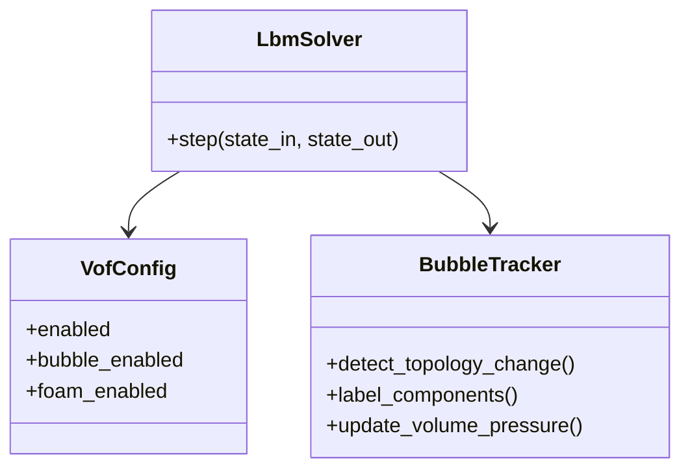
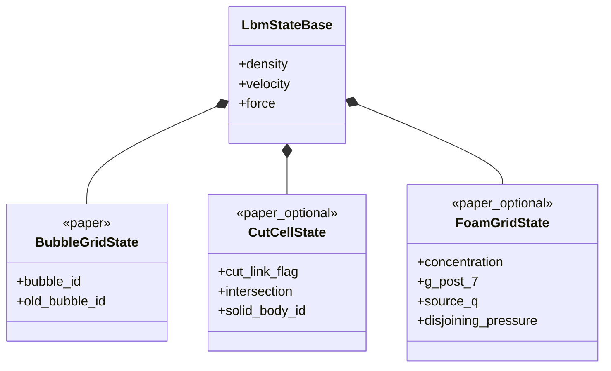
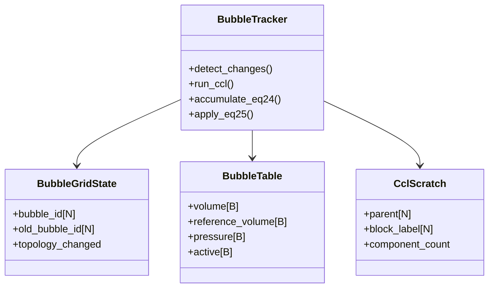
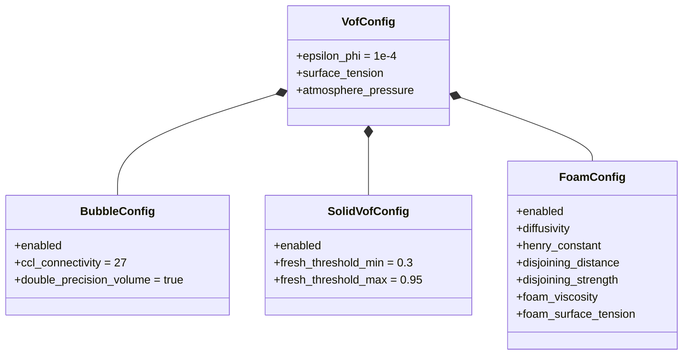

# 气泡、固体耦合与泡沫扩展数据结构

本文从[基础数据结构与 UML](03-data-model-and-uml.md) 中拆出仅在气泡、移动固体
或泡沫阶段启用的可选状态、模块、配置和生命周期约束。核心 VOF 数据结构不依赖
这些扩展；启用扩展时，它们与核心状态组合。

## 1. 扩展模块 UML



`BubbleTracker` 来自论文气泡拓扑、体积和压力更新要求。固体耦合和泡沫扩展在
当前设计中只固定状态与配置边界，尚未定义独立的顶层模块 class。

## 2. 扩展持久状态 UML



论文内存表列出 cut-cell 和 bubble info；泡沫阶段还需保存溶解气体与排斥压力相关
状态。这些字段均不应让未启用扩展的核心 VOF 状态承担分配成本。

## 3. 固体耦合数据与 link role

不要把 `SOLID` 强行并入核心 `cell_type`：

- 论文的 L/I/G 描述流体/气相占据；
- solid/cut-cell 是另一组几何和 link 属性；
- 一个 interface 节点也可能同时是 cut-cell node。

因此建议使用正交表示：

```text
cell_type     -> L/I/G
solid_phi     -> 固体内外
body_id       -> 固体归属
cut_link_flag -> 哪些 lattice links 穿过固体
intersection  -> 格链与固体表面的交点
```

这种表示能覆盖论文的 fluid/interface cut-cell 和 gas cut-cell 规则。核心 link role
枚举在启用固体耦合时增加：

```text
SOLID_LINK
```

生产实现可从 `solid_phi`、`body_id` 和 `cut_link_flag` 即时推导该角色；若为了调试
显式保存，仍应视为可选的 `Q*N` 数据。

建议字段：

| 字段 | 逻辑形状 | 建议类型 | 缓冲 | 来源 |
|---|---:|---|---|---|
| `solid_phi` | `N` | float | 双或静态 | 现有项目 |
| `body_id` | `N` | int32 | 双或静态 | 现有项目 |

## 4. 气泡数据 UML 与字段



论文要求：

- `bubble_id` 和 `old_bubble_id` 覆盖所有 G/I 节点；
- `volume` 和 `reference_volume` 使用双精度；
- Eq. (24) 用 atomic add；
- cut-cell 不进入 CCL；
- bubble pressure 由 Eq. (25) 更新。

`parent/block_label` 的具体布局依 CCL 实现而定，属于项目 scratch。

| 字段 | 逻辑形状 | 建议类型 | 来源 |
|---|---:|---|---|
| `bubble_id` | `N` | int32 | 论文 |
| `old_bubble_id` | `N` | int32 | 论文 |
| `bubble_volume` | `B` | float64 | Eq. (24) |
| `bubble_reference_volume` | `B` | float64 | Eq. (24) |
| `bubble_pressure` | `B` | float64 | Eq. (25) |
| `bubble_active` | `B` | uint8 | 项目管理 |

## 5. 扩展配置 UML



其中：

- bubble 27 邻域、双精度累计来自论文；
- fresh threshold 端点来自论文经验范围；
- foam 参数来自 Eq. (33)-(43)。

## 6. 扩展生命周期不变量

启用相应扩展后，每个可交换状态缓冲还必须满足：

```text
bubble_id 与 bubble table 同一 CCL epoch
```

`clone()`、`clear()`、双缓冲交换、初始化和 reset 必须同时维护已启用扩展的状态，
不能只复制 kinetic/core VOF state 而遗漏 bubble epoch 或其他已启用的扩展状态。
