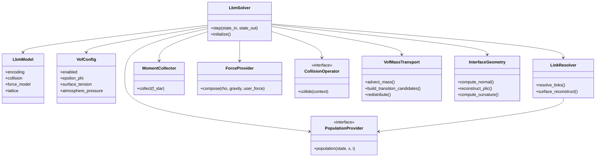
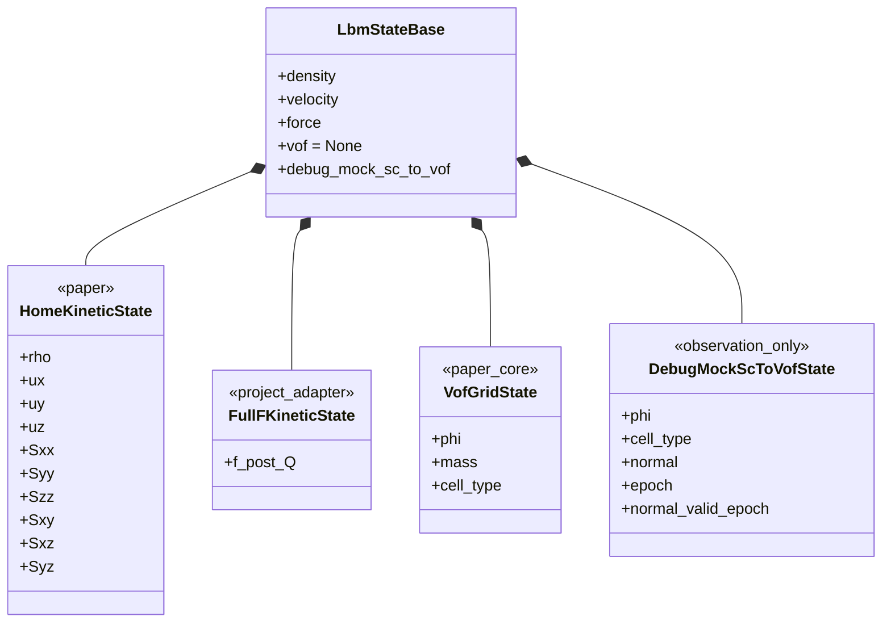
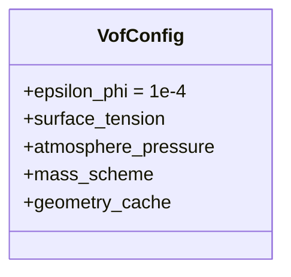

# 基础数据结构与 UML

## 1. 设计原则

### 1.1 论文状态与工程 scratch 分开

论文 Sec. 5.1 使用 SoA，并为时间推进保存两份 HOME 的 10 个 velocity moments。
论文内存表还列出双缓冲 `phi` 和 `mass`，以及 flag。气泡、固体耦合和泡沫的
可选状态见 [03-B-bubble-solid-foam-extensions.md](03-B-bubble-solid-foam-extensions.md)。

项目中建议区分：

```text
Persistent state
    必须跨 step 保存并参与双缓冲交换

Derived/cache state
    可由 persistent state 重建，但可能为性能持久保存

Scratch
    仅在一个 step 内有效，由 solver 持有并复用
```

### 1.2 论文与项目适配标记

- `paper`：论文直接要求或明确列出；
- `project`：为了当前 FullF/HOME、domain BC 和 Warp 执行设计增加。

### 1.3 阶段一实现状态

P0 保持 Shan-Chen 为唯一已实现的物理多相模型，仅在最终宏观密度写出后生成独立
调试状态。正式 VOF 与调试副本不共用容器：

| UML 内容 | 阶段一状态 |
|---|---|
| `VofCellType` | 已实现 `GAS / INTERFACE / LIQUID`，使用 `uint8` |
| `state.vof / VofGridState` | P1 authoritative 容器，P0 未实现且恒为 `None` |
| `DebugMockScToVofState` | 已实现调试 `phi/cell_type/normal/epoch`；没有 `mass` |
| `InterfaceGeometry` | 已实现液体指向气体的 Parker-Youngs normal |
| `DebugVofView` | 已实现只读渲染输入；不拥有也不计算物理状态 |
| `interface_model` | 已实现 `off/shan_chen/vof` 契约；`vof` 在 P0 fail-fast |
| `debug_vof_observation` | 已实现 SC 调试观察开关 |
| `VofConfig` | P1 未实现 |
| `VofMassTransport` | 未实现 |
| `LinkResolver` surface reconstruction | 未实现 |

阶段一的 `phi` 来源是：

\[
\phi_{debug}
=
\operatorname{clamp}
\left(
\frac{\rho-\rho_g}{\rho_l-\rho_g},
0,1
\right).
\]

它不是 Eq. (9)-(10) 推进得到的守恒 VOF 状态，只能写入
`state.debug_mock_sc_to_vof`，不能进入 streaming、collision、forcing 或边界处理。

## 2. 顶层模块 UML



说明：

- `PopulationProvider` 统一 FullF 直接读取与 HOME Eq. (16) 重构。
- `LinkResolver` 是项目抽象；论文没有定义统一 link-role class。
- `VofMassTransport` 的 Eq. (9)-(10) 有论文依据，但重标记和重分配的并行细节没有。
- `InterfaceGeometry` 的 PLIC/curvature 有论文依据，class 边界是项目设计。

## 3. 持久状态 UML



实际状态只应包含一种 kinetic encoding：

```text
HOME -> HomeKineticState
FullF -> FullFKineticState
```

图中同时画出是为了表示可替换关系，不代表同时分配。P0 只可能分配
`DebugMockScToVofState`；P1 开始后 `VofGridState` 的分配必须与观察开关无关。

## 4. 建议字段表

### 4.1 核心持久字段

| 字段 | 逻辑形状 | 建议类型 | 缓冲 | 来源 |
|---|---:|---|---|---|
| `rho` | `N` | float | 双 | 论文 HOME |
| `u_x/u_y/u_z` | `N` | float | 双 | 论文 HOME |
| `S_xx...S_yz` | `6N` | float | 双 | 论文 HOME |
| `phi` | `N` | float | 双 | 论文 VOF |
| `mass` | `N` | float | 双 | 论文内存表 |
| `cell_type` | `N` | uint8/int32 | 双或当前/下一 | 论文 flag |

`N = nx * ny * nz`。

### 4.2 几何字段

| 字段 | 逻辑形状 | 建议类型 | 属性 |
|---|---:|---|---|
| `normal` | `N x 3` | vec3 float | 可持久缓存 |
| `plic_offset` | `N` | float | 可持久缓存 |
| `curvature` | `N` | float | 可持久缓存 |
| `geometry_epoch` | scalar | int64 | 项目失效管理 |

论文没有把这些字段列为持久内存。第一版可以先持久保存以简化时间语义；性能稳定后
再决定按需计算或压缩。

### 4.3 Solver scratch

| 字段 | 逻辑形状 | 用途 |
|---|---:|---|
| `f_star` | `Q*N` | 完整 streamed populations |
| `rho_star/j_star/S_star` | 依碰撞需要 | moment collection |
| `force_star` | `3N` | 统一力密度 |
| `phi_tmp/mass_tmp` | `N` | 重标记前临时值 |
| `transition_candidate` | `N` | 类型转换请求 |
| `redistribution_delta` | `N` 或 `Q*N` | 守恒重分配 |
| `link_role` | 可选 `Q*N` | 调试/两阶段边界解析 |
| `missing_mask` | 可选 `N` bitset | gas/domain 未知方向 |

论文实现强调 on-the-fly population reconstruction，因此 `f_star` 作为完整持久状态
不符合其内存目标；把它作为 solver scratch 是本项目简化多碰撞路径和调试的适配。

## 5. Cell type

建议基础枚举：

```text
LIQUID
INTERFACE
GAS
```

`cell_type` 只描述论文的液体/界面/气体占据。扩展状态如何与它正交组合，见
[03-B 的固体耦合数据](03-B-bubble-solid-foam-extensions.md#3-固体耦合数据与-link-role)。

## 6. Link role

若为了调试显式保存 link role，建议使用：

```text
PERIODIC_PULL
FLUID_PULL
GAS_SURFACE
DOMAIN_BOUNDARY
INVALID
```

这是项目枚举，不是论文数据结构。生产实现可以从坐标、`cell_type` 和 domain BC
即时推导，避免 `Q*N` 额外内存。固体耦合启用时增加的 link role 见
[03-B](03-B-bubble-solid-foam-extensions.md#3-固体耦合数据与-link-role)。

## 7. 配置 UML



其中：

- `epsilon_phi=1e-4` 来自论文；
- 阶段一的 `vof_debug_epsilon=0.05` 仅用于把密度派生的 bounded `phi` 分类为
  L/I/G，不是论文的转换阈值，也不属于未来正式 `VofConfig`；
- `mass_scheme` 和 `geometry_cache` 是项目决策。

扩展配置见
[03-B 的扩展配置 UML](03-B-bubble-solid-foam-extensions.md#5-扩展配置-uml)。

## 8. 生命周期不变量

每个可交换的状态缓冲必须满足：

```text
kinetic fields 与 cell_type 同一时间层
phi 与 mass 同一时间层
geometry 若标记 valid，则与同一 phi/type epoch 对应
所有 INTERFACE 都有可用的 kinetic state
authoritative VOF 模式下，所有 GAS 的 kinetic state 被明确视为无效
```

`clone()`、`clear()`、双缓冲交换、初始化和 reset 必须同时维护这些字段；不能只复制
kinetic state 而遗漏 VOF 状态。扩展状态还需满足的生命周期不变量见
[03-B](03-B-bubble-solid-foam-extensions.md#6-扩展生命周期不变量)。

阶段一 observation 模式是该不变量的显式例外：SC 仍在所有参与计算的格点上演化
kinetic state，`cell_type=GAS` 只表示密度分类结果，不表示 kinetic state 无效。
阶段一已经保证 `phi / cell_type / normal` 与输出 density 同一时间层，且
`geometry.valid_epoch == vof.epoch`。
