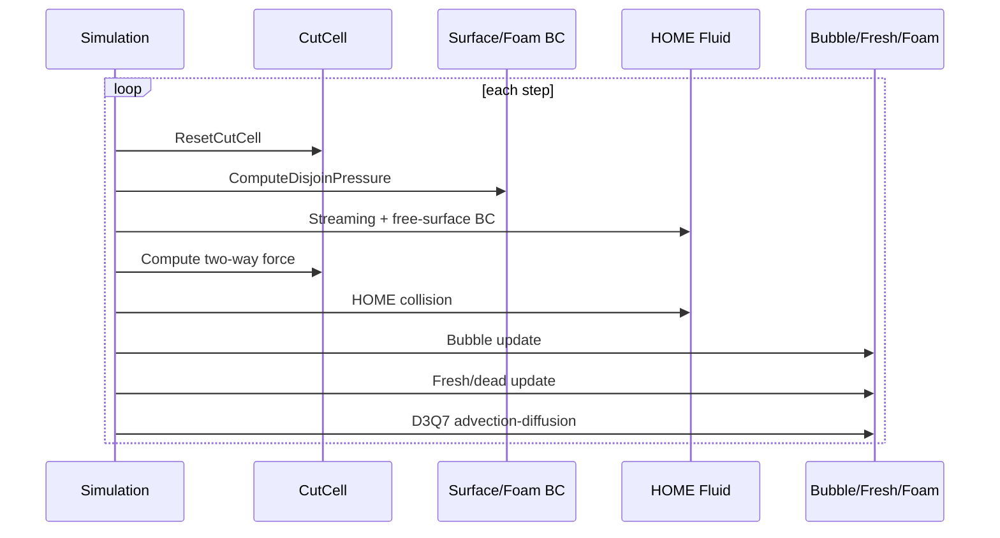
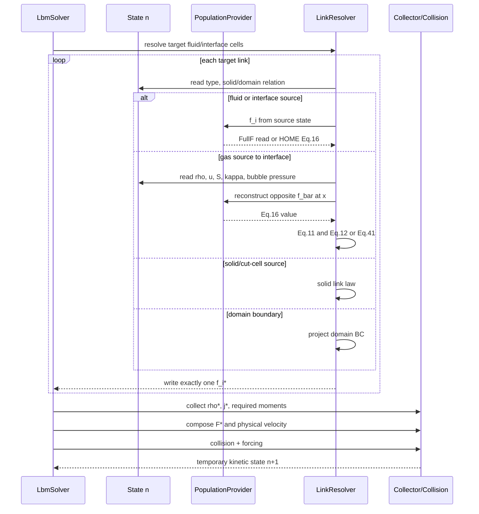
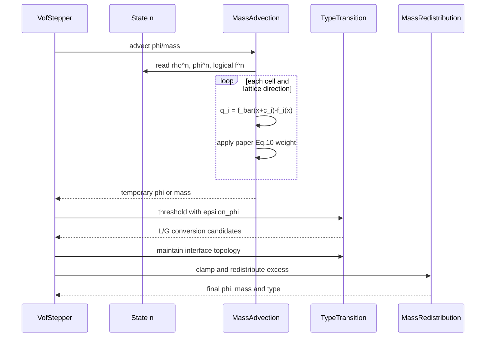
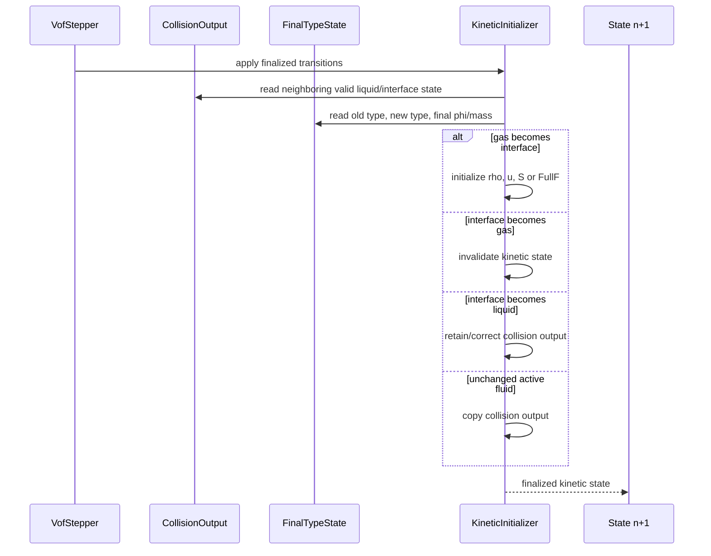
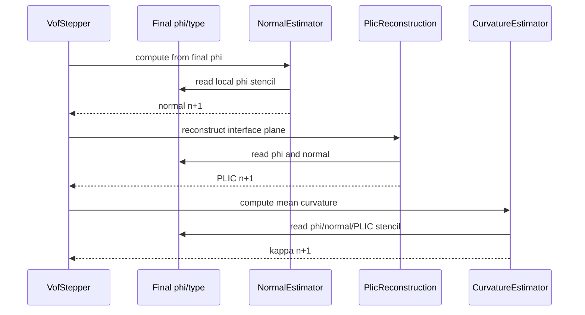
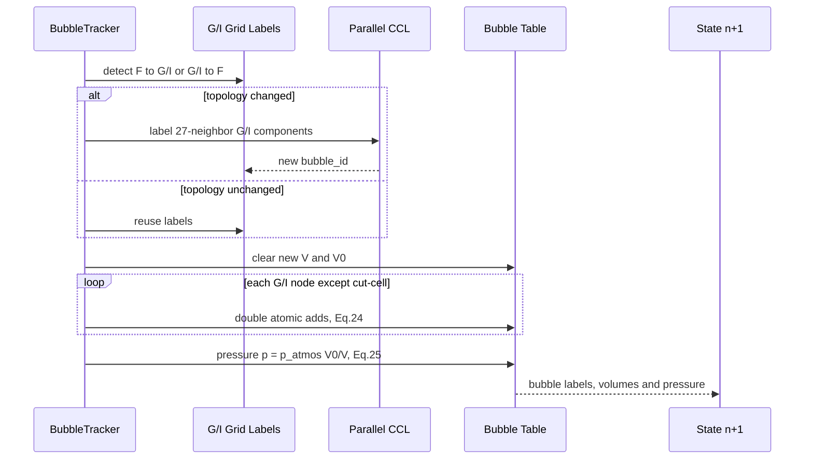
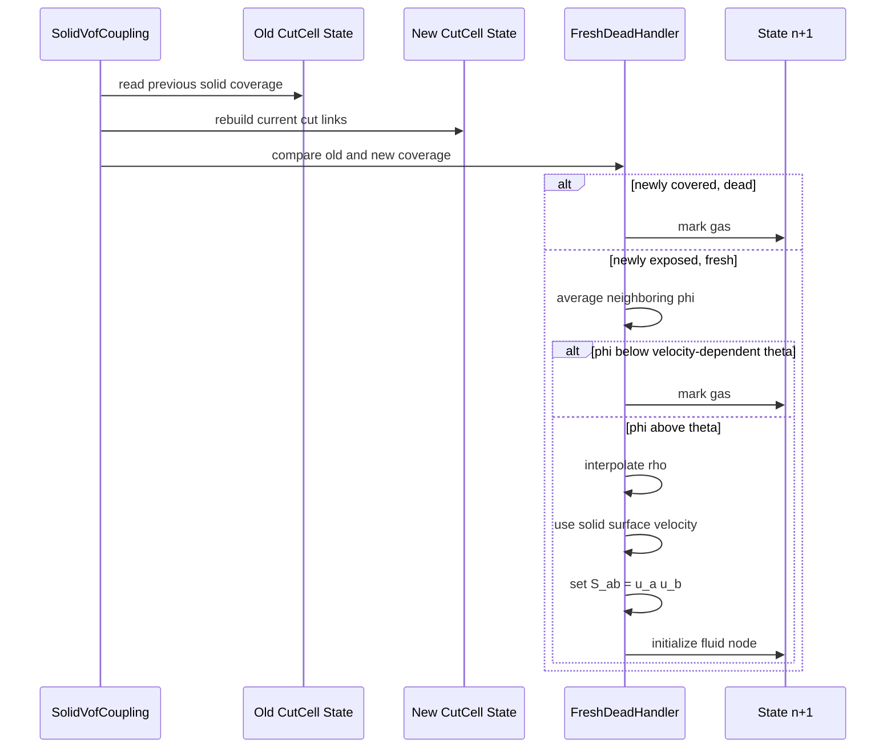
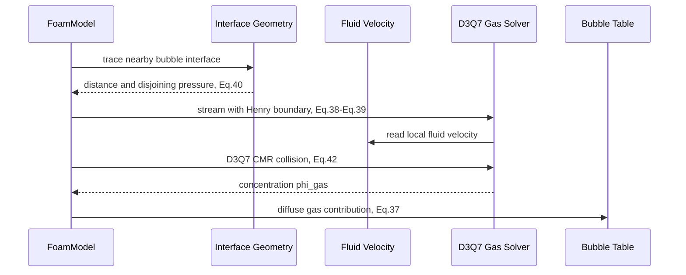

# 时序图

为便于阅读，本文件不画一张包含全部功能的总图，而按论文模块切分。图中：

- `paper` 表示论文明确时序；
- `project` 表示本项目为模块化加入的时序；
- 可选模块不阻塞核心自由表面。

## 1. 论文 Algorithm 1 顶层时序

这张图只复述论文 Algorithm 1，不加入质量重标记和几何缓存等推断步骤。



说明：

- `ComputeDisjoinPressure` 和 D3Q7 仅在 foam 模式启用。
- `ResetCutCell`、two-way force 和 fresh/dead 仅在移动固体/耦合启用。
- 论文没有在 Algorithm 1 中单列 Eq. (9) 质量更新、重分配和 PLIC 更新。

## 2. LBM population 时序

该图覆盖 streaming、gas surface reconstruction、moment collection、外力和 collision。



论文支持：

- HOME Eq. (16)-(17) 重构；
- gas-to-interface Eq. (11)；
- Eq. (12)/(41) 的自由表面密度；
- collision 的 Eq. (13)、(18)-(21)。

项目适配：

- 统一 `LinkResolver`；
- FullF provider；
- 通用 domain BC；
- `f_star` scratch；
- 把现有多 collision backend 接在统一 collector 后。

## 3. 质量平流与 TYPE 重标记时序

论文 Eq. (9) 使用旧状态 `rho(x,t)`，因此这一模块不等待 LBM collector 的 `rho*`。



其中只有以下部分由本文直接说明：

```text
Eq. (9)-(10)
epsilon_phi = 1e-4
I -> L/G 阈值
clamp 到 1/0
守恒重分配到邻居
```

`maintain interface topology`、并行冲突解决和具体重分配时序是项目待定设计，论文只
引用 Lehmann 2019。

## 4. Kinetic 类型转换时序

这张图是项目必须补充的适配，不是论文 Algorithm 1 中的独立模块。



论文没有给出一般 VOF `gas -> interface` 的完整初始化公式。不能把 Sec. 4.3 的
moving-solid fresh-node 方法直接当作通用 VOF 初始化，二者物理事件不同。

## 5. 几何更新时间序

论文确认 PLIC 用于 curvature，但没有规定它在 Algorithm 1 中的精确调度位置。
以下是保证下一步 Eq. (12) 可直接读取一致几何的项目时序。



下一步 surface reconstruction 使用同一 epoch 的：

```text
phi, type, normal, PLIC, kappa
```

## 6. 气泡时序



该时序由论文 Sec. 4.2 直接支持。CCL 的具体 GPU 数据布局依项目选择。

## 7. 移动固体 fresh/dead 时序



这是论文 Sec. 4.3 的 fresh/dead，不能与一般 VOF 类型重标记合并命名。

## 8. 泡沫扩展时序



该模块使用的 dissolved-gas concentration 应采用不同变量名，避免与液体体积分数
`phi` 混淆。
