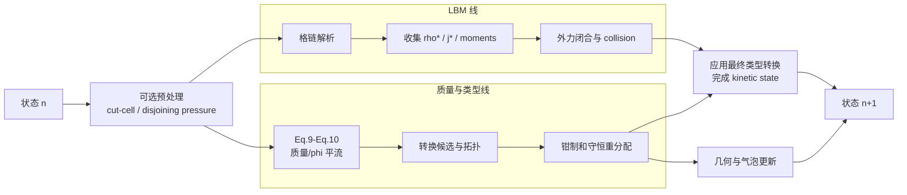
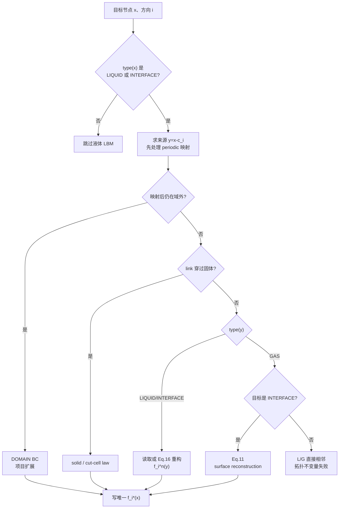
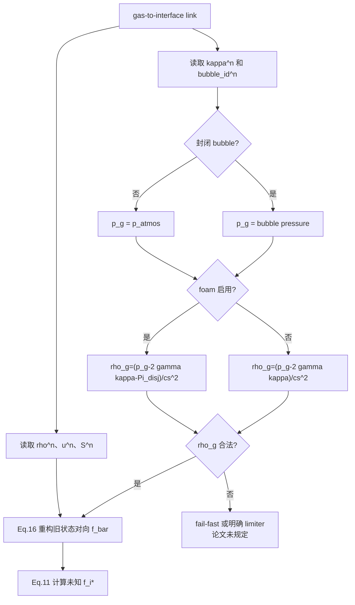
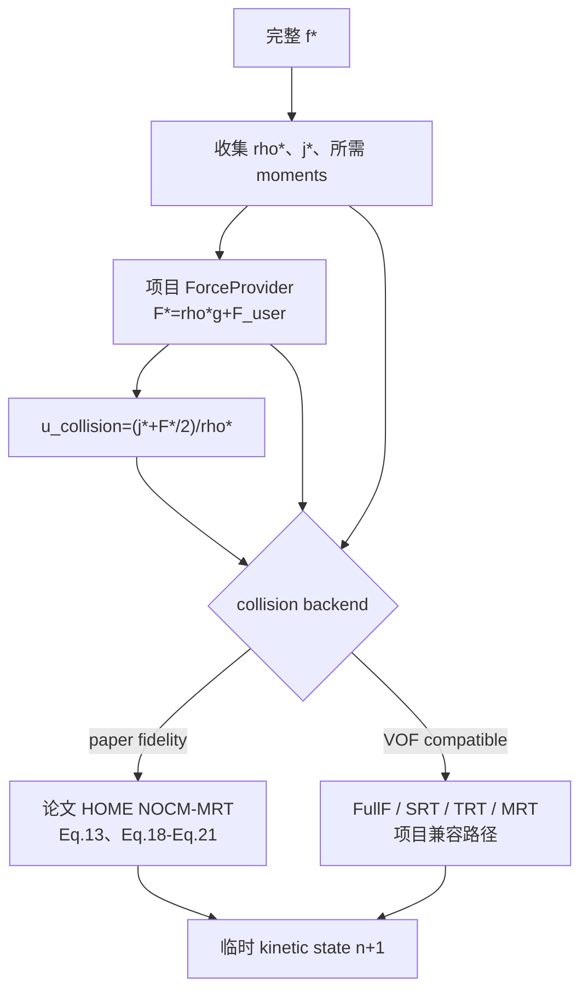
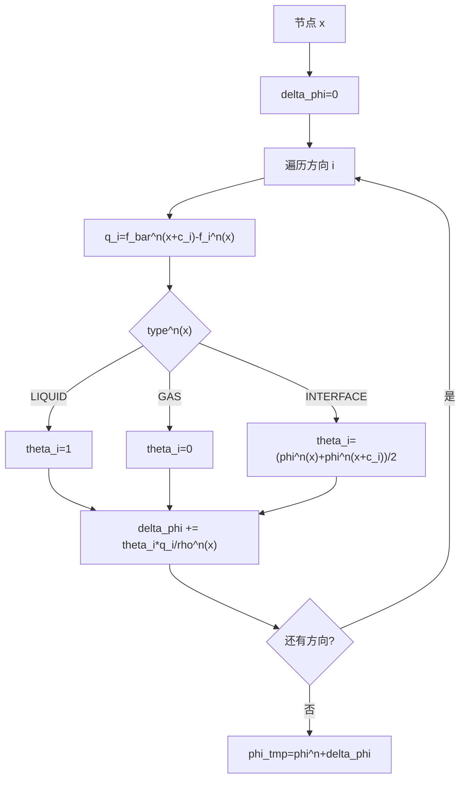
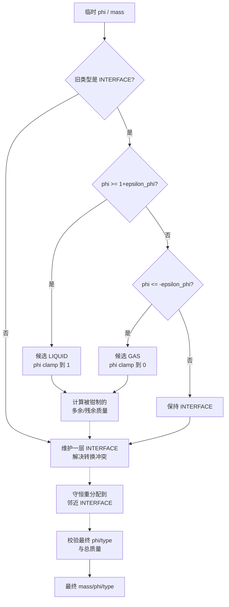
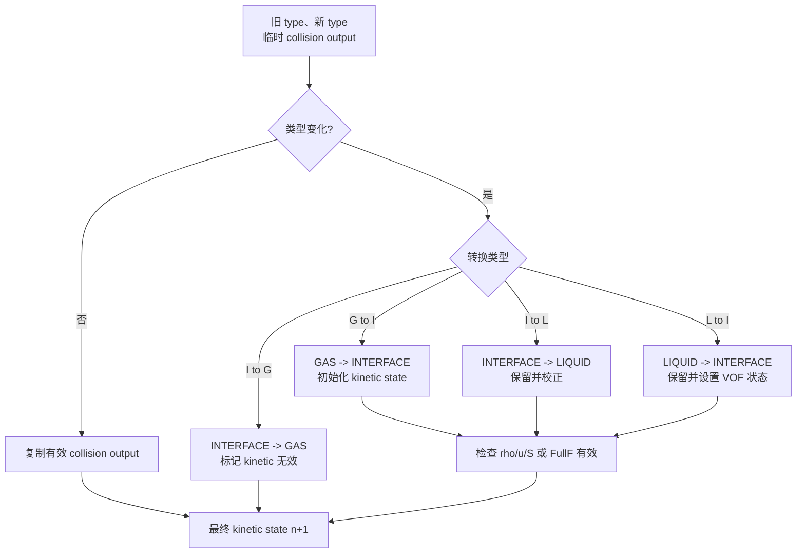
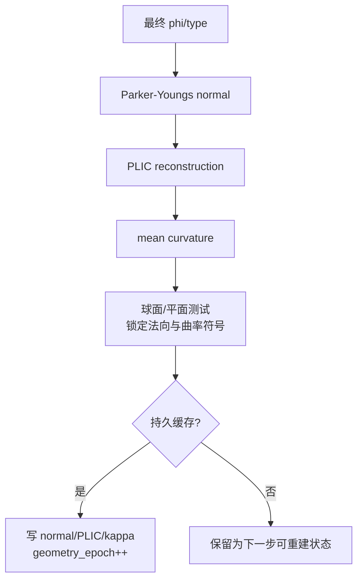
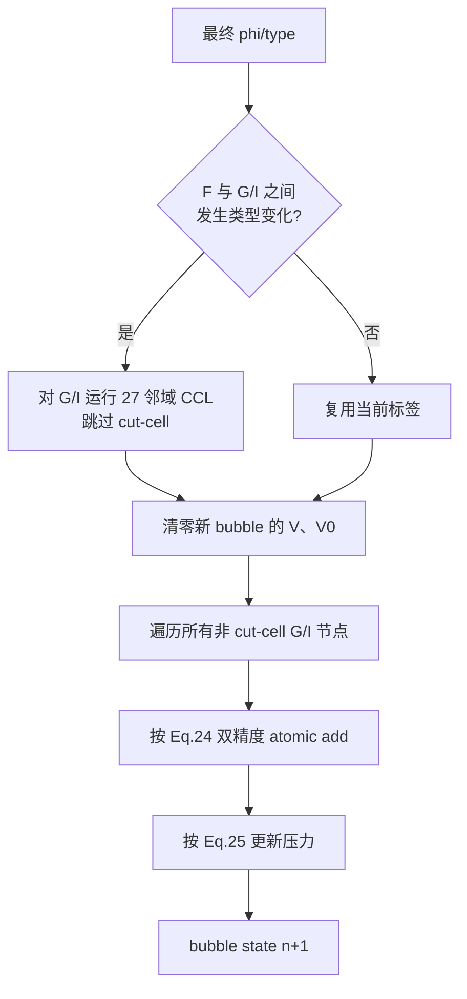
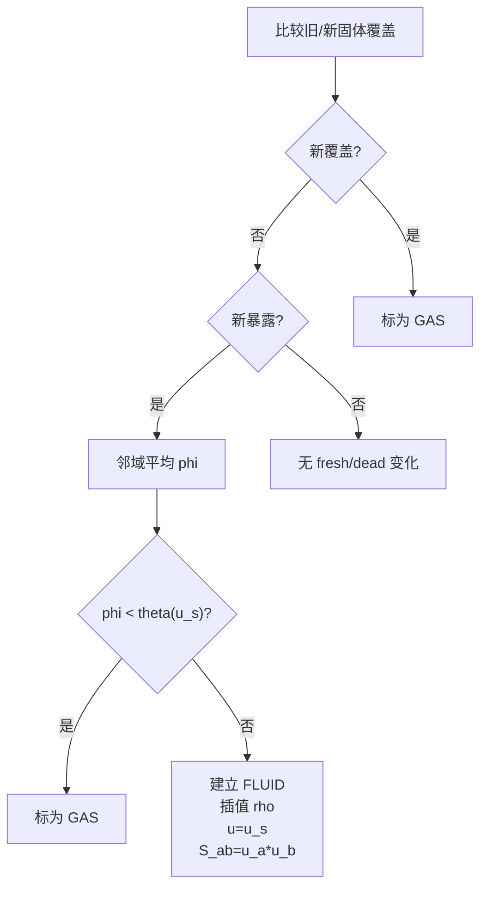

# 控制流图

## 1. 项目集成总览

这是把论文基线拆成项目模块后的建议控制流，属于 `DERIVED` 集成时序，不是论文
Algorithm 1 的逐行复刻。



两条主线的数据关系：

```text
LBM 线读取旧 kinetic state，输出临时碰撞后 kinetic state
质量线读取旧 kinetic/phi/rho，输出最终 mass/phi/type
应用转换时两条线合流
```

严格按论文 Eq. (9) 时，质量线使用 `rho(x,t)`，不等待 `M` 的 `rho*`。

## 2. LBM 格链解析

每个活动目标节点和方向必须得到唯一 population。



论文支持 `PULL`、gas-to-interface `SURF` 和 solid/cut-cell 概念。统一
`DOMAIN/CUT/SRC` 路由及 fail-fast 是项目控制层。

## 3. 自由表面 reconstruction



注意：本文 Eq. (11) 使用旧状态 `f_bar(x,t)`，不是另一个线程刚写出的
`f_bar*(x,t)`。

## 4. Moment、外力和碰撞



只有 HOME 高阶路径可以主张复现论文的碰撞稳定性设计；其他 backend 只表示共享
VOF 边界和质量模块。

## 5. 论文 Eq. (9)-(10) 质量平流

这张图严格表达本文印刷版公式。



solid link、domain boundary 和开放边界的质量通量不在 Eq. (9)-(10) 中定义，必须
作为额外策略单独设计。

## 6. TYPE 重标记与质量重分配

实线是论文明确要求；虚线是为并行实现和拓扑一致性补充的项目阶段。



论文只明确阈值、clamp 和守恒重分配，没有给出 `TOPO/REDIST/CHECK` 的 GPU
算法。实现前应核验被引用的 Lehmann 2019。

## 7. 最终 kinetic 类型转换



一般 `GAS -> INTERFACE` 初始化公式论文未说明，是实现阻塞决策。不要直接套用
moving-solid fresh-node 公式。

## 8. 几何



`phi -> normal -> PLIC -> curvature` 有论文依据；更新时间点、缓存和 epoch 是项目
设计。

## 9. 气泡



## 10. 移动固体 fresh/dead



该流程只表示论文 Sec. 4.3 的移动固体覆盖变化。
