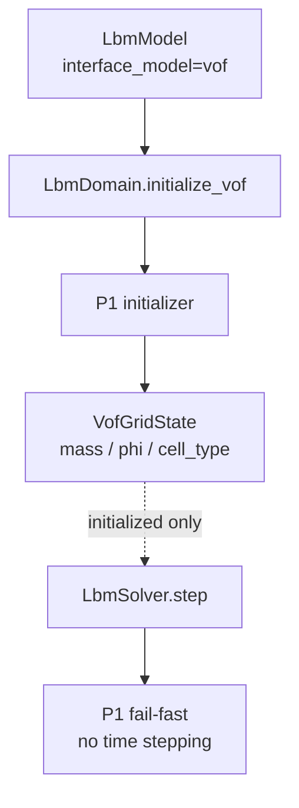
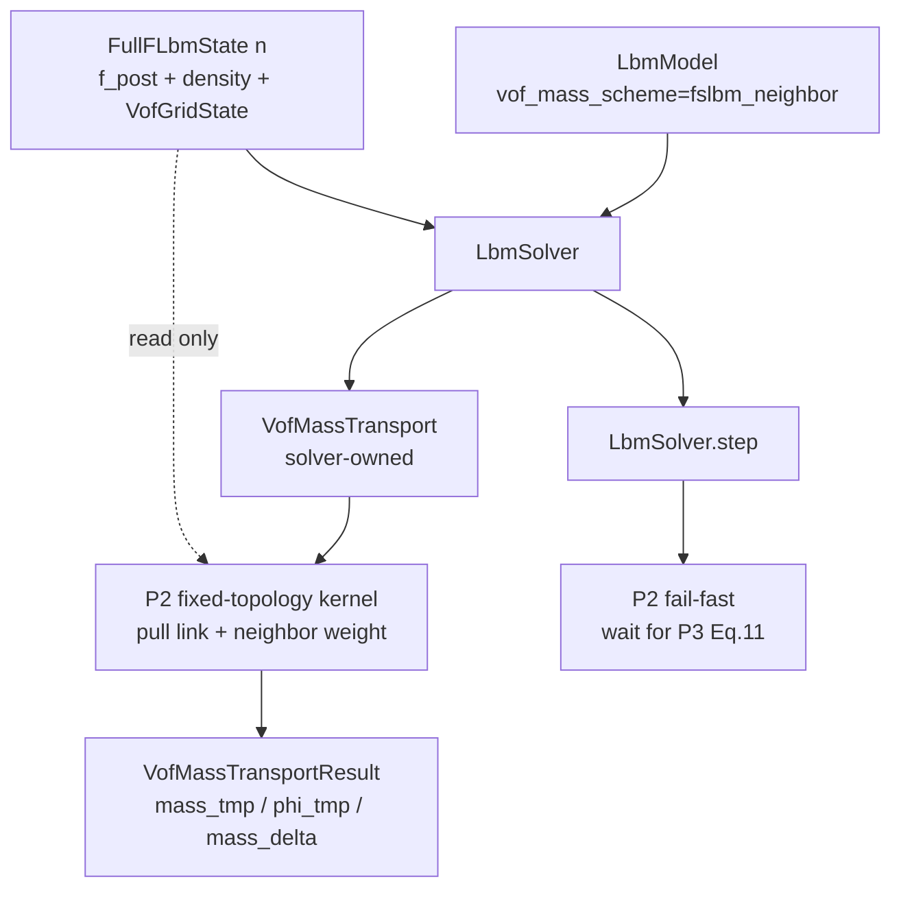
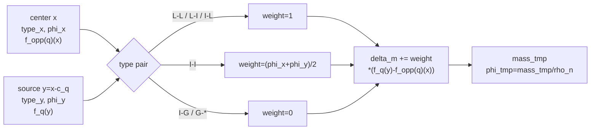

# P2 改动文件与架构差异说明

## 1. 改动目的

P2 在不开放完整 VOF step 的前提下，引入一个可独立验收的 FullF fixed-topology
mass transport stage。核心架构选择是：

- 持久状态仍只保存 `mass/phi/cell_type`；
- provisional transport 由 solver-owned scratch 承载；
- mass transport 与 ordinary LBM streaming 分离；
- P3 前不让 gas-side 无效 populations 进入完整物理路径。

## 2. 改动前架构



改动前：

- 没有质量交换 scheme 的代码契约；
- 没有 D3Q19 VOF mass kernel；
- 没有 provisional mass scratch；
- 任何 authoritative VOF time operation 都只能 fail-fast。

## 3. 改动后架构



新的写入边界：

```text
production state arrays: read-only
transport scratch: write-only output
cell_type: unchanged
domain buffers: not swapped
```

## 4. 质量格链数据流



## 5. 新增文件

### `wanphys/_src/fluid/fluid_grid/lbm/vof/advection_kernels.py`

职责：

- D3Q19 pull 来源解析；
- per-axis periodic wrap；
- non-periodic link zero flux；
- `fslbm_neighbor` 权重；
- `mass_delta/mass_tmp/phi_tmp` 写出。

明确不负责：

- surface Eq. (11)；
- collision；
- transition/redistribution；
- persistent state commit。

### `wanphys/_src/fluid/fluid_grid/lbm/vof/advection.py`

职责：

- `VofMassTransport` scratch 生命周期；
- FullF-only dispatch；
- 输入有限性、拓扑与 canonical mass/phi 校验；
- 无副作用的 transport result。

### `newton/tests/test_lbm_vof_p2.py`

职责：

- P2 契约测试；
- 手算 link weights；
- 独立 NumPy oracle；
- 周期质量守恒；
- gas storage independence；
- state no-mutation。

### P2 文档

```text
09-p2-engineering-plan.md
10-p2-completion-summary.md
11-p2-change-architecture.md
```

## 6. 修改文件

### `wanphys/_src/fluid/fluid_grid/lbm/vof/contracts.py`

新增：

```text
VofMassScheme
normalize_vof_mass_scheme
```

### `wanphys/_src/fluid/fluid_grid/lbm/model.py`

新增并规范化：

```text
vof_mass_scheme = "fslbm_neighbor"
```

### `wanphys/_src/fluid/fluid_grid/lbm/solver.py`

新增：

```text
_vof_mass_transport
compute_vof_mass_transport()
```

同时更新完整 `step()` fail-fast 文案，使阶段边界从 P1 指向 P3。

### Public exports

修改：

```text
lbm/vof/__init__.py
lbm/__init__.py
```

导出 scheme、transport 和 result contract。

### 文档状态

修改：

```text
00-capability-status.md
06-development-roadmap.md
README.md
```

把 P2 标记为 `CPU_ACCEPTED`，但保持完整 VOF step、HOME 和 CUDA 未验收。

## 7. 未改变文件与理由

```text
vof/state.py
```

P2 scratch 不属于持久状态，不能把 `mass_tmp/phi_tmp/mass_delta` 加进
`VofGridState`。

```text
streaming.py
```

P2 只观察旧时间层 populations 的质量通量；P3 才修改 gas-to-interface streaming。

```text
domain.py
```

P2 不增加一个看似完整的 domain time-step API，避免用户误用缺少 Eq. (11) 的路径。

```text
vof/geometry.py
```

P2 不依赖 normal/PLIC/curvature。

## 8. 架构不变量

改动后必须持续满足：

```text
mass remains the sole persistent conservative authority
phi_tmp is provisional and solver-owned
P2 never reads GAS kinetic storage for mass flux
P2 never mutates state_in/state_out
complete VOF step remains unavailable before P3
HOME remains an explicit P7 extension
```
