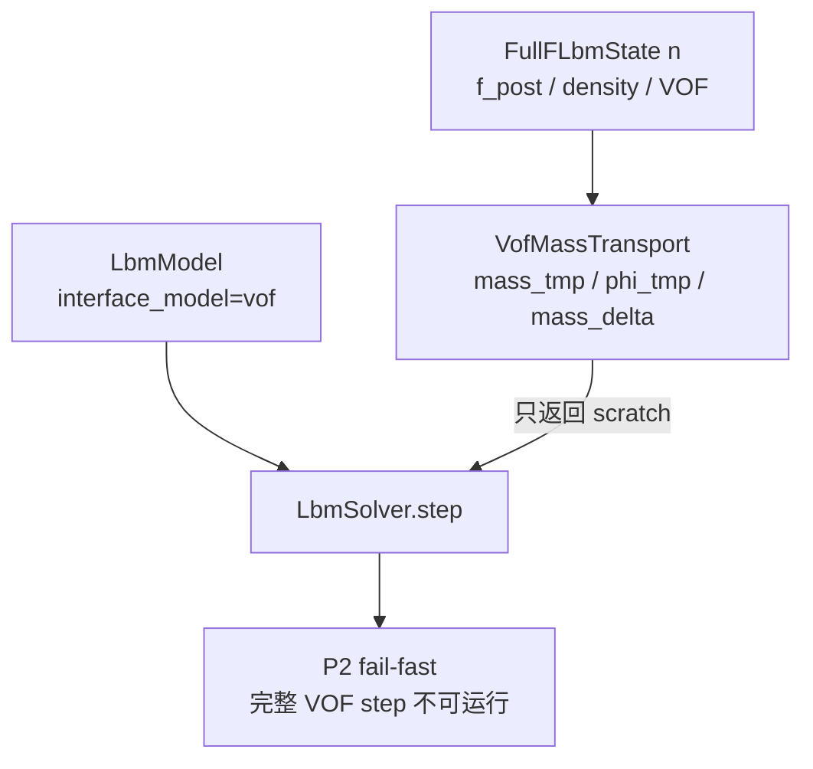
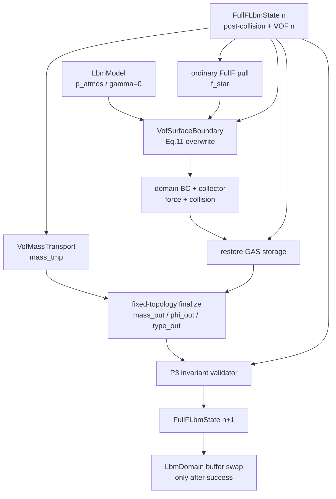
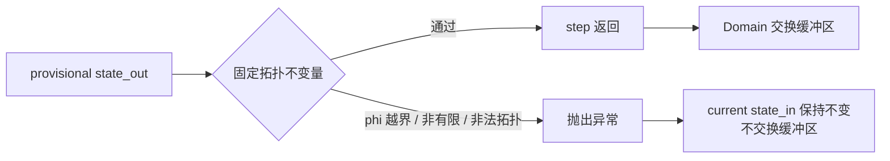
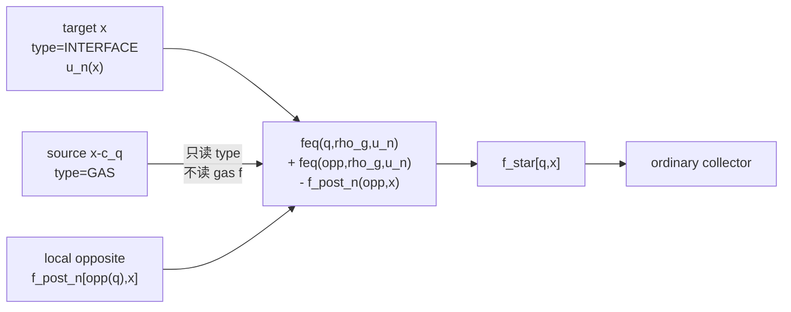

# P3 改动文件与架构差异说明

## 1. 改动目的

P3 把 P2 的独立质量 scratch 接入完整 FullF LBM 时间步，并在 collector 前按论文
Eq. (11) 补全 gas-to-interface 缺失 population。阶段边界保持固定拓扑、
`surface_tension=0`，因此没有提前引入 transition、redistribution 或 geometry。

## 2. 改动前架构



改动前：

- P2 mass transport 可独立验收，但不提交到持久状态；
- ordinary streaming 会从 gas storage 拉取无物理意义的 population；
- 没有 atmospheric pressure 或 Eq. (11) 的生产实现；
- domain buffer 不会执行 authoritative VOF 时间推进。

## 3. 改动后架构



失败分支：



## 4. Eq. (11) 数据流



写入所有权：

```text
ordinary streaming: initializes every f_star slot
surface completion: overwrites only GAS -> INTERFACE moving links
ordinary domain boundary: remains later in the existing pipeline
collector: consumes the final f_star
```

## 5. 新增文件

### `wanphys/_src/fluid/fluid_grid/lbm/vof/surface_kernels.py`

职责：

- 判定 pull source `x-c_q` 是否为 GAS；
- 按统一 D3Q19 equilibrium 和 opposite mapping 执行 Eq. (11)；
- 恢复 generic all-cell pipeline 后的 GAS kinetic/macroscopic storage。

明确不负责：

- mass transport；
- domain open boundary；
- transition/redistribution；
- curvature 或 surface tension。

### `wanphys/_src/fluid/fluid_grid/lbm/vof/surface.py`

职责：

- 保存 shape、periodicity 和固定 `rho_g`；
- 调度 FullF surface completion；
- 调度 GAS storage restore。

### `newton/tests/test_lbm_vof_p3.py`

职责：

- 配置与 capability gate；
- Eq. (11) 的 18 个 moving direction 独立公式；
- gas storage independence 和输入无副作用；
- 平面静止多步固定点；
- P2 mass commit、buffer swap 和失败事务边界。

### P3 文档

```text
12-p3-engineering-plan.md
13-p3-completion-summary.md
14-p3-change-architecture.md
```

## 6. 修改文件

### `wanphys/_src/fluid/fluid_grid/lbm/model.py`

新增并校验：

```text
vof_atmosphere_pressure
vof_surface_tension
```

同时对 P3 尚未支持的 nonzero surface tension 和 VOF open domain boundary
fail-fast。

### `wanphys/_src/fluid/fluid_grid/lbm/solver.py`

新增：

```text
_vof_surface_boundary
compute_vof_surface_populations()
```

并把 P2 mass、surface completion、普通 LBM 流水线、gas restore、VOF finalize 和
fixed-topology validator 组合成 P3 FullF step。

### `wanphys/_src/fluid/fluid_grid/lbm/vof/advection_kernels.py`

新增 `finalize_fixed_topology_vof_kernel()`：

- active mass 从 P2 `mass_tmp` 提交；
- active phi 由 `mass_tmp/density_out` 反算；
- GAS 写 canonical zero；
- type 从 `state_in` 原样复制。

### `wanphys/_src/fluid/fluid_grid/lbm/vof/advection.py`

新增 `VofMassTransport.finalize_fixed_topology()` 调度入口。

### `wanphys/_src/fluid/fluid_grid/lbm/vof/validation.py`

新增 P3 输出 validator，检查：

```text
type unchanged
active density finite and positive
GAS mass=phi=0
INTERFACE 0<phi<1
LIQUID phi≈1
mass≈density*phi
no direct LIQUID-GAS D3Q19 link
```

### Public exports

修改：

```text
lbm/vof/__init__.py
lbm/__init__.py
```

导出 `VofSurfaceBoundary`。

### 既有阶段测试

修改：

```text
newton/tests/test_lbm_vof_p1.py
newton/tests/test_lbm_vof_p2.py
```

旧的“所有 VOF step 在 P3 前失败”断言被收窄为“HOME 在 P7 前失败”，不削弱 P1/P2
状态、质量和事务不变量。

### 文档状态

修改：

```text
00-capability-status.md
06-development-roadmap.md
README.md
```

把 P3 标记为 `CPU_ACCEPTED`，并保持 P4-P8、HOME、CUDA 和 open VOF domain
boundary 未验收。

## 7. 未改变文件与理由

```text
vof/state.py
```

P3 不增加新的持久 VOF 字段。atmospheric pressure 是 model 配置，surface scratch
继续由 solver 持有。

```text
vof/geometry.py
```

P3 固定 `gamma=0`，不消费 normal、PLIC 或 curvature。

```text
vof/transition.py
vof/redistribution.py
vof/kinetic_init.py
```

这些模块尚未创建。P3 通过 validator 暴露需要转换的情况，P4/P5 才获得写权限。

## 8. 架构不变量

改动后必须持续满足：

```text
mass remains the sole persistent conservative authority
gas persistent kinetic storage is never a physical input
surface completion has one precise overwrite scope
ordinary LBM owns all non-surface links
state_in remains read-only
state_out is committed only by a successful domain-level step
P3 never changes topology
HOME and nonzero surface tension remain explicit future gates
```
