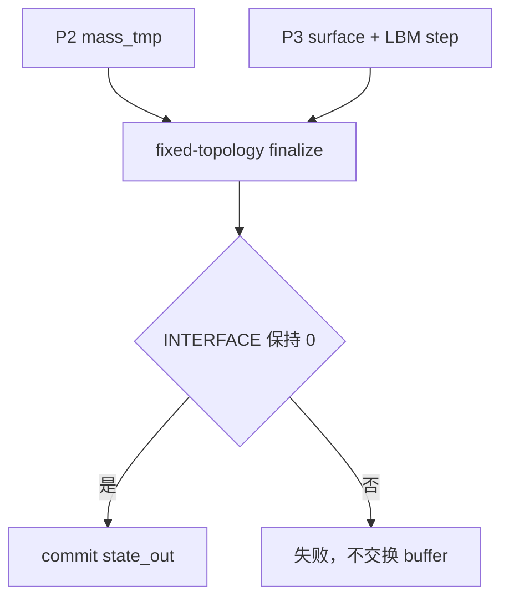
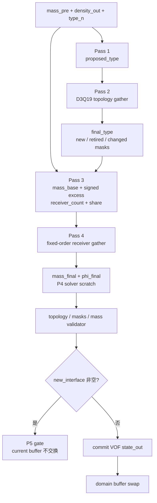
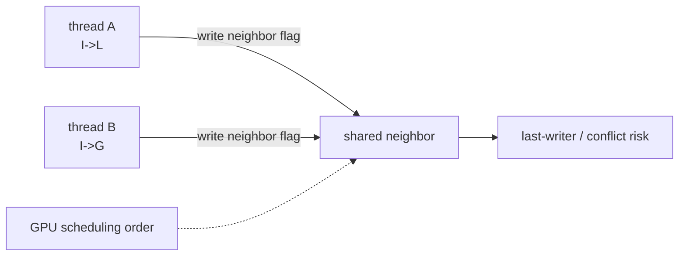
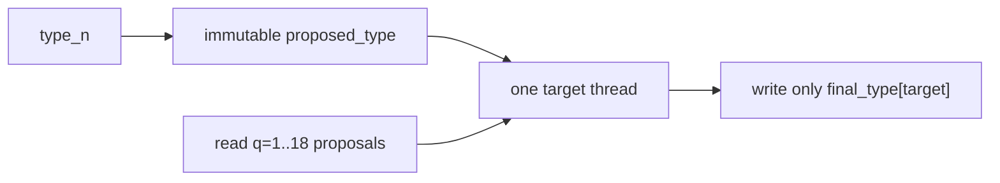
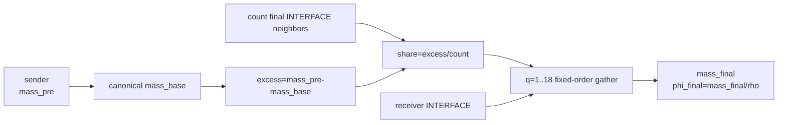

# P4 改动文件与架构差异说明

## 1. 改动目的

P4 将 P3 的“phi 越界即失败”升级为独立、可验证的 topology transition 与守恒
redistribution，同时保持 P5 kinetic 初始化边界。核心变化是把参考实现的原地邻居
flag 写入改造成确定性 multi-pass gather。

## 2. 改动前架构



改动前：

- `cell_type` 只能从 `state_in` 原样复制；
- mass 越界没有转换候选；
- 没有 interface halo 或冲突优先级；
- 没有 excess/deficit 质量重分配；
- 没有准确的新界面清单。

## 3. 改动后架构



## 4. 原地写与 gather 的新旧对比

### 4.1 参考式原地邻居写



### 4.2 P4 只读候选 + 单写者 gather



每个输出格点只有自己的 thread 写入，冲突由显式优先级解决，不依赖执行顺序。

## 5. redistribution 数据流



守恒关系：

```text
sum(mass_pre)
≈ sum(mass_base) + sum(excess)
≈ sum(mass_final)
```

若非尾差 excess 没有 receiver，则在 commit 前失败。

## 6. 新增文件

### `wanphys/_src/fluid/fluid_grid/lbm/vof/transition_kernels.py`

新增四个 Warp kernel：

```text
propose_vof_type_kernel
resolve_vof_topology_kernel
prepare_vof_redistribution_kernel
gather_vof_redistribution_kernel
```

职责严格限定为 P4 VOF 数组变换，不读写 kinetic populations。

### `wanphys/_src/fluid/fluid_grid/lbm/vof/transition.py`

新增：

```text
VofTopologyTransition
VofTransitionResult
validate_p4_transition_result
```

负责 scratch 生命周期、四 pass 调度、host invariant validation 和成功后的 VOF
commit。

### `newton/tests/test_lbm_vof_p4.py`

包含 threshold/topology/redistribution 手算、periodic seam、独立 oracle、确定性、
质量守恒、zero receiver 和 domain transaction tests。

### P4 文档

```text
15-p4-engineering-plan.md
16-p4-completion-summary.md
17-p4-change-architecture.md
```

## 7. 修改文件

### `wanphys/_src/fluid/fluid_grid/lbm/model.py`

新增：

```text
vof_transition_epsilon = 1e-4
```

并验证 finite、nonnegative 且 `<0.5`。

### `wanphys/_src/fluid/fluid_grid/lbm/solver.py`

新增 solver-owned `VofTopologyTransition`，用 P4 scratch/commit 替代 P3
fixed-topology finalizer。`new_interface` 非空时执行 P5 gate。

### `wanphys/_src/fluid/fluid_grid/lbm/vof/advection.py`

P2 input validator 现在允许 P4 redistribution 产生的 transient INTERFACE overshoot；
GAS、LIQUID、mass/phi 关系和 topology 约束仍保留。

### Public exports

修改：

```text
lbm/vof/__init__.py
lbm/__init__.py
```

导出 transition/result。

### P3 supersession test

`newton/tests/test_lbm_vof_p3.py` 保留“失败不交换 current buffer”不变量，但不再要求
合法 finite phi overshoot 必须失败；P4 已获得处理该状态的唯一写权限。

### 文档状态

修改：

```text
00-capability-status.md
06-development-roadmap.md
README.md
```

把 P4 标记为 `CPU_ACCEPTED`，P5 kinetic、HOME 与 CUDA 继续未验收。

## 8. 未改变文件与理由

```text
vof/state.py
```

P4 scratch 和 masks 不持久化；P1 的三字段单一权威保持不变。

```text
vof/surface.py
```

Eq. (11) 继续使用旧时间层 topology，与 P4 的 `state_out` transition 分工明确。

```text
vof/geometry.py
```

P4 redistribution 不依赖 normal/PLIC/curvature。

## 9. 架构不变量

```text
candidate/type input is read-only
each topology output cell has one writer
final topology has no direct D3Q19 LIQUID-GAS link
redistribution uses signed mass and fixed-order gather
mass remains the only persistent conservative authority
transition scratch never enters clone/checkpoint
new_interface is the exact P5 handoff
no new interface is committed before kinetic initialization
```
