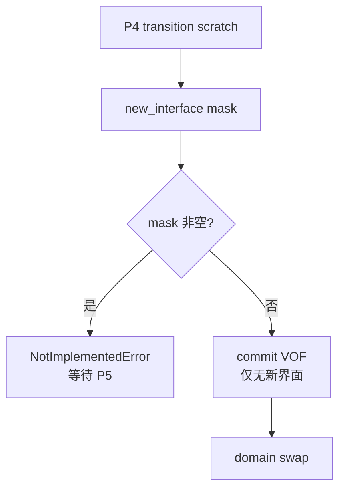
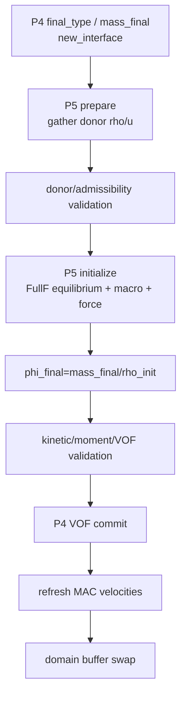
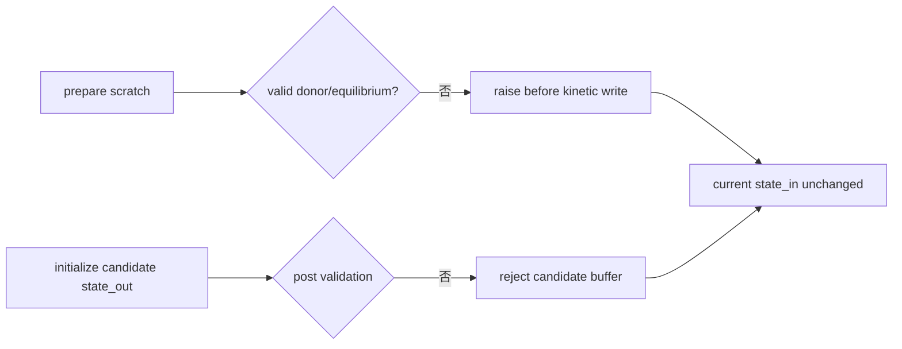
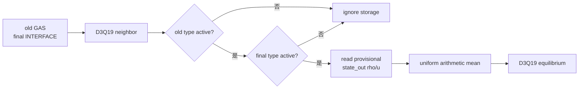
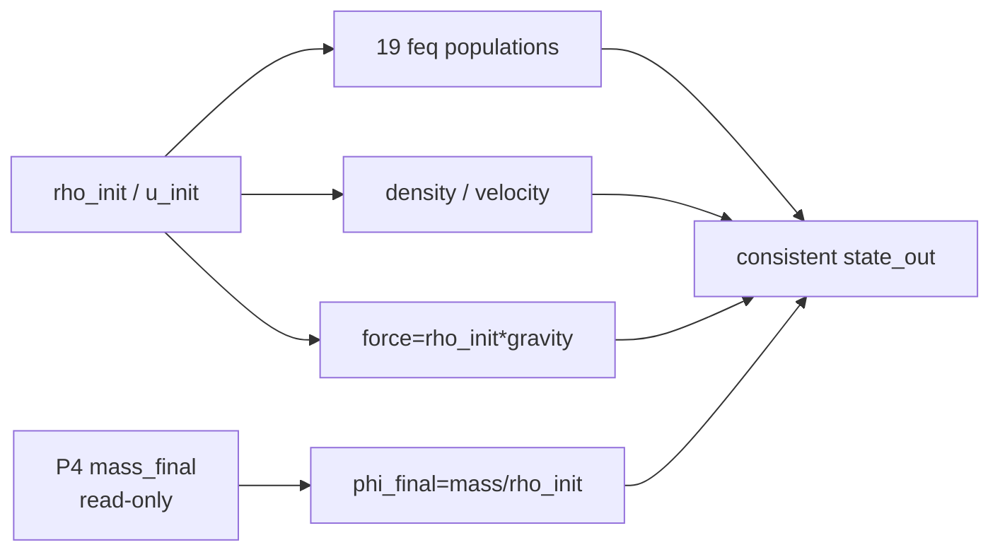

# P5 改动文件与架构差异说明

## 1. 改动目的

P5 消费 P4 的 `new_interface` mask，为旧 GAS→final INTERFACE 创建合法 FullF
kinetic state，并在 density 改变后重新闭合 phi。它移除 P4 的新界面 gate，但不
提前引入 geometry 或 surface tension。

## 2. 改动前架构



改动前：

- P4 已知道 final type/mass/phi；
- old GAS 的 collision output 会被 P3 restore 回无效 storage；
- 新 INTERFACE 没有合法 populations；
- 正向移动界面不能提交。

## 3. 改动后架构



失败路径：



## 4. donor 数据流



同批 new interface 的 old type 是 GAS，因此无论它的 scratch 值是什么都不能进入
另一新界面的均值。

## 5. kinetic 与 VOF 写入



质量写入权限没有转移给 P5。

## 6. 新增文件

### `wanphys/_src/fluid/fluid_grid/lbm/vof/kinetic_init_kernels.py`

新增：

```text
prepare_new_interface_donors_kernel
initialize_new_interface_fullf_kernel
```

第一个 kernel 只写 averages scratch，第二个只写 new-interface kinetic/macro/force
和对应 phi。

### `wanphys/_src/fluid/fluid_grid/lbm/vof/kinetic_init.py`

新增：

```text
VofKineticInitializer
VofKineticInitializationResult
validate_p5_prepared_kinetic
validate_p5_initialized_state
```

负责 shape/mask 契约、两段调度、独立 equilibrium host 检查和输出闭合。

### `newton/tests/test_lbm_vof_p5.py`

新增 donor 矩阵、periodic、gas isolation、zero donor、19-population、非目标隔离和
moving-interface tests。

### P5 文档

```text
18-p5-engineering-plan.md
19-p5-completion-summary.md
20-p5-change-architecture.md
```

## 7. 修改文件

### `wanphys/_src/fluid/fluid_grid/lbm/solver.py`

新增 solver-owned `VofKineticInitializer`，用 P5 prepare/initialize/validate 替代
P4 `new_interface` gate；VOF commit 移到 kinetic 成功之后。

同时把 MAC face velocity 更新抽成可重用阶段，使 P5 修改 cell-centered velocity
后再次刷新。

### Public exports

修改：

```text
lbm/vof/__init__.py
lbm/__init__.py
```

导出 initializer/result。

### P4 supersession test

`newton/tests/test_lbm_vof_p4.py` 的 gate 测试升级为 handoff 后质量/topology 集成
测试；P4 的 scratch 和 mask 断言保持。

### 文档状态

修改：

```text
00-capability-status.md
06-development-roadmap.md
README.md
```

把 P5 标记为 `CPU_ACCEPTED`，P6 geometry/surface tension、HOME 和 CUDA 继续未
验收。

## 8. 未改变文件与理由

```text
vof/state.py
```

donor averages 是 solver scratch，不属于持久状态。

```text
vof/transition.py
```

P4 仍独占 type/mass transition；P5 只更新 new density 对应的派生 phi。

```text
vof/surface.py
```

P3 Eq. (11) 继续读取旧时间层 state；新 kinetic 从下一时间步开始被消费。

```text
vof/geometry.py
```

P5 不需要 normal/PLIC/curvature。

## 9. 架构不变量

```text
old/final active donor eligibility is explicit
gas storage is never a donor
same-batch new interfaces do not depend on execution order
prepare fails before kinetic writes
only new interfaces are overwritten
mass_final is read-only during kinetic initialization
phi is re-derived after rho initialization
VOF commit follows successful kinetic validation
current buffer swaps only after the complete P5 chain returns
```
