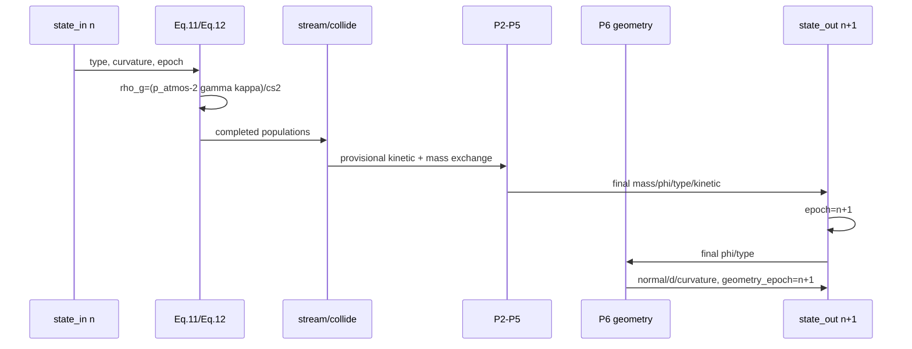

# P6 PLIC、曲率与表面张力工程计划

## 1. 阶段目标

P6 在 P5 已闭合的 authoritative `mass/phi/cell_type + kinetic` 状态上增加派生界面
几何，并把论文 Eq. (12) 接入 P3 自由面 population completion。

本阶段只包含：

```text
authoritative normal
PLIC plane offset
mean curvature
constant-atmosphere surface tension
geometry/VOF epoch lifecycle
FullF CPU acceptance
```

明确不包含：

```text
solid / moving solid
bubble pressure / CCL
foam / disjoining pressure
geometric PLIC mass advection
HOME
CUDA acceptance
open VOF domain boundary
```

## 2. 来源与裁决顺序

### 2.1 首选参考工作库

`[Code-Ref]Home-FSLBM/inc/3D/gpu/mrUtilFuncGpu3D.h` 提供：

- Parker–Youngs 3×3×3 weighted Sobel normal；
- unit-cube PLIC volume inversion；
- PLIC/normal 派生曲率的工程参考。

参考实现的 bubble、foam、disjoining pressure、经验 surface-tension switch 不进入
本阶段。

### 2.2 本仓库探讨文档

- `01-paper-audit.md`：PLIC 只服务几何/曲率，不接管 Eq. (9) 质量平流；
- `04-sequence-diagrams.md`：几何从最终 `phi/type` 计算并供下一步读取；
- `06-development-roadmap.md`：P6A–P6D 验收门禁。

### 2.3 论文原文

Eq. (12) 冻结：

\[
\rho_g =
\frac{p_{atmos}-2\gamma\kappa}{c_s^2},
\qquad c_s^2=1/3.
\]

## 3. 几何约定

### 3.1 normal

```text
n = -grad(phi) / |grad(phi)|
```

因此 `n` 从液体指向气体。梯度使用 3-D Parker–Youngs weighted Sobel stencil。

- periodic 轴 wrap；
- static domain 边界 clamp；
- authoritative `normal` 只在 INTERFACE cell 对外有效；
- 退化梯度写零向量，不产生 NaN。

### 3.2 PLIC plane

格点中心为原点，unit cube：

```text
r in [-0.5, 0.5]^3
liquid half-space: dot(n, r) <= d
```

`plic_offset=d`。对 L2-normalized `n`：

```text
d in [-0.5*L1(n), +0.5*L1(n)]
volume(cube intersect liquid half-space) = phi
```

反演使用精确 unit-cube inclusion–exclusion volume evaluator 加固定轮数二分。这样：

- 轴对齐 `d=phi-0.5`；
- `phi=0.5 -> d=0`；
- `(-n, phi) -> (-d)` 表示相反法向下的互补侧；
- `phi` 接近 0/1 时仍有有限结果；
- zero normal 明确写 `d=0` 并把几何标为退化。

PLIC 不修改 `mass/phi`，不参与 P2 mass advection。

## 4. 曲率与符号

首版 curvature estimator 采用 PLIC-normal field 的中心差分 divergence：

```text
kappa = -0.5 * div(n)
```

normal 采样与 P6A 相同，曲率只写 INTERFACE cell。这里的 `kappa` 是三维 mean
curvature：

```text
plane:          kappa = 0
convex sphere:  kappa = -1/R
```

因此静止凸液滴：

```text
rho_g = (p_atmos + 2*gamma/R) / cs2
```

符号与论文 Eq. (12) 一致。退化 stencil 写 `kappa=0`；首版将有限曲率限制在
`[-1, 1]` lattice-unit 区间，与参考实现的稳定范围一致。

## 5. 状态与 epoch

P6 后 `VofGridState` 包含：

```text
conservative:
  mass / phi / cell_type

derived geometry:
  normal / plic_offset / curvature

host metadata:
  epoch / geometry_epoch
```

生命周期：

```text
construct/clear: epoch=-1, geometry_epoch=-1, arrays canonical zero/GAS
initialize:      epoch=0, geometry_epoch=0
step commit:     epoch=n+1
geometry build:  geometry_epoch=epoch
clone/copy:      values independent, epochs equal
```

surface completion 只允许 `geometry_epoch == epoch`。这使过期几何无法静默进入下一步
Eq. (12)。

## 6. 调度



初始化时，在 candidate state 的 `mass/phi/type` 成功写入后立刻构造 epoch 0 几何；
clone 到第二缓冲区时完整复制。

## 7. Eq. (12) 与失败策略

对每个 INTERFACE target：

```text
if gamma == 0:
    rho_g = p_atmos / cs2
else:
    rho_g = (p_atmos - 2*gamma*kappa) / cs2
```

gamma=0 使用独立分支，必须精确退化为 P3 基线。

在修改 streamed populations 前，host validation 检查：

```text
geometry epoch current
normal / offset / curvature finite
rho_g finite and > 0 for every INTERFACE cell
```

失败时抛出异常，不做 clamp，不修改 current state，不进入 domain swap。
surface tension 只通过压力边界出现，不再作为 CSF force 重复施加。

## 8. 实现拆分

### 8.1 状态

- 扩展 `VofGridState` geometry arrays 与 epoch；
- 扩展 clear/copy/clone/buffer-pair validation；
- transition commit 推进 VOF epoch。

### 8.2 geometry

- 保留现有 Shan–Chen debug `InterfaceGeometry` 隔离路径；
- 新增 `VofInterfaceGeometry` authoritative operator；
- 新增 normal、PLIC、curvature Warp kernels；
- 新增 host 独立几何校验和 PLIC volume oracle。

### 8.3 surface

- `VofSurfaceBoundary` 保存 `p_atmos/gamma`；
- Eq. (11) kernel 按 target curvature 计算 Eq. (12)；
- 移除 model 的 nonzero-gamma P3 gate；
- 增加 epoch/rho positivity preflight。

### 8.4 solver

- 初始化时构造 epoch 0 geometry；
- P5 commit 后推进 VOF epoch；
- 每步末尾从 final `phi/type` 重构 P6 geometry。

## 9. 测试计划

### 9.1 状态与 epoch

- construct/clear canonical geometry；
- clone/copy 独立数组；
- 初始化 `epoch == geometry_epoch == 0`；
- 每步只推进一次且两个 epoch 相等；
- stale geometry 被 surface preflight 拒绝。

### 9.2 normal

- 轴对齐平面方向；
- 均匀场退化为零；
- periodic seam；
- 镜像/轴置换一致。

### 9.3 PLIC

- 轴对齐解析值；
- `phi=0.5`；
- 随机 normal/phi 的独立 volume closure；
- normal/volume 对称性；
- 极端 phi 有限。

### 9.4 curvature

- 平面接近零；
- 球面为负；
- 增大 lattice radius 时误差下降；
- 退化 field 无 NaN/Inf；
- 平移/轴置换不改变结论。

### 9.5 surface tension

- gamma=0 population 与 P3 基线一致；
- Eq. (12) 单链接手算；
- convex drop 对应正 Laplace density increment；
- non-positive rho_g 在 population write 前失败；
- surface tension step 后质量/拓扑/kinetic 仍满足 P0-P5 门禁。

## 10. 退出门禁

```text
[x] authoritative normal/PLIC/curvature 与 VOF epoch 一致
[x] PLIC volume closure 满足冻结容差
[x] 平面 normal/curvature 测试通过
[x] 球面 curvature 符号正确且随 lattice radius 收敛
[x] Eq.12 Laplace pressure 手算与符号通过
[x] gamma=0 精确退化回 P5/P3 基线
[x] rho_g positivity fail-fast 具备事务性
[x] P0-P6 全部 CPU 回归通过
[x] Ruff F/I 与 git diff --check 通过
[x] P6 三份文档与代码进入唯一提交
```

## 11. 阶段状态

```text
CPU_ACCEPTED
CPU: accepted
CUDA: not accepted
```
