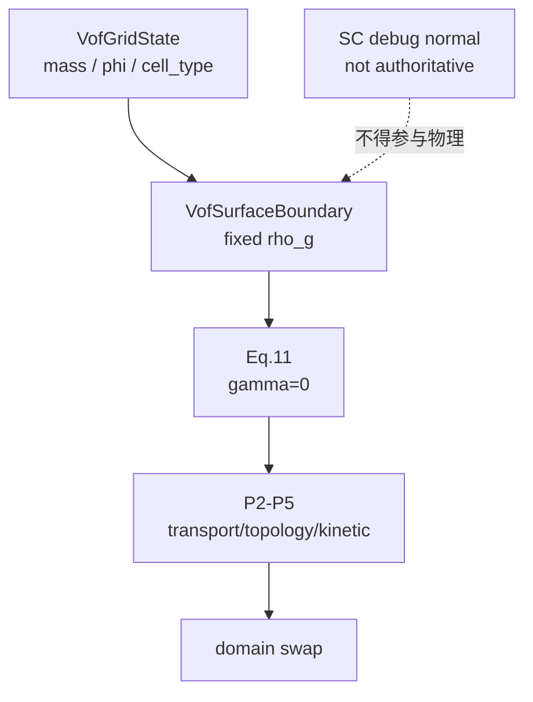
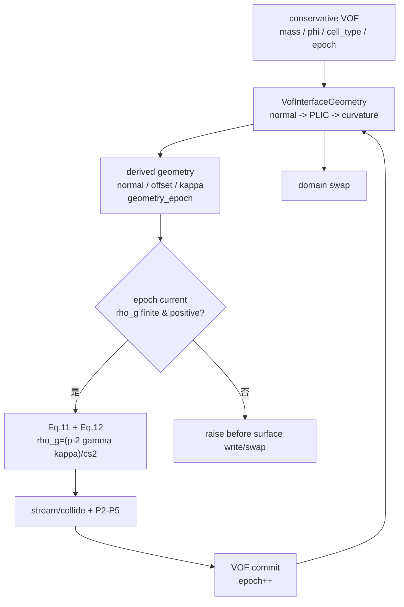
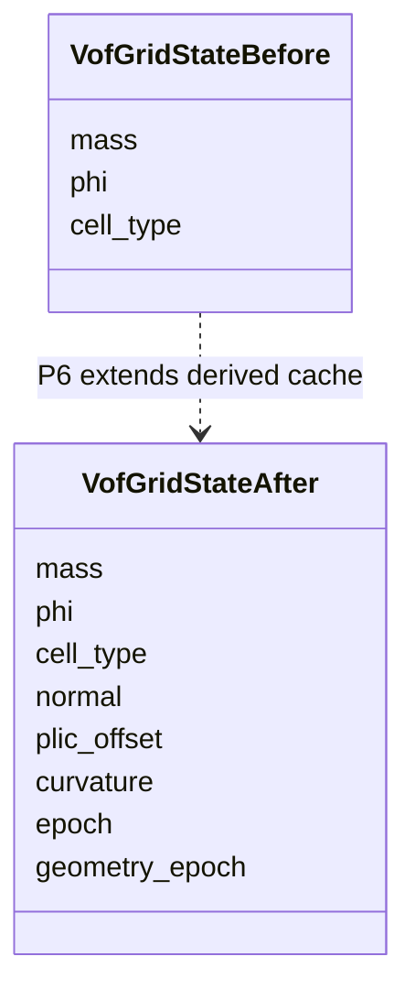
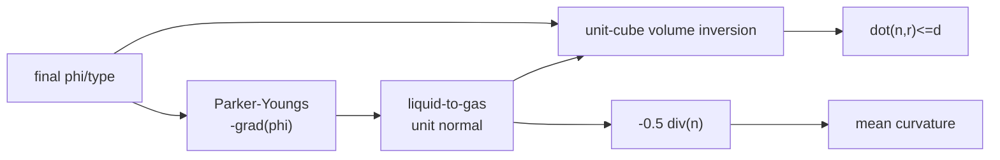
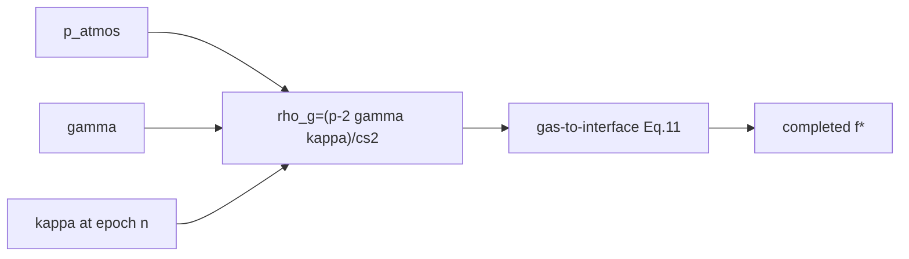
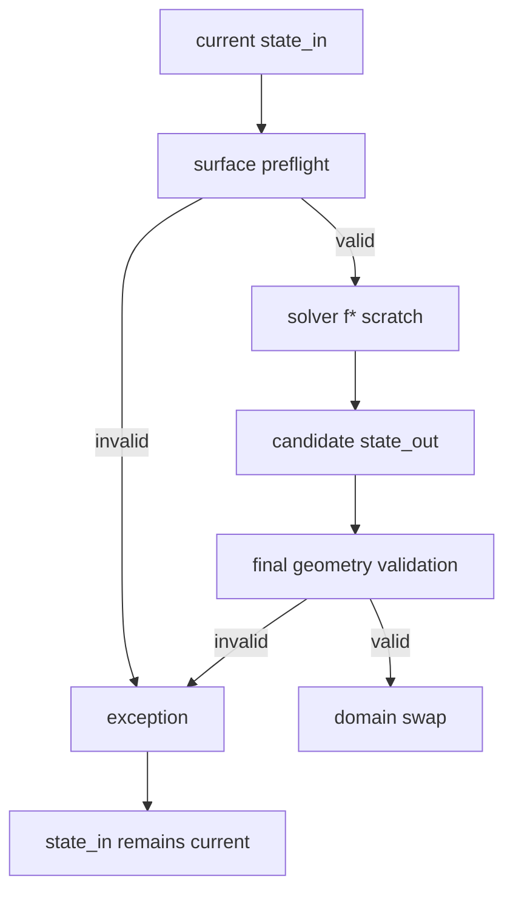

# P6 改动文件与架构差异说明

## 1. 改动目的

P6 把 observation-only normal 之外的正式几何接入 authoritative VOF，并使 P3
Eq. (11) 能按论文 Eq. (12) 消费 curvature。守恒状态、派生几何和调试观察保持三条
独立的数据所有权边界。

## 2. 改动前架构



改动前：

- authoritative VOF 没有 normal/PLIC/curvature；
- surface boundary 只保存标量 `rho_g=p_atmos/cs2`；
- nonzero gamma 在配置层 fail-fast；
- 没有正式 geometry epoch。

## 3. 改动后架构



## 4. 状态新旧对比



只有前三项是守恒/拓扑权威。后三个数组可以从 `phi/type` 重建，epoch 只管理其有效
时间层。

## 5. 几何数据流



PLIC 不回写 `phi` 或 `mass`。

## 6. 表面压力数据流



gamma=0 直接选 P3 atmosphere density，不让 curvature 的数值噪声进入旧基线。

## 7. 新增文件

### `vof/geometry_kernels.py`

新增：

```text
parker_youngs_normal_at
plic_cube_volume_from_alpha
plic_cube_offset
authoritative_normal_plic_kernel
authoritative_curvature_kernel
```

### `newton/tests/test_lbm_vof_p6.py`

新增 state/epoch、normal、PLIC、sphere curvature、Eq.12、失败事务和 nonzero-gamma
集成测试。

### P6 文档

```text
21-p6-engineering-plan.md
22-p6-completion-summary.md
23-p6-change-architecture.md
```

## 8. 修改文件

### `vof/state.py`

增加 geometry arrays 与 epoch，并扩展 clear/copy/clone。

### `vof/geometry.py`

保留 debug `InterfaceGeometry`，新增：

```text
VofInterfaceGeometry
plic_cube_volume / plic_plane_offset host oracle
validate_authoritative_geometry
```

### `vof/surface.py` 与 `surface_kernels.py`

由固定 gamma=0 density 扩展为 Eq.12 target-local density；增加 geometry epoch 和
rho positivity preflight。

### `solver.py`

- 配置 authoritative geometry operator；
- 初始化 epoch 0 geometry；
- P5 commit 后推进 epoch；
- swap 前重建 final geometry。

### `vof/transition.py`

commit 接收 source epoch，写入 `epoch+1` 并使旧 geometry 失效。

### `vof/validation.py`

扩展 empty、initialized 和 double-buffer geometry/epoch 检查。

### `model.py`

移除 P3 nonzero-gamma gate；保留 gamma finite/non-negative contract。

### Public exports

导出 authoritative geometry operator、PLIC host oracle 和 validator。

### P1/P3/P4/P5 supersession tests

- P1 clone/copy 覆盖新增派生数组；
- P3 配置测试从 nonzero-gamma gate 升级为数值合法性；
- P4/P5 synthetic phi 变更后显式刷新 P6 geometry。

### 文档状态

`00-capability-status.md`、`06-development-roadmap.md`、`README.md` 更新到 P6
`CPU_ACCEPTED`。

## 9. 失败事务边界



## 10. 架构不变量

```text
mass remains the only conserved VOF scalar
PLIC never advects or corrects mass
debug geometry never enters authoritative physics
normal direction and curvature sign are explicit
surface tension enters only Eq.12
gamma=0 exactly preserves P3 boundary density
stale geometry cannot enter Eq.12
non-positive rho_g is never silently clamped
geometry is rebuilt from final phi/type before swap
CUDA remains not accepted
```
