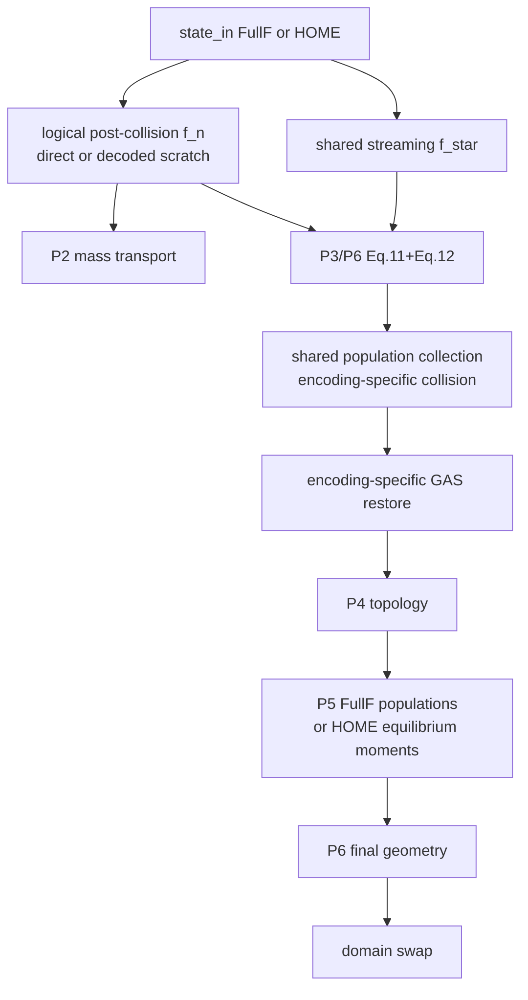

# P7 综合验收、HOME 与 CPU/CUDA 扩展工程计划

## 1. 阶段目标

P7 将 P0–P6 的 FullF 子系统组合为统一验收基线，并让 HOME persistent encoding
通过同一套 authoritative VOF 逻辑 population、surface、topology、kinetic 与
geometry 链路。

本阶段包含：

```text
shared logical post-collision population provider
HOME P2 mass transport
HOME P3 Eq.11/Eq.12 surface completion
HOME GAS storage isolation
HOME P5 new-interface equilibrium moment initialization
FullF/HOME differential acceptance
closed-domain scenario diagnostics
CPU acceptance
conditional CUDA execution and explicit status
```

明确不包含：

```text
open VOF domain boundary
solid / moving solid
bubble / CCL / foam / disjoining pressure
D3Q27 paper-equivalence claim
P8 interactive visualization
```

## 2. 来源与契约

### 2.1 参考工作库

Home-FSLBM 的 HOME 路径存储 `rho/rho*u/rho*S`，需要逻辑 population 时再重构。
本仓库已在 P0 冻结同一十矩约定：

```text
rho
rho*ux / rho*uy / rho*uz
rho*Sxx / rho*Syy / rho*Szz
rho*Sxy / rho*Sxz / rho*Syz
```

P7 不复制参考库的 bubble、foam、D3Q27 或经验开关。

### 2.2 共享逻辑 population

VOF 子系统读取统一的 post-collision D3Q19 `f_n[q,x]`：

```text
FullF: state.f_post (zero-copy semantic source)
HOME:  home_to_populations(state.kinetic_fields) -> solver scratch
```

P2 和 P3 不再按 persistent encoding 分叉：

```text
P2 mass flux reads logical f_n
P3 Eq.11 reads local logical opposite f_n
streaming continues to produce shared f_star
```

scratch 只在本次 step 内有效，不进入 state/checkpoint。

## 3. HOME GAS 语义

GAS persistent kinetic/macro storage仍是无效占位，不能成为物理输入。

collision/encoding 完成后，对 old GAS：

```text
restore all 10 HOME moment fields from state_in
restore density / velocity / force from state_in
```

随后只有 P5 old GAS→final INTERFACE target 可以获得新 kinetic。

## 4. HOME 新界面初始化

P5 donor eligibility、rho/u 均值与 mass 只读契约不变。对 new interface 写 equilibrium
HOME moments：

```text
rho   = rho_init
rho_u = rho_init * u_init
rho_S = rho_init * outer(u_init,u_init)
```

这些 moments 用现有 HOME decoder 重构时必须与 P5 D3Q19 equilibrium populations
一致，并同步写：

```text
density / velocity
force = rho_init*gravity
phi_final = mass_final/rho_init
```

FullF 与 HOME 共享 prepare/validator，只在最终 persistent write/encode 处分派。

## 5. solver 调度



## 6. 公共 API

以下入口升级为 FullF/HOME：

```text
compute_vof_mass_transport(state)
compute_vof_surface_populations(state)
LbmDomain.step()
```

旧 FullF 专用内部入口保留兼容 wrapper，但 production solver 使用共享 logical
population 方法。

## 7. 综合诊断与阈值

P7 测试使用 closed periodic/static bounce-back domain，因此 boundary VOF flux 为零。
每个场景记录或断言：

```text
initial/current total mass
relative mass error
phi min/max on committed state
illegal direct LIQUID-GAS adjacency count
non-finite count
non-positive active density count
max velocity
interface/new-interface count
epoch equality
```

预先冻结 CPU 阈值：

```text
closed-domain relative total-mass error <= 5e-6
committed phi in [0,1] with 3e-6 tolerance
illegal L-G adjacency count = 0
non-finite count = 0
active density > 0
max velocity <= model.max_lattice_speed + 2e-6
geometry_epoch == epoch
```

FullF/HOME differential（SRT、低马赫、小网格、短时）：

```text
cell_type: exact
mass/phi/density: atol=2e-4, rtol=2e-4
velocity: atol=3e-4, rtol=3e-4
```

这些是编码投影差异门禁，不用于放宽单编码自身守恒。

## 8. 场景矩阵

CPU 必测：

1. 静止平面自由面，多步 fixed point；
2. periodic uniform-fill 低马赫平移；
3. gravity 下短时平面自由面；
4. nonzero-gamma 平面；
5. 球形界面 geometry/Laplace boundary；
6. synthetic advancing/retiring topology；
7. FullF/HOME 逐步差分；
8. 长时 closed-domain mass ledger。

P8 dam-break 可视化不在 P7 新增，但 P7 提供可复用 diagnostics 与门禁。

## 9. CUDA 策略

```text
if wp.is_cuda_available():
    run the same FullF/HOME smoke and compare discrete topology + arrays
    CUDA acceptance requires all checks to pass
else:
    record skipped test
    status remains CUDA_NOT_ACCEPTED
```

没有 CUDA 的构建不能因为 CPU kernel 可编译而写成 `CUDA_ACCEPTED`。

CUDA 预冻结差分：

```text
cell_type: exact
mass/phi/density/velocity/curvature: atol=5e-5, rtol=5e-5
total mass relative difference <= 5e-6
repeat topology exact
```

## 10. 测试计划

- logical population provider 对 equilibrium FullF/HOME 一致；
- HOME P2 mass oracle 与 FullF 一致；
- HOME Eq.11/Eq.12 link oracle；
- HOME GAS storage garbage isolation；
- HOME new-interface moments 与 reconstructed equilibrium；
- FullF/HOME planar/translation/topology differential；
- closed-domain diagnostic validator positive/negative fixtures；
- 50+ step mass ledger；
- conditional CPU/CUDA identical scenario；
- P0-P6 全部回归持续通过。

## 11. 退出门禁

```text
[x] shared logical population provider 被 P2/P3 同时使用
[x] HOME GAS storage 不进入 active 物理
[x] HOME new-interface kinetic/macro/VOF 闭合
[x] FullF/HOME 单独守恒门禁通过
[x] FullF/HOME differential 通过
[x] 综合场景无 NaN/Inf、非法 L-G 邻接或过期 geometry
[x] 长时 closed-domain mass error <= 5e-6
[x] CUDA 可用时同场景通过；不可用时明确 NOT_ACCEPTED
[x] P0-P7 全部 CPU 回归通过
[x] Ruff F/I 与 git diff --check 通过
[x] P7 三份文档与代码进入唯一提交
```

## 12. 阶段状态

```text
CPU_ACCEPTED
CPU: accepted
CUDA: not accepted
```
