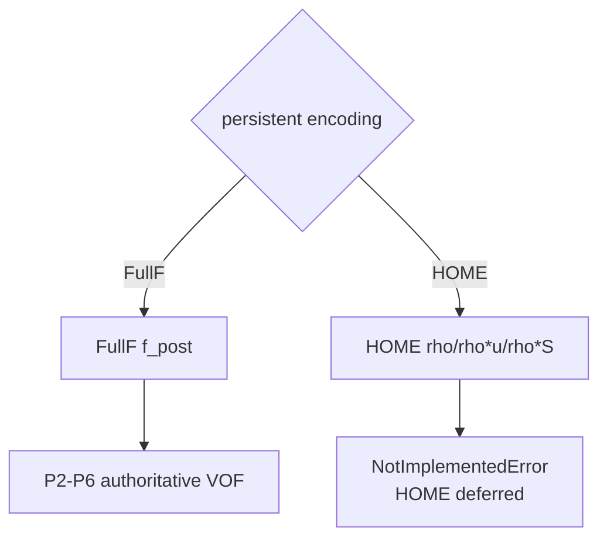
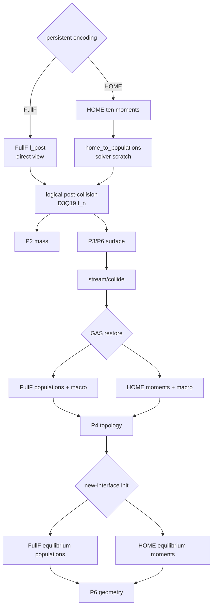
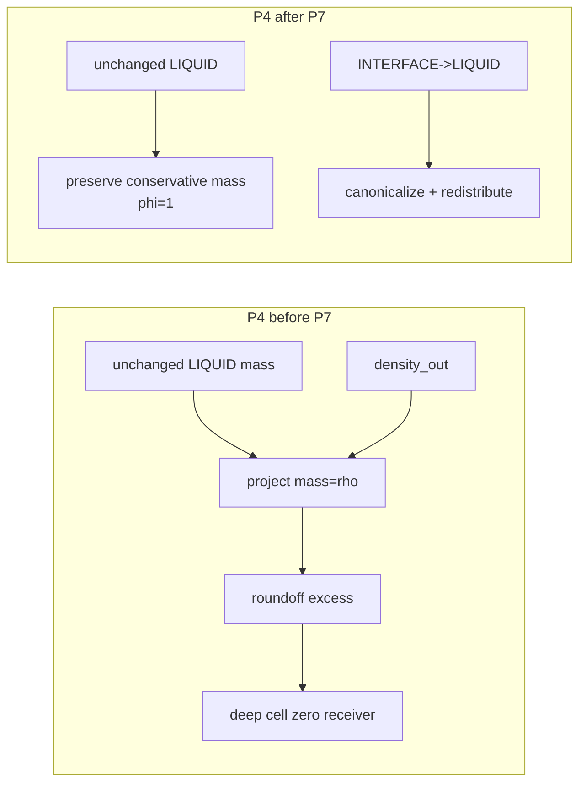
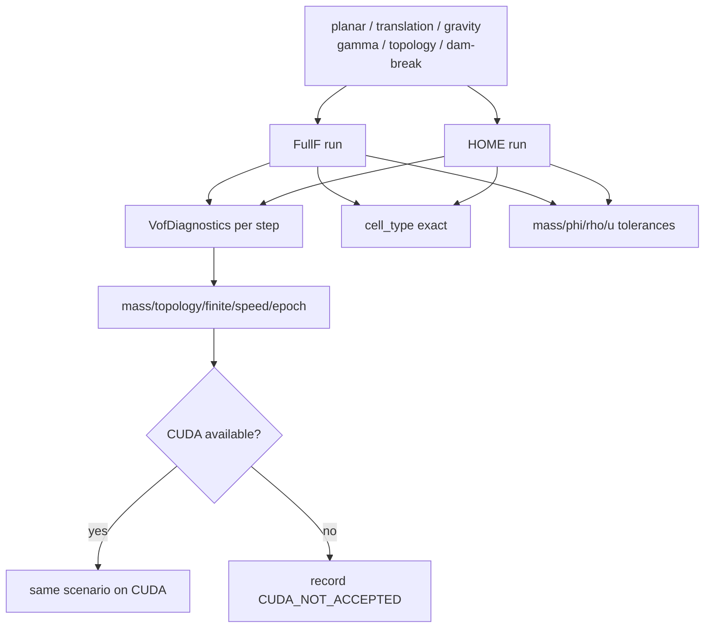

# P7 改动文件与架构差异说明

## 1. 改动目的

P7 移除 authoritative VOF 的 FullF-only 硬边界，让 FullF/HOME 共享逻辑 population
算法，并增加 closed-domain 综合验收 ledger 与条件 CUDA 门禁。

## 2. 改动前架构



改动前 P2、P3 GAS restore 和 P5 initializer 都直接依赖 `FullFLbmState.f_post`。

## 3. 改动后架构



## 4. logical population 生命周期

```mermaid
sequenceDiagram
    participant State as state_in
    participant Adapter as LogicalPopulationProvider
    participant Mass as P2
    participant Surface as P3/P6
    participant Scratch as solver scratch

    alt FullF
        State->>Adapter: direct f_post reference
    else HOME
        State->>Adapter: ten moments
        Adapter->>Scratch: decode f_post_n
    end
    Adapter-->>Mass: logical f_post_n
    Adapter-->>Surface: same logical f_post_n
    Note over Scratch: step-local; never persistent
```

## 5. P4 supersession 新旧对比



没有修改 P4 `mass_tolerance=2e-6`。

## 6. 验收数据流



## 7. 新增文件

### `vof/diagnostics.py`

新增：

```text
VofDiagnostics
collect_vof_diagnostics
validate_vof_diagnostics
```

拓扑检查覆盖 D3Q19 的九组无向邻接，不只检查六个 face neighbor。

### `newton/tests/test_lbm_vof_p7.py`

新增 11 个 HOME、cross-encoding、综合 ledger、headless dam-break 与条件 CUDA 测试。

### P7 文档

```text
24-p7-engineering-plan.md
25-p7-completion-summary.md
26-p7-change-architecture.md
```

## 8. 修改文件

### `solver.py`

- 分配 HOME logical post-collision scratch；
- P2/P3 改用 shared population provider；
- step 接受匹配的 FullF 或 HOME 双缓冲；
- GAS restore 与 P5 initializer 按 persistent encoding 分派。

### `vof/advection.py`

新增 encoding-independent `compute(state, logical_populations)`；FullF 入口成为兼容
wrapper。P2 输入闭合区分 INTERFACE 与 canonical LIQUID。

### `vof/surface.py` 与 `surface_kernels.py`

- Eq.11 接收 shared logical `f_post_n`；
- 新增 HOME GAS moment restore；
- macro/force GAS storage 一并恢复。

### `vof/kinetic_init.py` 与 `kinetic_init_kernels.py`

prepare 共享；新增 HOME equilibrium moment writer 和 host validator。

### `vof/transition.py` 与 `transition_kernels.py`

unchanged LIQUID 保留 mass；只有 INTERFACE→LIQUID 做 density canonicalization 和
excess redistribution。

### `vof/geometry.py` 与 `geometry_kernels.py`

把 near-degenerate 2-D unit-cube volume evaluator 改为稳定分段公式，避免小 normal
component 下 inclusion–exclusion 消减；PLIC 容差没有放宽。

### Public exports

导出 diagnostics dataclass、collector 与 validator。

### P1/P2/P3 supersession tests

旧 HOME fail-fast 测试升级为 HOME positive step/transport 与状态不变量测试。

### 文档状态

能力表、路线图与 README 更新为 P7 `CPU_ACCEPTED/CUDA_NOT_ACCEPTED`。

## 9. 架构不变量

```text
one logical D3Q19 population contract feeds P2 and P3
logical HOME populations are solver scratch, never persistent
GAS storage is not an active physical input in either encoding
FullF and HOME share topology, redistribution and geometry
new-interface mass remains read-only during kinetic initialization
unchanged LIQUID mass is not mistaken for transition excess
closed-domain boundary VOF flux is exactly zero
CUDA absence never becomes CUDA acceptance
solid, bubble and foam remain out of scope
```
