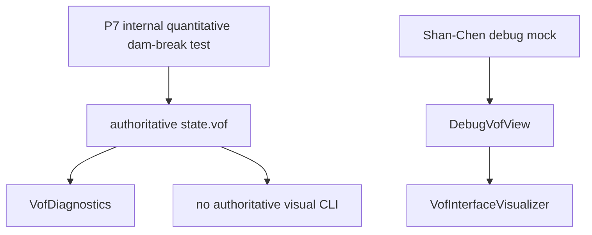
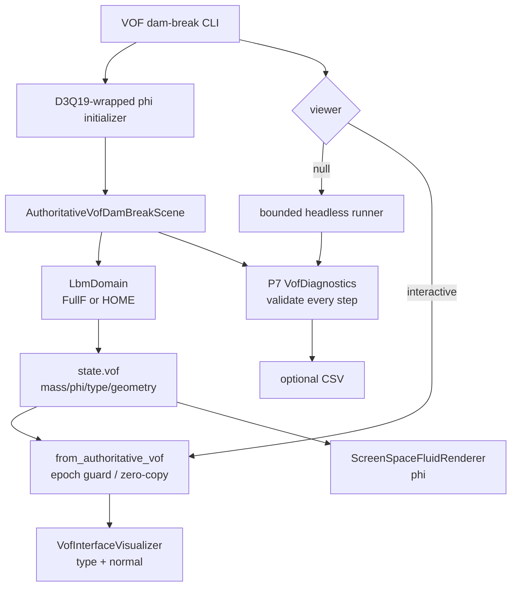
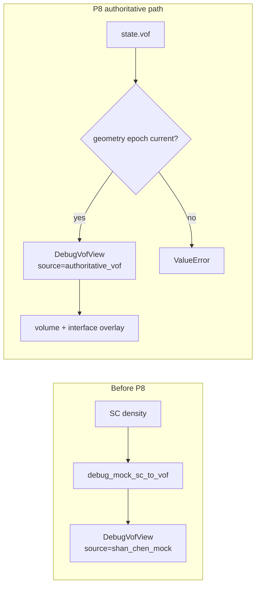
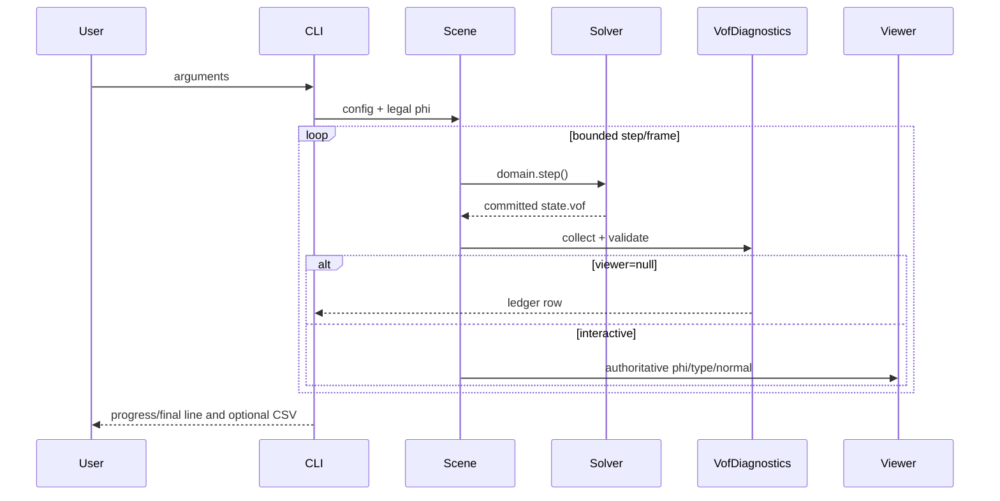
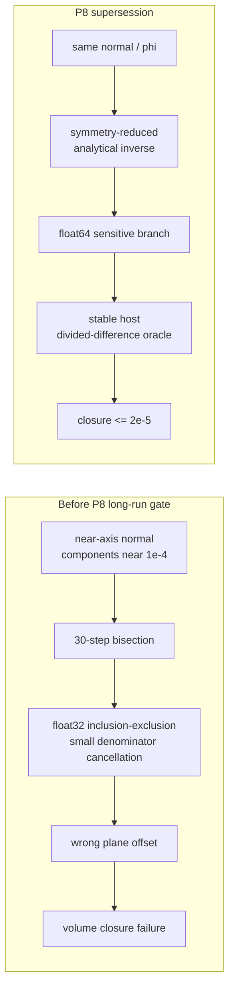

# P8 改动文件与架构差异说明

## 1. 改动目的

P8 把 P7 的定量 dam-break 场景变为可启动产品入口，同时保持物理权威状态、观察适配和
渲染完全单向。所有可视化数据都来自 `state.vof`。

## 2. 改动前关键架构



改动前 authoritative dam-break 只能作为 P7 测试运行；已有 visual adapter 只表达
Shan-Chen observation source。

## 3. 改动后关键架构



## 4. 数据权威性新旧对比



P8 保留旧 debug adapter，但 authoritative path 不经过 density threshold 或
`debug_mock_sc_to_vof`。

## 5. 运行模式时序



## 6. 新增文件

### `wanphys/examples/lbm/fluid_grid_lbm_vof_dambreak.py`

- authoritative dam-break config 与 legal interface initializer；
- FullF/HOME shared scene；
- finite headless runner、stable progress formatter 与 CSV writer；
- interactive Newton viewer wrapper；
- CPU/HOME/CUDA-guard CLI。

### `newton/tests/test_lbm_vof_p8.py`

新增 9 个 initializer、state-source、FullF/HOME、CSV、parser、device 与 fake-render
验收测试。

### P8 文档

```text
27-p8-engineering-plan.md
28-p8-completion-summary.md
29-p8-change-architecture.md
```

## 7. PLIC 数值 supersession



该 supersession 来自默认 30-step CLI 验收，不改变 PLIC 几何定义或阈值。

## 8. 修改文件

### `vof/visualization.py`

`DebugVofView` 新增 `from_authoritative_vof()`：

```text
requires non-negative epoch
requires geometry_epoch == epoch
returns direct phi/cell_type/normal references
sets source="authoritative_vof"
does not derive or copy physical arrays
```

### `vof/geometry.py` 与 `geometry_kernels.py`

- PLIC device offset 改为 symmetry-reduced analytical inverse；
- cancellation-sensitive branch 使用 float64；
- host unit-cube volume 改用 stable divided difference；
- component threshold 后重新 L1 normalize，保持一致的有效维数语义。

### `newton/tests/test_lbm_vof_p6.py`

新增从默认 dam-break 失败状态提取的两个 near-axis normal regression，不放宽 P6
volume tolerance。

### 状态文档

`00-capability-status.md`、`06-development-roadmap.md` 与 `README.md` 更新 P8
`CPU_ACCEPTED/CUDA_NOT_ACCEPTED`、启动方式及限制。

## 9. 架构不变量

```text
state.vof.mass remains the only conservative authority
visualization never writes phi/type/normal/curvature
headless and visual paths share one scene and initializer
every completed step passes the frozen P7 diagnostics
FullF and HOME use identical P8 orchestration
CSV records the in-memory ledger without changing simulation state
unavailable CUDA fails before allocation
no solid, bubble or foam dependency is introduced
```
