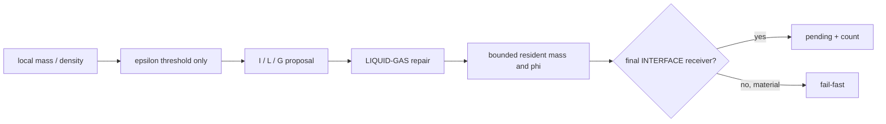
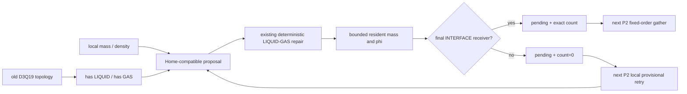
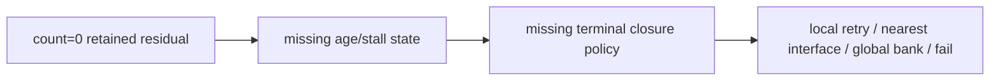

# FIX2 改动文件与架构对比

状态：`PARTIALLY_RESOLVED`

## 1. 修复前



该结构允许最后一个邻居 `I→G` 后留下 `I`，并把已有的 count=0 local-retry kernel
路径限制在 sub-tolerance roundoff。

## 2. 修复后



## 3. 关键文件

### 求解语义

- `wanphys/_src/fluid/fluid_grid/lbm/vof/transition_kernels.py`
  - proposal 接收 periodic/shape；
  - 扫描 old D3Q19 LIQUID/GAS presence；
  - no-GAS 优先 LIQUID，no-LIQUID 转 GAS。
- `wanphys/_src/fluid/fluid_grid/lbm/vof/transition.py`
  - `unresolved_excess` 改为 retained-zero-receiver 一致性 scratch；
  - strict P4 不再拒绝合法 count=0。
- `wanphys/_src/fluid/fluid_grid/lbm/vof/advection.py`
  - P2 输入允许 stored=actual=0 的 material pending。
- `wanphys/_src/fluid/fluid_grid/lbm/vof/advection_kernels.py`
  - count=0 local retry 正式覆盖 material residual。
- `wanphys/_src/fluid/fluid_grid/lbm/vof/state.py`
  - state contract 记录 retained residual。

### 诊断

- `wanphys/_src/fluid/fluid_grid/lbm/vof/runtime.py`
  - zero receiver 只增加观测计数；
  - mismatch 继续增加 invalid count。
- `wanphys/_src/fluid/fluid_grid/lbm/vof/diagnostics.py`
  - host 重新计算 actual count；
  - zero/mismatch 分类与 device 对齐。
- `wanphys/examples/lbm/fluid_grid_lbm_vof_dambreak.py`
  - progress line 增加 `zero_rx`。

### 测试

- `newton/tests/test_lbm_vof_fix2.py`
  - epoch-832 局部拓扑复现；
  - material residual 两步生命周期。
- `newton/tests/test_lbm_vof_p4.py`
  - 独立 no-LIQUID/no-GAS oracle；
  - zero receiver 从 fail 改为 retained。
- `newton/tests/test_lbm_vof_p2.py`
  - HOME no-GAS closure 与 resident+pending 守恒。
- `newton/tests/test_lbm_vof_p3.py`
  - 使用合法双侧界面 fixture 隔离 P2/P3 handoff。
- `newton/tests/test_lbm_vof_fix1.py`
  - zero receiver accepted；mismatch rejected。

## 4. 没有改变

```text
phi geometry remains bounded
resident+pending remains the mass authority
D3Q19 equal-share receiver definition remains final INTERFACE only
P5 new-interface kinetic handoff remains unchanged
surface tension / PLIC / curvature remain unchanged
no solid / bubble / foam / open-boundary expansion
```

## 5. 未完全解决的架构空缺



FIX2 只实现第一节点。后两节点必须由后续独立 phase 冻结，不能在本修复中猜测。
