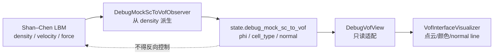

# VOF P2–P8 前置阅读：P0/P1——先把“旧世界”和“正式状态”分开

## 为什么要补这份 P0/P1 阅读

P2–P8 之前有一个关键分叉：

```text
P0：冻结已有 LBM / Shan–Chen，并建立只读的 VOF 形状观察副本
P1：引入正式 authoritative VOF 状态，并安全初始化、复制和验证它
```

如果跳过 P0/P1，很容易把下面两件事误认为同一件事：

```text
从 Shan–Chen density 映射出一个 phi 用来显示
用 mass/phi/cell_type 推进守恒的 VOF
```

它们的数学外观相似，但数据所有权、守恒语义和写入权限完全不同。

## 1. P0/P1 的阶段边界

| 阶段 | 解决的问题 | 结束后能做什么 | 结束后还不能做什么 |
|---|---|---|---|
| P0 | 冻结已有 LBM/SC 行为，建立 debug observation | 运行原有 LBM，显示 VOF-shaped debug view | 正式 VOF 初始化、质量输运、自由面 step |
| P1 | 建立 authoritative `state.vof`，完成初始化和双缓冲 | 构造并验证正式 VOF 初始状态 | P2 平流、P3 surface、类型转换、几何 |

> P0 的 debug VOF 是“观察 LBM 结果”；P1 的 authoritative VOF 是“为后续 VOF 物理准备正式账本”。

## 2. P0：冻结旧系统，不要误以为已经有 VOF

原文：`docs/wanphys/lbm/VOF/07-p0-baseline.md`。

P0 冻结结论：

```text
P0 = CPU_ACCEPTED
CUDA = CUDA_NOT_ACCEPTED
authoritative VOF = 尚未实现
```

P0 冻结的是：

```text
已有 LBM streaming
已有 collision / force pipeline
已有 Shan–Chen 多相路径
Shan–Chen -> VOF-shaped debug observation
```

它没有冻结守恒的 VOF mass transport；P0 中 `interface_model="vof"` 仍然是 fail-fast 或尚未开放能力。

## 3. P0 的 debug observation 数据流



P0 的 debug 填充率大致是：

$$
\phi_{debug}=\operatorname{clamp}\left(\frac{\rho-\rho_g}{\rho_l-\rho_g},0,1\right).
$$

它回答：

> 根据当前 Shan–Chen density，哪些格子看起来像气体、界面、液体？

它不回答液体质量下一步应该怎样沿格链搬运，因为 debug state 没有 `mass`，也没有正式 VOF 账本。

## 4. P0 的 debug 容器和写入权限

源码：`wanphys/_src/fluid/fluid_grid/lbm/vof/state.py` 的 `DebugMockScToVofState`。

包含：

```text
phi / cell_type / normal
epoch / normal_valid_epoch
```

不包含：

```text
mass / pending_excess / reference_mass
PLIC offset / curvature
```

P0 的更新时机是：

```text
LBM step 写出 density/velocity/force
→ DebugMockScToVofObserver.update_from_density()
→ 更新 debug phi/type/normal
→ visualizer 只读使用
```

关键测试要求：打开/关闭 observation 后，populations、density、velocity、force 逐元素一致。

| 数据 | P0 权威写入者 | P0 含义 |
|---|---|---|
| Shan–Chen density | LBM/SC pipeline | 正式 LBM 宏观量 |
| debug `phi/cell_type` | debug observer | density 派生观察值 |
| debug `normal` | 调试几何计算 | 显示方向 |
| `state.vof.mass/phi/cell_type` | P0 没有 | 正式 VOF 尚未出现 |
| render points/colors/lines | visualizer | 渲染数据 |

Visualizer 可以转换坐标、压缩点云、生成颜色和 normal line，但不能改物理字段，也不能把 debug phi 写回正式 VOF。

## 5. P0 为什么必须先冻结

P1 只能在 P0 基线上增加正式 VOF 状态，不能顺便重写已有 LBM 数值算法。P1 不应修改：

```text
FullF/HOME kinetic encoding
HOME population reconstruction
streaming / moment collection
force closure
SRT/TRT/MRT/NOCM collision
普通 domain boundary
```

读 P0 时要问：

```text
这个改动是 VOF 新增逻辑吗？
还是偷偷改变了旧 LBM 的行为？
```

## 6. P1：正式 VOF 状态第一次出现

原文：`docs/wanphys/lbm/VOF/08-p1-engineering-plan.md`。

P1 的目标是让以下操作安全成立：

```text
构造 interface_model="vof" 的模型
→ 分配 state_in.vof / state_out.vof
→ 用已有 LBM 初始化 FullF/HOME kinetic
→ 读取实际 state.density
→ 用 phi0 构造 mass/phi/cell_type
→ 检查拓扑和不变量
→ 生成独立双缓冲
```

P1 完成后仍必须 fail-fast：

```text
domain.step()
质量平流
gas-to-interface population completion
类型转换和质量重分配
新界面 kinetic 初始化
normal / PLIC / curvature / surface tension
```

所以 P1 是“正式状态的安全构造阶段”，不是“可运行自由表面的阶段”。

## 7. P1 的最小 authoritative 状态

P1 计划最初冻结的最小容器是：

```python
class VofGridState:
    mass
    phi
    cell_type
```

P1 当时不加入：

```text
initialized / epoch / active_mask
normal / plic_offset / curvature
transition / redistribution scratch
HOME moment 副本 / density 副本
```

当前源码里的 `VofGridState` 已经包含 P4–P6/FIX1 后新增的 pending、几何和 epoch 字段。因此读 P1 文档时要区分：

```text
P1 当时冻结的最小状态
当前最终实现中的扩展状态容器
```

## 8. P1 的三个正式字段

### `mass`：唯一守恒权威

初始化关系：

$$
mass^0=\rho^0\phi_{input},
\qquad
\phi^0=\frac{mass^0}{\rho^0}.
$$

### `phi`：持久派生缓存

它保留 `phi0` 的填充率语义，但用实际初始化 density 重新闭合。

### `cell_type`：持久拓扑

```text
phi == 0       -> GAS
0 < phi < 1    -> INTERFACE
phi == 1       -> LIQUID
```

P1 不保存第二份 `active_mask`；后续由 `cell_type != GAS` 即时派生。

## 9. P1 为什么使用实际 `state.density`

公共 API 有 `rho0`，但 VOF 初始化不直接把它当成每个格子的最终密度。正确顺序是：

```text
initialize_equilibrium(candidate_in, rho0, u0)
→ LBM 写 candidate_in.density
→ VOF 读取 candidate_in.density
→ 计算 mass = density * phi0
```

这样 FullF/HOME 都通过同一个公共接口接入 VOF，而不是让 VOF 直接读取：

```text
HomeLbmState.rho
HomeLbmState.rho_u_*
HomeLbmState.rho_s_*
```

## 10. P1 按类型初始化

```text
GAS:
    mass = 0
    phi = 0

LIQUID:
    mass = density
    phi = 1

INTERFACE:
    mass = density * phi_input
    phi = mass / density
```

已有 `solid_phi` 在 P1 只用于拒绝不支持的 solid；不参与 VOF 分类、质量计算或拓扑规则。

## 11. P1 初始拓扑：不静默修复 L–G 直连

P1 用 D3Q19 的 18 个非零方向检查：

```text
发现 LIQUID ↔ GAS 直接邻接
→ ValueError
→ 报告数量和首个 cell/方向
```

要求用户提供：

```text
LIQUID ↔ INTERFACE ↔ GAS
```

参考实现可能把邻接 FLUID 的 GAS 自动改为 `INTERFACE, phi=0.5`，但 P1 不复制，因为这会改变初始几何和质量，并提前引入 P5 donor/kinetic 决策。

P1 的选择是拒绝不合法输入，而不是悄悄替用户修改初始状态。

## 12. P1 的初始化事务

公共入口：

```python
domain.initialize_vof(
    phi0,
    rho0=1.0,
    u0=(0.0, 0.0, 0.0),
)
```

严格顺序：

```text
1. 检查 interface_model、rho0/u0 和 solid 配置
2. 检查 phi0 shape、dtype、finite、[0,1]
3. 转为 C-contiguous float32，按精确 0/1 分类
4. 用周期设置检查 D3Q19 L-G 邻接
5. 创建不属于 domain 当前状态的 candidate_in
6. 初始化 candidate_in 的 LBM equilibrium
7. 检查实际 density finite 且 >0
8. 用实际 density 初始化 VOF mass/phi/type
9. 验证 candidate_in
10. candidate_out = candidate_in.clone()
11. 验证两个 buffer 数值相同且数组独立
12. 全部成功后一次性替换 domain 两个 buffer
```

初始化失败时：

```text
已有成功状态 -> 保留旧 state_in/state_out
首次初始化   -> 不提交 candidate
```

这和运行时 step 的事务思想一致：先构造候选，再验证，再提交。

## 13. P1 的 clone/copy/clear

`VofGridState` 的核心方法是：

```python
def clear(self): ...
def copy_to(self, target): ...
def clone(self): ...
```

P1 必须覆盖：

```text
mass / phi / cell_type
```

验证重点：

```text
clone 数值相同
clone 数组不 alias
clear 后 mass=0、phi=0、cell_type=GAS
copy_to 后目标与源一致
```

后续新增 pending/geometry/epoch 后，clone/copy/clear 也必须同步扩展，否则双缓冲会读到旧字段。

## 14. P1 源码阅读路线

推荐：

```text
1. vof/state.py
   确认 VofGridState 与 DebugMockScToVofState 是两个容器

2. lbm/state.py
   看 off/shan_chen/vof 的分配矩阵

3. domain.py.initialize_vof()
   追 candidate、equilibrium、初始化、验证、clone、替换

4. vof/initialization.py 和 vof/validation.py
   看 phi0 分类、拓扑拒绝、mass 生成和失败语义
```

第一遍不要钻 Warp 线程索引，先确认“谁是输入、谁是输出、何时提交”。

## 15. P0/P1 和 P2 的接口

P1 给 P2 的是三样干净原材料：

```text
canonical mass
canonical bounded phi
legal GAS/INTERFACE/LIQUID topology
```

P2 在此基础上新增 solver-owned：

```text
mass_tmp / phi_tmp / mass_delta
```

P1 不提前实现质量通量，P2 也不重新发明初始化逻辑。

## 16. P0/P1 最容易误读的四件事

### 误读一：debug phi 是正式 VOF phi

不是。debug phi 来自 Shan–Chen density，不守恒，没有 mass。

### 误读二：P1 完成后可以普通 `domain.step()` 推进 VOF

不是。P1 的 step 仍然 fail-fast，P2/P3/P4/P5 还没有接齐。

### 误读三：`rho0` 就是 VOF 初始化必须使用的密度数组

不是。`rho0` 是 LBM 初始化输入，VOF 初始化读取实际写出的 `state.density`。

### 误读四：L-G 直连会自动插一层 interface

P1 有意拒绝，不静默改变用户几何和质量；自动修复属于后续拓扑/kinetic 设计。

## 17. P0/P1 验收证据怎么看

P0 重点看：

```text
核心配置/碰撞/力/streaming/观察回归
观察开关前后物理数组一致
debug clone/copy/clear
visualizer 只读
```

P1 重点看：

```text
正式 state.vof 分配矩阵
phi0 分类和 L-G 直连拒绝
mass = actual density * phi0
FullF/HOME 初始化后的 density 接口一致
clone/copy/clear
candidate 失败不替换 current buffers
```

`CPU_ACCEPTED` 只说明当前 CPU 范围内通过；`CUDA_NOT_ACCEPTED` 表示当前 Warp 环境没有可验收 CUDA，不等于 CUDA 失败。

## 18. 前置部分小结

```text
P0:
    Shan-Chen density
        -> debug phi/type/normal
        -> 只读 visualizer

P1:
    phi0 + actual LBM density
        -> authoritative mass/phi/cell_type
        -> candidate double buffers
        -> initialized legal state

P2 onward:
    authoritative state
        -> transport / surface / topology / kinetic / geometry
```

> P0 保护旧 LBM 行为，P1 建立正式 VOF 的起始账本；P2 才开始让这本账动起来。

