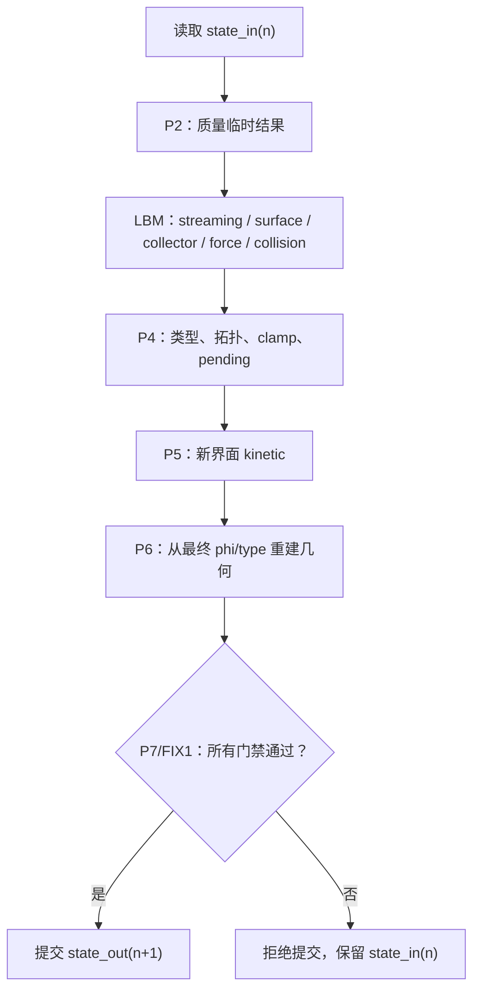

# VOF P2–P8 讲解第一部分：先建立架构地图

## 这一部分先解决什么问题

已经理解 VOF 原理后，最容易走偏的是一上来钻进 `*_kernels.py`，只看到 Warp 数组、索引和并行写入，却不知道代码为什么这样组织。

第一部分只做一件事：把代码实现看成一条有入口、有中间站、有提交点的生产线。

读完后应该能回答：

- `LbmModel`、`LbmDomain`、`LbmSolver` 各自负责什么？
- 当前状态和下一状态为什么分开？
- VOF 数据和 LBM kinetic 数据为什么分开？
- P2–P8 在一个 step 中分别站在哪个位置？
- 一个阶段失败时，为什么不会提交半成品？

## 1. 先背一句总纲

> 两套状态仓库 + 一条事务式流水线 + 一组阶段化工人 + 一套质量审计系统。

翻译成大白话：

- **状态仓库**：真正跨 step 记住的 population、`mass`、`phi`、类型和几何。
- **流水线**：每个时间步按确定顺序执行。
- **阶段化工人**：P2、P3、P4、P5、P6 各自只负责一类工作。
- **质量审计**：交换双缓冲前检查守恒、范围、拓扑、有限性、速度和几何版本。

> 每个阶段只能从规定的输入拿数据，把结果写到规定的位置，最后由统一的提交门决定这一步是否生效。

## 2. 总体数据流

```mermaid
flowchart LR
    Model["LbmModel\n配置与能力开关"]
    Domain["LbmDomain\n双缓冲与初始化"]
    In["state_in\n当前已提交状态"]
    Solver["LbmSolver.step\n总调度器"]
    Out["state_out\n候选下一状态"]
    P2["P2 质量搬运"]
    P3["P3 自由面补全"]
    LBM["Streaming / Collision\n基础 LBM"]
    P4["P4 类型转换\n质量重分配"]
    P5["P5 新界面初始化"]
    P6["P6 几何重建\n表面张力"]
    Check["P7/FIX1 诊断验收"]
    View["P8 可视化 / CSV"]
    Model --> Domain
    Domain --> In
    In --> Solver
    Solver --> P2 --> P3 --> LBM --> P4 --> P5 --> P6 --> Check
    Check -->|"全部合法才提交"| Out
    Out -->|"交换双缓冲"| In
    Out --> View
```



这不是说每个阶段只调用一个函数，而是说所有阶段都围绕同一个候选 `state_out` 组织。基础 LBM 线和 VOF 质量/类型线会产生各自的 scratch，最后在 P4/P5/P6 附近汇合。

## 3. 四个总角色

### 3.1 `LbmModel`：规则和开关

入口：`wanphys/_src/fluid/fluid_grid/lbm/model.py`。

```python
@dataclass
class LbmModel(FluidGridModelBase):
    encoding: str = "fullf"
    interface_model: str = "off"
    vof_mass_scheme: str = "fslbm_neighbor"
    vof_atmosphere_pressure: float = 1.0 / 3.0
    vof_surface_tension: float = 0.0
    vof_transition_epsilon: float = 1.0e-4
    vof_runtime_profile: str = "strict"
    vof_validation_interval: int = 60
```

它像施工图，不是工人，也不是仓库：

| 参数 | 白话解释 |
|---|---|
| `encoding` | FullF 或 HOME 的长期 kinetic 存法 |
| `interface_model` | `off`、`shan_chen` 或正式 `vof` |
| `vof_mass_scheme` | P2 质量交换方案，当前冻结为 `fslbm_neighbor` |
| `vof_atmosphere_pressure` | P3/P6 计算气相侧压力的输入 |
| `vof_surface_tension` | P6 的常数 `gamma` |
| `vof_transition_epsilon` | P4 类型转换阈值，默认 `1e-4` |
| `vof_runtime_profile` | strict/sampled/device/off 审计策略 |

源码还说明 lattice timestep 固定为 1，`step(dt=...)` 的 `dt` 只是 API 兼容参数，内部不改变 lattice 推进。

### 3.2 `LbmDomain`：当前/下一份状态的拥有者

入口：`wanphys/_src/fluid/fluid_grid/lbm/domain.py`。

```python
self._state_in: LbmStateBase | None = None
self._state_out: LbmStateBase | None = None
```

- `state_in`：当前已提交、可信、只读的快照；
- `state_out`：正在加工的下一版本候选。

只有 solver 正常返回，`domain.step()` 才执行：

```python
self._state_in, self._state_out = self._state_out, self._state_in
```

如果中途验证失败，异常会阻止交换，上一份 `state_in` 仍然是 current。

### 3.3 `LbmSolver`：时间步总调度器

入口：`wanphys/_src/fluid/fluid_grid/lbm/solver.py` 的 `LbmSolver.step()`。

第一遍读它时，不要马上追每个 `wp.launch()` 的线程索引，先追阶段边界：

```text
source validation
→ P2 mass transport
→ streaming
→ P3 surface completion
→ collector / force / collision
→ P4 transition
→ P5 kinetic initialization
→ commit
→ P6 geometry
→ target validation
→ diagnostics
```

### 3.4 `state`：持久状态容器

`LbmStateBase` 保存公共的 `density`、速度、力、固体字段，以及条件分配的 `vof` 或 debug observer。kinetic 部分按配置二选一：

```text
FullF -> state.f_post，19 个 D3Q19 populations
HOME  -> 10 个 rho/rho*u/rho*S moment fields
```

这两种长期编码不是两套 VOF 算法。P7 会把它们统一成 logical D3Q19 population，供 P2/P3/streaming 使用。

## 4. 两个状态仓库不要混淆

### 正式 VOF：`state.vof`

正式状态包括：

```text
mass / pending_excess / pending_receiver_count
phi / cell_type
normal / plic_offset / curvature
epoch / geometry_epoch / reference_mass
```

正式封闭域账本是：

$$
M=\sum_x \mathrm{mass}(x)+\sum_x \mathrm{pending\_excess}(x).
$$

### Shan–Chen 观察副本：`state.debug_mock_sc_to_vof`

它只在 Shan–Chen + debug 开关时存在，由密度派生：

$$
\phi_{debug}=\operatorname{clamp}\left(\frac{\rho-\rho_g}{\rho_l-\rho_g},0,1\right).
$$

它没有 `mass`，不能进入 streaming、collision、forcing、VOF transport 或边界处理。它只是“把现有结果画成 VOF 风格”。

## 5. 一步为什么叫事务式

用数据库打比方：

```text
state_in       已提交快照
scratch        事务临时表
state_out      待提交新快照
validators     commit constraints
buffer swap    commit
```



`mass_tmp`、`phi_tmp`、`f_star`、transition mask 和 donor 统计都只是半成品。它们通过检查前，不能被下一步视为正式物理状态。

## 6. LBM 公式在架构中的位置

基础 LBM 从 populations 收集：

$$
\rho=\sum_i f_i,
\qquad
\rho\mathbf u=\sum_i\mathbf c_i f_i+\frac12\mathbf F.
$$

因此要区分：

$$
\mathbf j_{raw}=\sum_i\mathbf c_i f_i,
\qquad
\mathbf u_{physical}=\frac{\mathbf j_{raw}+\mathbf F/2}{\rho}.
$$

P2 使用旧时间层的 logical `f` 和 VOF/density 语义；streaming 产生 `f_star`；collector 从 `f_star` 收集 `rho*` 和 moments；collision 产出 kinetic 候选；P4/P5 再把 kinetic 和 VOF 类型对齐。

## 7. P2–P8 用“工人职责”记忆

| 阶段 | 真正负责的事情 | 不负责什么 |
|---|---|---|
| P2 | 搬运液体质量 | 类型转换、几何 |
| P3 | 补界面缺失 population | 让 GAS 跑完整 LBM |
| 基础 LBM | streaming、宏观量、力、collision | VOF 账本提交 |
| P4 | 类型、拓扑、clamp、质量路由 | 新界面 kinetic |
| P5 | donor 和新界面 FullF/HOME 初始化 | PLIC/曲率 |
| P6 | normal、PLIC、curvature、表面张力输入 | 质量输运 |
| P7/FIX1 | 守恒、有限性、范围、拓扑、epoch 门禁 | 修复错误 |
| P8 | 只读可视化、headless、CSV | 生成另一套 VOF 物理 |

## 8. 第一遍源码阅读顺序

### 第一步：读配置

只看 `model.py` 中的：

```text
interface_model / encoding / vof_mass_scheme
vof_atmosphere_pressure / vof_surface_tension
vof_transition_epsilon / vof_runtime_profile
```

### 第二步：读初始化和交换

看 `domain.py` 的：

```text
initialize_vof
prepare_initial_vof
initialize_equilibrium
validate_initialized_vof_state
candidate_out = candidate_in.clone()
_state_in, _state_out = _state_out, _state_in
```

### 第三步：只读 `LbmSolver.step()` 的调用链

先建立这些函数名的位置：

```text
_validate_vof_transaction_source
_vof_postcollision_populations
_vof_mass_transport.compute
_stream_to_populations
_vof_surface_boundary.complete_populations
_write_observables
_vof_topology_transition.compute
_vof_kinetic_initializer.initialize_fullf / initialize_home
_vof_topology_transition.commit
_vof_interface_geometry.compute
_validate_vof_transaction_target
collect_vof_diagnostics / validate_vof_diagnostics
```

第一遍能复述调用链，再进入具体 kernel。

## 9. 第一部分小结

`LbmModel` 规定规则，`LbmDomain` 持有 current/next 双缓冲，`LbmSolver.step()` 组织基础 LBM 和 VOF 阶段。正式 VOF 在 `state.vof`，Shan–Chen 观察数据在独立 debug 容器。P2–P6 通过 scratch 加工候选 `state_out`，P7/FIX1 检查守恒、范围、拓扑、有限性和 epoch；全部通过后才交换双缓冲，P8 再只读地使用同一份 authoritative 状态。

