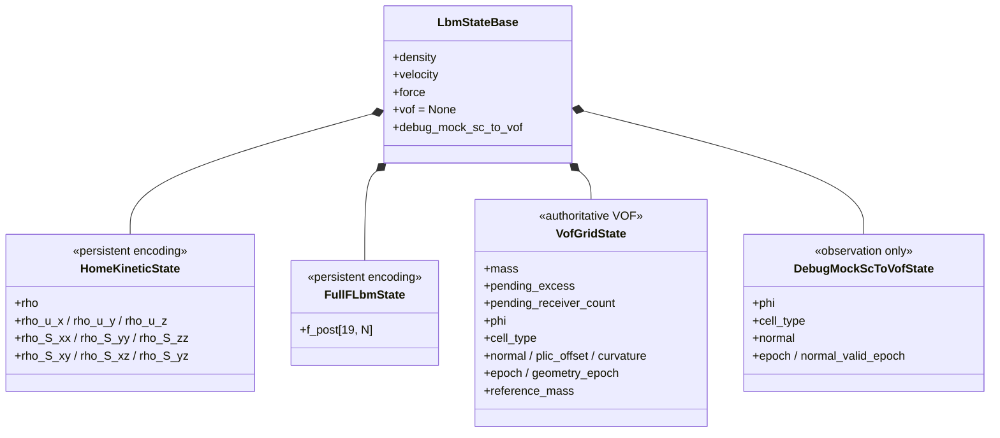

# VOF P2–P8 讲解第二部分：状态地图——谁是账本，谁是缓存，谁只是显示

## 这一部分先记住一句话

> 先问“这份数据要不要跨 step 记住”，再问“它是什么公式算出来的”。

在同一个格子附近，可能同时看到 `state.density`、`state.vof.mass`、`state.vof.phi`、`cell_type`、几何字段、solver scratch 和 debug phi。它们都像“液体状态”，但职责完全不同。

项目的四层分类是：

```text
Persistent state    跨 step 保存，参与双缓冲交换
Derived/cache       可以从持久状态重建，也可能为性能暂存
Scratch             只服务当前 step，由 solver 复用
Observation         只为显示或调试，不能控制正式物理
```

## 1. 对象关系图



三个配置的状态结构不同：

| 配置 | 正式界面物理 | `state.vof` | debug 副本 |
|---|---|---|---|
| `interface_model="off"` | 单相 LBM | 无 | 无 |
| `interface_model="shan_chen"` + debug | Shan–Chen | 无 | 有 |
| `interface_model="vof"` | 守恒 VOF | 有 | 与观察开关无关 |

正式 VOF 即使不显示，也必须分配 `state.vof`。

## 2. LBM `density` 和 VOF `mass` 不是一回事

### `state.density`

LBM 宏观密度来自：

$$
\rho(x)=\sum_i f_i(x).
$$

它回答：

> 这个格子当前的 kinetic 状态对应什么宏观密度？

### `state.vof.mass`

它回答：

> 这个格子账面上实际存了多少液体质量？

它由 P2 的质量输运和 P4 的类型转换/重分配产生，不是每一步都简单写成 `density * phi`。

因此要把两条线分开：

```text
LBM line: populations -> density/momentum/velocity -> collision
VOF line: populations + old VOF state -> mass/phi/type -> topology
```

## 3. `cell_type`：格子的身份证

`vof/contracts.py` 定义：

```python
class VofCellType(IntEnum):
    GAS = 0
    INTERFACE = 1
    LIQUID = 2
```

```text
LIQUID      完全由液体占据
INTERFACE   自由表面穿过这个格子
GAS         不保存 resident liquid mass
```

它不是固体标记，也不是“population 是否有效”的标记。固体由 `solid_phi`、`solid_body_id` 描述；kinetic 语义由 FullF/HOME 和 link 规则决定。

它的工程作用是：

1. P2 决定哪些格子参与质量交换；
2. P3 识别 `GAS → INTERFACE` 缺失方向；
3. P4 负责最终转换和拓扑修复。

所以 P2/P3 可以读取身份证，但正式 transition 写权限集中在 P4。

## 4. `phi`：有界占据率，不是完整账本

直觉上：

```text
phi = 0       全气体
phi = 1       全液体
0 < phi < 1   界面
```

工程语义还要加一句：

> `phi` 是几何、分类和质量通量的权重；`mass` 才是 resident liquid mass 的权威载体。

成功提交后：

```text
GAS:        phi = 0
INTERFACE:  phi = mass / density，且在 [0,1]
LIQUID:    phi = 1
```

LIQUID 不一定每一步写成 `mass/density`。P7/FIX1 修复后，unchanged LIQUID 要保留 conservative resident mass，不能把微小可压缩性误差当成 excess。几何语义是 `phi=1`，账本中的 `mass` 仍要单独验证。

## 5. 正式守恒量：`mass + pending_excess`

### 为什么有 pending

多余质量理想上应立即分给邻居，但接收者可能没有容量，或拓扑暂时没有合法 receiver。直接丢掉会破坏守恒；直接写入会让 `phi>1`。

FIX1/FIX2 的一拍延迟规则是：

```text
本步：sender clamp 到合法 resident mass/phi
本步：未能安全搬走的 signed transfer 写入 pending_excess
下一步：P2 按固定顺序 gather
```

### 守恒公式

封闭域的正式账本是：

$$
M^n=\sum_x m^n(x)+\sum_x e^n(x),
$$

其中 $m$ 是 `mass`，$e$ 是 `pending_excess`。验收比较：

$$
\frac{|M^{n+1}-M^0|}{M^0}
\leq \text{mass tolerance}.
$$

### receiver count

```text
pending_excess           signed mass transfer
pending_receiver_count   final D3Q19 INTERFACE receiver 数量
```

它不是界面总数，也不是几何字段，只用于下一拍质量路由。

FIX2 中，若确实没有合法 receiver，count 为 0 的 material residual 会保留并重试；“保存的数量和实际拓扑数量不一致”才是非法路由，会在提交前 fail-fast。

## 6. 派生几何：normal、PLIC、curvature

```text
normal       液体指向气体的单位法向
plic_offset  centered unit cube 中的界面平面偏移
curvature    由法向散度得到的平均曲率
```

关系可以写成：

$$
\mathbf n=\text{Parker--Youngs}(\phi\text{ stencil}),
$$

$$
\text{PLIC plane}:\quad \mathbf n\cdot\mathbf x=\alpha(\phi,\mathbf n),
$$

$$
\kappa\approx-\frac12\nabla\cdot\mathbf n.
$$

PLIC 只回答“液面在格子里放在哪里”，不负责搬运质量。

曲率会进入下一步自由面密度：

$$
\rho_g=\frac{p_{atmos}-2\gamma\kappa}{c_s^2}.
$$

因此必须满足：

```text
geometry_epoch == epoch
```

否则就是“新 phi/type 配旧 geometry”，不能继续做表面张力 reconstruction。

## 7. epoch：给派生数据盖时间戳

```python
self.epoch = -1
self.geometry_epoch = -1
self.reference_mass = 0.0
```

| 字段 | 白话含义 |
|---|---|
| `epoch` | 正式 VOF 是第几步 |
| `geometry_epoch` | 几何根据第几步 VOF 算出 |
| `reference_mass` | 初始化的封闭域质量基准 |

成功推进后：

```text
target epoch = source epoch + 1
target geometry_epoch = target epoch
reference_mass 不变
```

source gate 会拒绝：未初始化、source geometry 过期、两个 buffer 的 reference mass 不一致、buffer alias 等情况。因此 epoch 不是日志计数器，而是数据一致性的门禁。

## 8. FullF 和 HOME：两种仓库存法，一个逻辑接口

### FullF

```text
state.f_post[q, x], q = 0 ... 18
```

P2/P3/streaming 需要方向 population 时可以直接读，但内存较大。

### HOME

长期保存：

```text
rho
rho*u_x, rho*u_y, rho*u_z
rho*S_xx, rho*S_yy, rho*S_zz
rho*S_xy, rho*S_xz, rho*S_yz
```

需要 `f_i` 时由 Hermite reconstruction：

$$
f_i=\rho w_i\left[
1+\frac{\mathbf c_i\cdot\mathbf u}{c_s^2}
+\frac{\mathbf H^{[2]}(\mathbf c_i):\mathbf S}{2c_s^4}
+\cdots\right].
$$

源码字段是 density-weighted 的 `rho*u` 和 `rho*S`，所以不是简单的 `ux`、`Sxx`。

### P7 shared logical population

```text
FullF -> state.f_post
HOME  -> decode 10 moments -> solver-owned logical_f_post scratch
```

于是：

```text
P2 读取 f^n
P3 读取 local opposite f^n
streaming 形成 f_star
collision 写回 FullF 或 HOME
```

HOME 解码结果是 scratch，不进入 clone/copy/checkpoint，也不能和 streamed `f_star` 混用。

## 9. Scratch 为什么不属于 state

solver 会复用：

```text
_f_star                 streamed populations
_moments                collector 工作区
_ux/_uy/_uz             临时速度
_fx/_fy/_fz             临时力密度
_vof_logical_f_post     HOME 解码视图
VofMassTransport        P2 工作台
VofSurfaceBoundary      P3 工作台
VofTopologyTransition   P4 工作台
VofKineticInitializer   P5 工作台
VofInterfaceGeometry    P6 工作台
```

共同特征：

1. 只服务当前 step；
2. 可被下一步覆盖复用；
3. 不是用户意义上的 current state；
4. 不应作为 authoritative VOF 写入 checkpoint。

例如 `mass_tmp` 是“这一步的候选质量”，不是已经提交的 `state.vof.mass`。

## 10. 读写权限表

| 数据 | 主要读取者 | 正式写入者 | Visualizer 能否写 |
|---|---|---|---|
| `vof.mass` | P2/P4/diagnostics | initializer、P4 commit | 不能 |
| `pending_excess` | P2/P4/diagnostics | P4/FIX1/FIX2 | 不能 |
| `pending_receiver_count` | P2/diagnostics | P4 topology | 不能 |
| `vof.phi` | P2/P4/P6/P8 | initializer、P4/P5 | 不能 |
| `vof.cell_type` | P2/P3/P4/P5/P6 | P4 commit | 不能 |
| `vof.normal` | P3/P6/P8 | P6 geometry | 不能 |
| `vof.plic_offset` | P6/diagnostics | P6 geometry | 不能 |
| `vof.curvature` | P3/P6/P7 | P6 geometry | 不能 |
| `vof.epoch` | transaction/diagnostics | commit | 不能 |
| `density` | LBM/P4/P5/P7 | collector/output | 不能 |
| `f_star` | collector/collision/P3 | streaming/boundary | 不适用 |
| `debug_mock_sc_to_vof.*` | debug view | debug observer | 只能读 |

P8 可以做点云压缩、坐标转换、颜色和 normal line，但不能借渲染机会修改物理状态。

## 11. 三个小例子

### LIQUID 格子

```text
cell_type = LIQUID
phi       = 1
mass      = 守恒账本中的 resident mass
```

不能因为 `phi=1` 就推断 `mass == density`。

### INTERFACE 格子

```text
cell_type = INTERFACE
0 < phi < 1
mass      ≈ density * phi
normal    = 液体指向气体
plic      = 格内界面平面
curvature = 下一步 Eq.12 的输入
```

pending transfer 是额外账本通道，不直接塞进 `phi`。

### 没有 receiver 的 residual sender

```text
resident mass/phi       保持 bounded canonical
pending_excess          保留未丢失的 signed transfer
pending_receiver_count  可能为 0
```

它不是几何意义上的“液体格子”，而是等待拓扑重新出现合法 receiver 的转账残留。FIX2 当前允许重试，但不宣称所有长期 residual 都已经自动消散。

## 12. 第二部分小结

判断一个字段时依次问：

1. 它是不是跨 step 的权威事实？
2. 它是否参与守恒？`mass` 和 `pending_excess` 参与，`phi` 不单独作为总账，几何不参与质量守恒。
3. 它是 FullF/HOME 的持久编码，还是 logical population/f_star scratch？
4. 它的 epoch 是否和其他派生数据一致？

下一部分把这些状态按时间层排成一条线，解释为什么 P2 先读旧状态、为什么 `f_star` 不能代替 `f_post`，以及两条主线最后怎样汇合。

