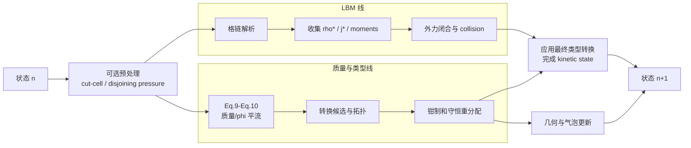

# VOF P2–P8 讲解第三部分：单步时序——两条主线怎样汇合

## 这一部分先给一个最重要的答案

VOF 的一个时间步不是“把所有数组都加一遍”，而是多个时间层的数据依次经过流水线：

```text
state_in(n)
  ├─ 旧 kinetic：f_post(n) 或 HOME moments(n)
  ├─ 旧 VOF：mass/phi/type/geometry(n)
  └─ 旧宏观量：density/velocity(n)

  ├─ P2：从旧状态算质量候选 mass_tmp
  ├─ LBM：从旧 kinetic 做 streaming，得到 f_star
  ├─ P3：在 f_star 上补自由面缺失方向
  ├─ collector/force/collision：得到 state_out kinetic 候选
  ├─ P4/P5：把质量、类型和 kinetic 对齐
  ├─ P6：从最终 VOF 状态重建几何
  └─ P7/FIX1：通过门禁后才允许 swap

state_out(n+1) -> 交换为新的 state_in
```

> 旧状态是原材料，scratch 是生产线上的半成品，`state_out` 是待验收成品，buffer swap 才是正式入库。

## 1. 项目原始总控制流



两条线不是完全独立的：LBM 线产出 kinetic 候选，VOF 线产出 `mass/phi/type` 候选，P4/P5 对齐它们，P6 生成同一版本的几何，最后统一验证。

## 2. `LbmSolver.step()` 的真实顺序

在 `wanphys/_src/fluid/fluid_grid/lbm/solver.py` 中，VOF step 可以按以下阶段阅读：

```text
1. 检查 source transaction
2. 决定 validation profile
3. 建立 shared logical post-collision population
4. P2 mass transport
5. copy boundary fields
6. streaming -> f_star
7. P3 surface completion
8. domain/cut-link/open boundary completion
9. population admissibility limiter
10. collector -> rho*, j*, moments
11. force density + hydrodynamic closure
12. collision -> state_out kinetic candidate
13. positivity repair / HOME re-encode
14. write observables 到 state_out
15. restore GAS storage
16. P4 transition / redistribution / pending
17. P5 new-interface kinetic initialization
18. VOF commit
19. P6 geometry rebuild
20. target transaction gate
21. host/device diagnostics
22. update optional debug observer
```

“P2 → P3 → LBM → P4 → P5 → P6”是理解用简图；上面这份列表才是读源码时的施工顺序。

## 3. 时间层表

| 名称 | 所在位置 | 白话含义 | 是否长期保存 |
|---|---|---|---|
| `state_in.f_post` | $n$，碰撞后 | 当前 FullF kinetic | 是 |
| HOME 10 moments | $n$，碰撞后 | 当前压缩 kinetic | 是 |
| `state_in.vof.*` | $n$ | 当前已提交 VOF | 是 |
| `logical_f_post` | $n$，碰撞后 | FullF 直接读或 HOME 解码的统一视图 | 否 |
| `mass_tmp` | 从 $n$ 推出 | 当前 step 的候选质量 | 否 |
| `f_star` | $n\to n+1$，碰撞前 | streaming/边界后的 population | 否 |
| `rho*`, `j*`, `S*` | $n+1$ 候选，碰撞前 | 从完整 `f_star` 收集的临时矩 | 否 |
| `state_out.density/velocity` | $n+1$ 候选 | collision 后宏观量 | 是，若提交 |
| `state_out` kinetic | $n+1$ 候选 | collision 后 kinetic | 是，若提交 |
| `state_out.vof.*` | $n+1$ 候选 | P4/P5/P6 加工后的 VOF | 是，若提交 |

```text
f_i^n       旧状态 logical population
f_i^*       streaming/边界之后、collision 之前
f_i^{n+1}   collision 之后、下一步要保存
```

不要把 `f_post` 和 `f_star` 当成别名：前者是持久碰撞后状态，后者是当前 step 的流动后工作数组。

## 4. 第 0 站：source transaction gate

源码函数：

```python
_validate_vof_transaction_source(state_in, state_out)
```

它会拒绝：

```text
state_in is state_out
VOF storage 缺失
epoch < 0
source geometry_epoch != source epoch
reference_mass 非有限
两个 buffer 的 reference_mass 不一致
任一 persistent VOF array alias
```

这一步先确认原材料和两本账本合法，避免 kernel 已经写坏后才追查原因。它检查的是 source/buffer 关系，不是本步最终 phi 范围；后者在后面的 transition/target/diagnostics 阶段检查。

## 5. 第 1 站：建立 shared logical `f_post`

```python
logical_f_post = self._vof_postcollision_populations(state_in)
```

```python
if FullFLbmState:
    return state.f_post

if HomeLbmState:
    decode_home_to_populations(state, self._vof_logical_f_post)
    return self._vof_logical_f_post
```

P7 的关键成果是：VOF 后续逻辑不需要知道长期状态是 FullF 还是 HOME。

HOME 的解码来自保存的 moments：

$$
f_i^n=\rho w_i\left[
1+\frac{\mathbf c_i\cdot\mathbf u}{c_s^2}
+\frac{\mathbf H^{[2]}(\mathbf c_i):\mathbf S}{2c_s^4}
+\cdots\right].
$$

```text
logical_f_post 是 solver scratch
不是新的 persistent state
不能和 streamed f_star 混用
```

## 6. 第 2 站：P2 为什么先于 collector

在 `step()` 中：

```python
self._vof_mass_transport.compute(
    state_in,
    logical_f_post,
    validate=full_vof_validation,
)
```

它读取旧时间层：

```text
state_in.vof.phi/type/mass
state_in.density
logical_f_post = f^n
```

论文 Eq. (9)：

$$
\phi^{n+1}(\mathbf{x})
=\phi^n(\mathbf{x})
+\frac{1}{\rho^n(\mathbf{x})}
\sum_i\theta_i^n(\mathbf{x})q_i^n(\mathbf{x}),
$$

$$
q_i^n(\mathbf{x})
=f_{\bar i}^n(\mathbf{x}+\mathbf c_i)-f_i^n(\mathbf{x}).
$$

所以 P2 不等待 collector 的 `rho*`。混入 `rho*` 就把旧状态质量输运和当前 step 的 hydrodynamic evolution 混成一件事。

当前实现还会消费上一拍 pending：固定顺序 gather 后与本步 provisional 质量合并，但仍不会修改 `state_in` 或立刻提交 `state_out.vof`。

## 7. 第 3 站：streaming 形成唯一 `f_star`

```python
self._stream_to_populations(state_in, px, py, pz)
```

目标格子 $x$、方向 $i$ 的普通来源是：

$$
y=x-c_i.
$$

```text
periodic source      -> 周期映射后普通 pull
fluid/interface      -> 读取或重构 f_i^n(y)
gas -> interface     -> 留给 P3
solid/cut-link       -> solid link law
domain boundary      -> domain law
```

每个 `f_star[q,x]` 必须只有一个最终写入者，否则 GPU 结果会依赖执行顺序。

## 8. 第 4 站：P3 在 collector 前补自由面

```python
self._vof_surface_boundary.complete_populations(
    state_in,
    logical_f_post,
    self._f_star,
    validate=full_vof_validation,
)
```

P3 只处理：目标是 INTERFACE、来源是 GAS、这是 GAS→INTERFACE pull link。它修改 `f_star`，必须位于 collector 前，否则新 population 不会进入本步的 `rho*`、momentum 和 collision。

Eq. (11)：

$$
f_i^*(\mathbf{x},t)=
f_i^{eq}(\rho_g,\mathbf u)
+f_{\bar i}^{eq}(\rho_g,\mathbf u)
-f_{\bar i}(\mathbf x,t).
$$

气相不运行正常 LBM，因此 gas persistent kinetic storage 不是边界物理输入。P3 使用界面旧速度、对向 population、`rho_g` 和曲率。

Eq. (12)：

$$
\rho_g=\frac{p_{atmos}-2\gamma\kappa}{c_s^2}.
$$

P3 固定点：

```text
p_atmos = c_s² = 1/3
gamma = 0
rho_g = 1
```

P6 支持非零 gamma 后，P3 才读取上一版本已经确认的曲率；因此 `geometry_epoch == epoch` 是读取曲率的前置条件。

## 9. 第 5–8 站：边界、collector、force

P3 后，`f_star` 继续经过：

```text
ordinary domain/cut-link completion
population admissibility
collector: f_star -> rho*/j*/moments
force density
hydrodynamic closure
```

宏观闭合是：

$$
\mathbf F^*=\rho^*\mathbf g+\mathbf F_{other},
\qquad
\mathbf u^*=\frac{\mathbf j_{raw}^*+\mathbf F^*/2}{\rho^*}.
$$

这里的 `rho*` 是本步流体演化输入，不是 P2 刚才使用的 `rho^n`。

## 10. 第 9 站：collision 写入 `state_out` 候选

```text
FullF -> state_out.f_post
HOME  -> state_out 的 10 个 kinetic fields
```

collision 不修改 `state_in`。到这里，两条线第一次真正靠近：

```text
VOF 线：mass_tmp / pending 结果
LBM 线：state_out density/velocity/kinetic 候选
下一站：P4 用两者决定最终类型和质量
```

## 11. 第 10 站：写宏观量和恢复 GAS

```python
_write_observables(state_out)
self._vof_surface_boundary.restore_gas(state_in, state_out)
```

generic LBM kernel 可能遍历更广的数组范围，但 VOF 语义上 GAS 不是 active fluid。`restore_gas` 保留 GAS 的旧 FullF population、HOME moments、density、velocity 和 force，避免无意义漂移反馈到活跃格子。

这不代表 GAS storage 变成有效物理输入，只是让语义无效的 storage 稳定、可隔离、可测试。

## 12. 第 11 站：P4 生成 transition

```python
transition = self._vof_topology_transition.compute(
    self._vof_mass_transport.result.mass_tmp,
    state_out.density,
    state_in.vof.cell_type,
    validate=full_vof_validation,
)
```

输入分别代表：

```text
mass_tmp                 P2 质量候选
state_out.density        collision 后下一密度
state_in.vof.cell_type  旧拓扑身份证
```

P4 在 scratch 中完成 proposal、拓扑修复、clamp、signed excess、receiver count 和 new/retired/changed masks。不能一边读旧类型一边让 GPU 线程改 `state_in`，所以最终写入延后。

## 13. 第 12 站：P5 对齐类型和 kinetic

```text
GAS -> INTERFACE:
    找 old active + final active donor
    平均 donor rho/u
    FullF 写 equilibrium populations
    HOME 写 rho/rho*u/rho*S
    用 final mass 重闭合 phi

INTERFACE -> GAS:
    变成 GAS canonical 状态

INTERFACE -> LIQUID:
    保留或校正 collision output

无类型变化:
    保留 collision output
```

合法 donor 的要求：旧 active、最终 active；同一批新 interface 不能互相当 donor，旧 GAS 不能当 donor，zero donor 在写入前失败。

## 14. 第 13 站：commit 和 P6 geometry

```python
self._vof_topology_transition.commit(
    state_out.vof,
    source_epoch=state_in.vof.epoch,
)
state_out.vof.reference_mass = state_in.vof.reference_mass
self._vof_interface_geometry.compute(state_out.vof, ...)
```

P4/P5 的最终 VOF scratch 写入 `state_out.vof` 后，target epoch 推进一位；P6 再执行：

```text
final phi/type
→ Parker–Youngs normal
→ PLIC offset
→ curvature
→ geometry_epoch = epoch
```

不能用新 phi 配旧 curvature。

## 15. 第 14 站：target gate 和 diagnostics

```python
_validate_vof_transaction_target(state_in, state_out)
```

至少检查：

```text
state_out.epoch == state_in.epoch + 1
state_out.geometry_epoch == state_out.epoch
reference_mass 不变
```

完整诊断还检查：

```text
total/initial mass
closed boundary flux
relative mass error
phi range
D3Q19 LIQUID-GAS adjacency
non-finite count
positive active density
max velocity
interface count
VOF/geometry epochs
```

diagnostics 是阻止提交的审计器，不是发现错误后偷偷修数组的修复器。

## 16. 第 15 站：真正的 swap 在 Domain

```python
# LbmDomain.step()
self._solver.step(self._state_in, self._state_out, dt, ...)
self._state_in, self._state_out = self._state_out, self._state_in
```

```mermaid
sequenceDiagram
    participant D as LbmDomain
    participant S as LbmSolver
    participant In as state_in(n)
    participant Out as state_out(candidate)
    participant V as Validators
    D->>S: step(In, Out)
    S->>In: read old kinetic + old VOF
    S->>Out: write candidate
    S->>V: source/target/diagnostics gates
    alt all checks pass
        V-->>S: accept
        S-->>D: return normally
        D->>D: swap buffers
    else any check fails
        V-->>S: raise/fail-fast
        S-->>D: exception
        D->>D: no swap; old In remains current
    end
```

## 17. runtime profile 改变审计频率，不改变事务骨架

| profile | 主要行为 | 用途 |
|---|---|---|
| `strict` | 每步完整 host validation | 测试、冻结、headless |
| `sampled` | 按 interval 完整验证，其余保留 transaction/epoch 门禁 | 长运行抽样 |
| `device` | device reduction + compact readback | 交互和较大运行 |
| `off` | 只保留基础 transaction/source-target/epoch 门禁 | 明确选择的低同步演示 |

四档都仍保留：

```text
distinct double buffers
no persistent-array alias
source geometry current
target epoch = source epoch + 1
target geometry_epoch = target epoch
stable reference_mass
exception before Domain swap
```

## 18. 为什么 P2 早、P3 中间、P4/P5 晚、P6 最后

- **P2 早**：Eq. (9) 要旧的 $f^n$、$φ^n$、type、$ρ^n$。
- **P3 中间**：要修改 collector 将要读取的 `f_star`。
- **P4/P5 晚**：要同时看到 `mass_tmp`、`state_out.density` 和 collision output。
- **P6 最后**：几何必须来自最终候选 `phi/type`。
- **diagnostics 在 swap 前**：保证 current 永远是最后一次通过审计的状态。

## 19. 第三部分小结

> 每一步先把 `state_in` 当成只读快照。FullF 直接提供 `f_post`，HOME 把 10 个 moments 解码成 logical population。P2 用旧时间层的 population、density、phi/type 计算质量候选和 pending。随后 streaming 形成 `f_star`，P3 只补 INTERFACE 从 GAS 方向缺失的 pull link，再由 LBM 完成 collector、force 和 collision，把 kinetic 候选写到 `state_out`。P4 生成最终拓扑与有界账本，P5 安装新界面 kinetic，commit 推进 epoch，P6 重建同一 epoch 的几何。所有门禁通过后，`LbmDomain` 才交换双缓冲；失败则保留旧 `state_in`。

