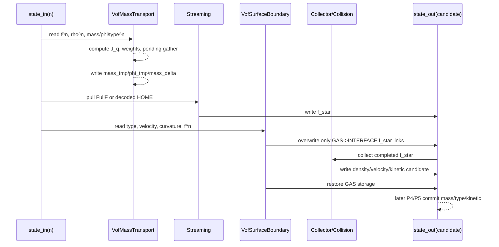

# VOF P2–P8 讲解第四部分：P2/P3——质量怎么走，气相方向怎么补

## 这一部分的主线

P2 和 P3 解决的是两个不同问题：

```text

P2：液体质量怎样沿 D3Q19 格链交换？

P3：气相不运行 LBM 时，界面缺少的 population 怎样补齐？

```

它们都读同一份旧状态 `state_in(n)`，但写入的位置和时机不同：

```text

P2：读 f_post(n)，写 mass_tmp / phi_tmp / mass_delta

P3：读 f_post(n) 和 state_in velocity/type/curvature，改写 f_star

```

最重要的边界是：

> P2 不读取 GAS 的 kinetic storage；P3 也不读取 GAS 的 kinetic storage。P2 只管质量，P3 只管给 active INTERFACE 补 LBM 链接。

## 1. P2 的工程边界：先只做“固定拓扑质量输运”

P2 文档把自己的范围写得很明确：

```text

物理范围：FullF、固定 cell_type、无类型转换的守恒质量交换

不包含：自由面 population 补全、类型转换、质量重分配、新界面初始化、PLIC、曲率、表面张力

```

通俗理解：先拿一张不变形的液面网格，验证液体质量沿格链搬运是对的；暂时不处理液面格子变成 GAS 或 LIQUID 的问题。

因此 P2 自己不能代表完整 VOF step。P2 的独立入口是：

```python

LbmSolver.compute_vof_mass_transport(state_in)

```

完整 `LbmDomain.step()` 要等 P3 把缺失 population 补齐之后才开放；等 P4/P5 做好类型转换和新界面初始化之后，才可以支持真正的 moving interface。

## 2. P2 的数据所有权：只读输入，scratch 输出

`VofMassTransport` 在 solver 初始化时分配自己的工作数组：

```python

self._mass_tmp = wp.zeros(shape, dtype=float, device=device)

self._phi_tmp = wp.zeros(shape, dtype=float, device=device)

self._mass_delta = wp.zeros(shape, dtype=float, device=device)

self._received_excess = wp.zeros(shape, dtype=float, device=device)

```

对外返回一个只读语义的 result view：

```python

@dataclass(frozen=True)

class VofMassTransportResult:

mass_tmp: wp.array

phi_tmp: wp.array

mass_delta: wp.array

received_excess: wp.array

```

这里的 `frozen=True` 只是 host 端 result 对象不能重新绑定字段，不代表 GPU array 自身变成不可写；真正的架构约束是：P2 的 kernel 只写这些 solver-owned scratch，不写 `state_in` 和持久 `state_out`。

P2 读：

```text

logical post-collision populations f^n

state.density^n

state.vof.mass^n

state.vof.phi^n

state.vof.cell_type^n

state.vof.pending_excess^n

state.vof.pending_receiver_count^n

periodicity

```

P2 写：

```text

mass_tmp

phi_tmp

mass_delta

received_excess

```

所以 P2 结束后，`state_in` 仍然应该逐数组保持不变。这个无副作用契约是后面做 NumPy oracle 和回归测试的基础。

## 3. P2 的格链方向：先把 pull 关系看懂

对中心格子 $x$ 和方向 $q$，kernel 使用 pull 视角：

$$

y=x-c_q.

$$

也就是说，目标格子 $x$ 在方向 $q$ 上要拿到的 incoming population，来源是 $x-c_q$。

对应代码结构：

```python

si = i - direction_x(q)

sj = j - direction_y(q)

sk = k - direction_z(q)

```

如果 periodic，就把来源坐标绕回去；如果非周期且来源出域，就把这条 VOF 质量链视为不可穿透：

```text

out-of-domain VOF mass weight = 0

boundary mass flux = 0

```

P2 的 pull 方向和 P3 的 pull 方向必须一致，否则会出现“质量向一个方向搬、surface completion 却从另一个方向补”的错位。

## 4. P2 的裸格链通量

当前冻结的 `fslbm_neighbor` 方案把一条方向链的裸通量写成：

$$

J_q(x)=f_q^n(y)-f_{\bar q}^n(x),

\qquad y=x-c_q.

$$

它的含义很直白：

```text
incoming from source y along q
- outgoing from center x along opposite(q)
```

代码对应：

```python
incoming = f_post[q * stride + source_index]
outgoing = f_post[
    opposite_direction(q) * stride + center_index
]
delta += weight * (incoming - outgoing)
```

两个索引都重要：

- `q * stride + source_index`：从来源格拿方向 `q` 的 population；
- `opposite_direction(q) * stride + center_index`：从中心格拿反向 outgoing population。

最常见的方向 bug 有两个：

```text
把 source 写成 x+c_q，而不是 x-c_q
把 outgoing 也写成 q，而不是 opposite(q)
```

P2 的单格链测试和独立 NumPy oracle 专门锁定了这两件事。

## 5. P2 的权重：谁可以交换液体质量

当前冻结的邻居类型权重是：

$$
w_q(x,y)=
\begin{cases}
1,& x\in L,\ y\in L\cup I,\\
1,& x\in I,\ y\in L,\\
\dfrac{\phi_x+\phi_y}{2},& x\in I,\ y\in I,\\
0,& \text{otherwise}.
\end{cases}
$$

| 中心格 `x` | 来源格 `y` | 权重 | 大白话 |
|---|---|---:|---|
| LIQUID | LIQUID | `1` | 完全液体之间正常交换 |
| LIQUID | INTERFACE | `1` | 液体可以和界面交换 |
| LIQUID | GAS | `0` | 不从气体读质量 |
| INTERFACE | LIQUID | `1` | 界面接收液体输运 |
| INTERFACE | INTERFACE | `(phi_x + phi_y)/2` | 按两端液体占据率折算 |
| INTERFACE | GAS | `0` | 不从气体读质量 |
| GAS | 任意 | `0` | GAS 不作为 VOF 质量中心 |

这套方案来自经典 FSLBM/Home-FSLBM 邻居类型路径。文档特别提醒：它不能宣传成目标论文印刷 Eq. (10) 的逐字实现，因为论文印刷版的 `theta` 更偏向由中心格类型分段，而当前工程实现冻结的是邻居类型适配方案。

## 6. P2 的质量更新公式

对每个中心 active 格子，P2 先把所有 moving directions 的加权通量累加：

$$
\Delta m(x)=\sum_{q=1}^{18}w_q(x,y)J_q(x).
$$

然后得到临时质量：

$$
m^{tmp}(x)=m^n(x)+\Delta m(x).
$$

代码的核心逻辑是：

```python
updated_mass = mass_n[i, j, k] + delayed + delta
mass_delta[i, j, k] = delta
mass_tmp[i, j, k] = updated_mass
phi_tmp[i, j, k] = updated_mass / density_n[i, j, k]
```

其中 `delayed` 是 FIX1/FIX2 引入的上一拍 pending transfer 消费量；普通格链变化放在 `delta` 中。

P2 的 provisional `phi` 是：

$$
\phi^{tmp}(x)=\frac{m^{tmp}(x)}{\rho^n(x)}.
$$

这里特意是 `density_n`，不是 `state_out.density`。它只是 P2 的暂存观察值，P2 不负责把它 clamp 到 `[0,1]`，也不负责改变 `cell_type`。

## 7. 为什么 active-active 格链能守恒

考虑一条无向格链，左端为 $a$，右端为 $b$。对左端计算一个方向通量时，贡献大致是：

$$
\Delta m_a=w_{ab}(f_{a\leftarrow b}-f_{b\leftarrow a}).
$$

右端沿相反方向计算时，权重相同，population 顺序相反：

$$
\Delta m_b=w_{ab}(f_{b\leftarrow a}-f_{a\leftarrow b})=-\Delta m_a.
$$

所以：

$$
\Delta m_a+\Delta m_b=0.
$$

周期封闭域中，把所有格链相加，理想情况下得到：

$$
\sum_x\Delta m(x)=0.
$$

这就是 P2 测试“随机场全局 `sum(mass_delta)` 为零”和“格链两端 delta 等大反号”的数学依据。

## 8. 为什么 P2 不读 GAS populations

P2 对 `INTERFACE–GAS` 的 weight 固定为零。因此 kernel 在这些链接上根本不会使用 gas source 的 `f_post`。

隔离测试是：

```text
保持 active cell populations 不变
把 GAS cell 的 19 个 populations 随机改掉
重新跑 P2
mass_tmp 必须完全不变
```

这验证的是一个物理/架构契约：

> GAS 的 persistent kinetic storage 不是 VOF 质量物理输入。

不要为了“补全数据”而在 P2 里读取 GAS population。气相方向需要补 population，是 P3 的工作，而且补的是界面目标格子的 `f_star`。

## 9. pending excess 如何接入 P2

FIX1/FIX2 之后，P2 还多了一个 side channel 的消费规则：

```python
delayed = 0.0
if pending_receiver_count_n[i, j, k] == 0:
    delayed = pending_excess_n[i, j, k]
```

对 INTERFACE 中心格子，邻居 sender 的 pending 会按 sender 记录的 receiver count 平均 gather：

```python
if center_type == INTERFACE:
    receiver_count = pending_receiver_count_n[si, sj, sk]
    if receiver_count > 0:
        delayed += pending_excess_n[si, sj, sk] / receiver_count
```

区分三件事：

```text
pending_excess      账本里的 signed transfer
received_excess     本步被 receiver 收到的临时金额
resident mass       当前格子的正式 bounded mass
```

P2 会消费能按固定拓扑路由的 pending，但 P4 还要根据最终类型和 receiver 集合决定新的 pending 是否写回。zero receiver 的 material residual 由 FIX2 允许跨步保留。

## 10. P2 的固定拓扑边界

P2 即使算出：

```text
phi_tmp > 1
phi_tmp < 0
mass_tmp 需要转换
某个 INTERFACE 已经没有 GAS 或 LIQUID 邻居
```

也不会在这里自行修复，因为这些问题属于 P4：

```text
P2 只报告 provisional 结果
P4 决定最终 cell_type
P4 做 topology repair
P4 做 clamp 和 redistribution/pending
P5 处理 new interface kinetic
```

这样才能把质量 transport 和 topology transition 分别测试，也避免 GPU 线程同时写同一邻居。

## 11. P3 的工程边界：给界面补一条缺失的 LBM 链

P3 的问题不是“气体质量怎么流”，而是：

> 气相不推进 LBM，但一个 INTERFACE 目标格子的 streaming 仍可能需要从 GAS 方向 pull 一个 population，这个方向不能空着。

P3 支持：

```text
FullF
固定拓扑
固定大气压力
gamma = 0
periodic 或 static bounce-back domain boundary
```

P3 不负责：

```text
类型转换、质量重分配、新界面初始化
PLIC/curvature、HOME、open VOF boundary、CUDA acceptance
```

P3 完成后，固定拓扑的完整 FullF step 可以运行；只要质量推进要求类型变化，P3 就应 fail-fast，把工作交给 P4/P5。

## 12. P3 的方向关系：target/source/opposite

对目标 INTERFACE 格点 $x$ 和方向 $q$：

```text
target       = x
direction    = q
source       = x - c_q
source type  = GAS
write        = f_star[q, x]
read         = f_post[opposite(q), x]
```

kernel 主体可以简化成：

```python
if cell_type_n[i, j, k] != INTERFACE:
    return

for q in range(1, 19):
    si = i - direction_x(q)
    sj = j - direction_y(q)
    sk = k - direction_z(q)

    if not outside and cell_type_n[si, sj, sk] == GAS:
        opposite = opposite_direction(q)
        f_star[q * stride + local_index] = ...
```

只遍历 `q=1...18` moving directions，rest `q=0` 不经过自由面补全。

## 13. Eq. (11)：用大气侧 equilibrium 补未知方向

论文 Eq. (11)：

$$
f_i^*(\mathbf{x},t)=
f_i^{eq}(\rho_g,\mathbf{u})
+f_{\bar i}^{eq}(\rho_g,\mathbf{u})
-f_{\bar i}(\mathbf{x},t).
$$

代码对应：

```python
f_star[q * stride + local_index] = (
    equilibrium_population(q, rho_g, ux, uy, uz)
    + equilibrium_population(opposite, rho_g, ux, uy, uz)
    - f_post_n[opposite * stride + local_index]
)
```

逐项解释：

```text
第一项：气相 equilibrium 的 q 方向项
第二项：气相 equilibrium 的 opposite 方向项
第三项：减去目标界面格子的旧 opposite population
结果：写入目标 interface 的 f_star[q]
```

这里读的是目标格子旧状态的 `f_post[opposite]`，不是 GAS 来源格子的 population。

## 14. Eq. (12)：从压力和曲率得到 `rho_g`

$$
\rho_g=\frac{p_{atmos}-2\gamma\kappa}{c_s^2}.
$$

D3Q19 lattice units 中：

$$
c_s^2=\frac13,
\qquad
\rho_g=3(p_{atmos}-2\gamma\kappa).
$$

P3 固定：

```text
p_atmos = 1/3
gamma = 0
rho_g = 1
```

P6 支持非零表面张力后，kernel 才按 interface cell 的 curvature 计算：

```python
rho_g = 3.0 * (
    atmosphere_pressure - 2.0 * surface_tension * curvature
)
```

若 `rho_g` 非有限或非正，必须在写 population 之前 fail-fast。

## 15. P3 为什么使用 `state_in.velocity`

Eq. (11) 固定读取 `state_in.velocity_x/y/z`，不再自己做一次：

```text
u_pred = u + F/(2 rho)
```

因为速度已经经过统一 hydrodynamic closure：

$$
\mathbf u=\frac{\mathbf j_{raw}+\mathbf F/2}{\rho}.
$$

如果 P3 再加一次半力，就会重复加入外力。代码直接读取 velocity 不是遗漏 correction，而是 correction 已在前面完成。

## 16. P3 的调度位置

```text
P2 mass transport
→ ordinary pull streaming -> f_star
→ P3 Eq.11 overwrite gas-to-interface links
→ ordinary domain boundary completion
→ admissibility
→ collector
→ force closure
→ collision
```

P3 太晚，collector 已经用不完整的 `f_star` 算过宏观量；P3 太早，普通 streaming 还没有完成其它方向。这个顺序是数据依赖决定的硬顺序。

## 17. P3 的唯一写入者规则

```text
fluid/interface source -> ordinary pull
GAS source + INTERFACE target -> Eq.11 surface overwrite
solid/cut link -> solid law
domain out-of-bounds -> domain boundary law
```

source 分类不能重叠：普通 domain boundary 不能同时被当成 GAS surface link，P3 不能二次写普通 fluid-fluid pull link。

## 18. P3 之后为什么还要 `restore_gas`

generic LBM kernel 可能遍历更广的数组范围，但 VOF 语义上 GAS 不是 active fluid。P3 之后执行：

```python
self._vof_surface_boundary.restore_gas(state_in, state_out)
```

FullF 对 GAS 复制旧的 `f_post/density/velocity/force`，HOME 复制 10 个 kinetic moments 以及宏观量。它只是保持 storage 稳定，不把 GAS 变成有效物理输入。

## 19. P2/P3 合起来的一次固定拓扑 step



P2 的结果是质量 scratch，P3 的结果落在 `f_star`；两者不是把同一个数组顺序改两遍。

## 20. 测试怎样对应实现契约

### P2 targeted

```text
scheme 默认且非法 scheme 被拒绝
L-L、L-I、I-L、I-I、I-G、G-I 权重正确
rest direction 无质量通量
周期域 active-active 质量守恒
非周期出域质量通量为零
GAS population 随机化不影响结果
transport 不修改输入
phi_tmp 使用 density^n
```

### P3 targeted

```text
p_atmos = c_s² -> rho_g = 1
非正/非有限压力 fail-fast
非零 gamma 在 P3 阶段拒绝到 P6
18 个 moving directions Eq.11 手算一致
rest 不被覆盖
source = x-c_q
opposite(q) 正确
GAS storage 隔离
surface stage 不修改 state_in
固定 topology 多步 equilibrium 平面保持稳定
phi 越界时不交换 current buffer
```

这些测试分别证明方向、时间层、所有权和失败语义，而不是只测最后的数值“差不多”。

## 21. 两个容易混淆的 `phi`

```text
phi_n       持久状态 n 的 canonical phi
phi_tmp     mass_tmp / density_n 的 provisional phi
phi_final   完整 step 最终决定提交的 phi
```

不要把 P2 的 `phi_tmp` 当成最终提交值，也不要为了让 P2 通过而在那里 clamp；那会把 P4 的职责提前混进 P2。

## 22. 第四部分小结

### P2

> P2 读取旧时间层的 logical D3Q19 population、density 和 VOF 类型，按照冻结的 `fslbm_neighbor` 权重计算每条 active 格链的质量交换，把结果写入 solver-owned `mass_tmp/phi_tmp/mass_delta`；它不改类型、不修拓扑、不读 GAS population、不提交持久状态。

### P3

> P3 在普通 streaming 形成 `f_star` 之后、collector 之前，只对目标为 INTERFACE 且来源为 GAS 的 pull link 用 Eq. (11) 补 population；`rho_g` 来自 Eq. (12)，P3 读取界面旧速度和对向 population，不读取 GAS storage，随后 generic LBM 完成 collector/collision，GAS storage 再被恢复隔离。

下一部分进入 P4/P5：解释 `mass_tmp` 为什么会触发类型转换，P4 如何修复 L/I/G 拓扑并产生 `pending_excess`，以及 P5 为什么必须找旧 active donor 给 GAS→INTERFACE 安装合法 FullF/HOME kinetic 状态。
