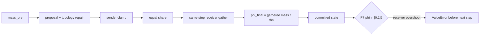
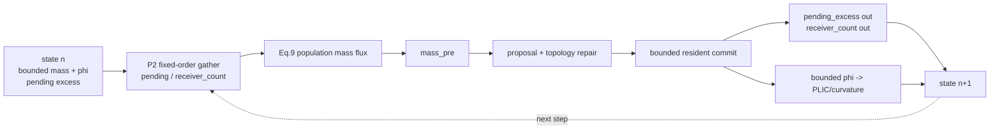
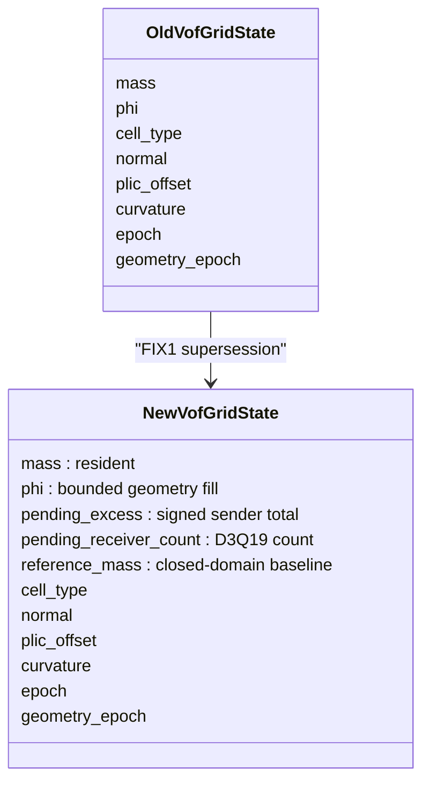
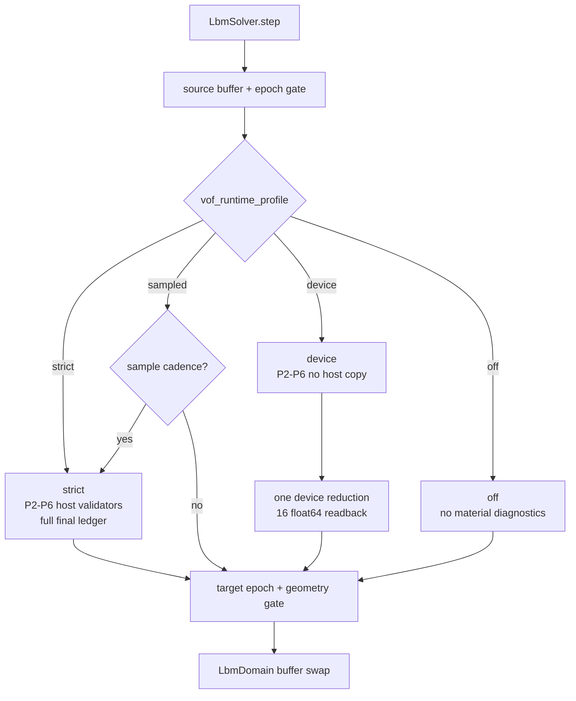
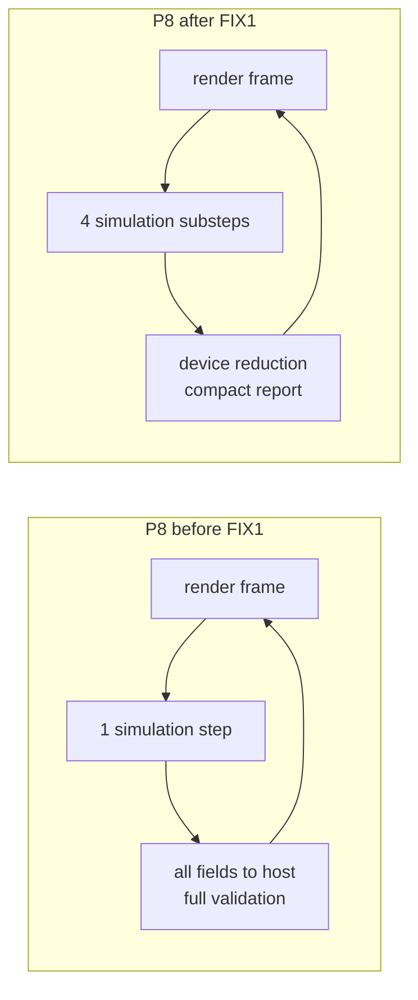

# FIX1 改动文件与架构新旧对比

## 1. 总览

FIX1 把 P4 的 same-step receiver overshoot 改为 Home-FSLBM 风格的一拍延迟
pending-excess channel，并把严格验收从唯一生产路径提升为可配置 runtime policy。

## 2. 重分配架构：旧



旧数据流的 sender 是 bounded 的，但 receiver gather 后不再 bounded。P4 与 P7
对 committed state 的定义不一致。

## 3. 重分配架构：新



守恒关系：

```text
sum(resident mass n+1) + sum(pending excess n+1)
  = sum(mass_pre)
  = sum(resident mass n) + sum(pending excess n)
```

## 4. 状态架构新旧对比



## 5. Runtime 架构



`source/target` transaction gate 不受 profile 控制。material validator 可以降频，
buffer ownership 与 epoch 不能关闭。

## 6. P8 auto 新旧对比



headless `auto` 不使用右侧交互策略，而是保持 `strict + 1 step`。

## 7. 关键改动文件

### 状态与初始化

- `wanphys/_src/fluid/fluid_grid/lbm/vof/state.py`
  - 新增 pending fields 与 reference mass；
  - clear/copy/clone 全覆盖。
- `wanphys/_src/fluid/fluid_grid/lbm/vof/initialization.py`
  - pending 初始化为零；
  - 冻结 initialization reference mass。
- `wanphys/_src/fluid/fluid_grid/lbm/vof/validation.py`
  - empty/initialized/buffer-pair 新字段门禁。

### 重分配与平流

- `wanphys/_src/fluid/fluid_grid/lbm/vof/advection_kernels.py`
  - P2 在 population flux 前 gather 上一步 pending；
  - 输出 `received_excess` scratch。
- `wanphys/_src/fluid/fluid_grid/lbm/vof/advection.py`
  - strict host routing/count 验证；
  - public result 暴露 received excess。
- `wanphys/_src/fluid/fluid_grid/lbm/vof/transition_kernels.py`
  - 删除危险的 same-step receiver gather；
  - final kernel 只提交 bounded mass/phi。
- `wanphys/_src/fluid/fluid_grid/lbm/vof/transition.py`
  - excess/count 成为 state pending 输出；
  - 守恒 validator 使用 resident+pending。

### Runtime

- `wanphys/_src/fluid/fluid_grid/lbm/vof/contracts.py`
  - 新增 `VofRuntimeProfile`。
- `wanphys/_src/fluid/fluid_grid/lbm/model.py`
  - 新增 profile 与 sampled interval 配置。
- `wanphys/_src/fluid/fluid_grid/lbm/vof/runtime.py`
  - 新增 compact device reduction。
- `wanphys/_src/fluid/fluid_grid/lbm/vof/diagnostics.py`
  - ledger 纳入 pending、routing、surface pressure 与 bounded phi。
- `wanphys/_src/fluid/fluid_grid/lbm/solver.py`
  - profile dispatch；
  - P2–P6 validate policy；
  - profile-independent transaction/epoch gate。
- `wanphys/_src/fluid/fluid_grid/lbm/vof/surface.py`
  - surface preflight 接受 policy-controlled validation。
- `wanphys/_src/fluid/fluid_grid/lbm/vof/kinetic_init.py`
  - P5 host oracle 接受 policy-controlled validation。

### P8

- `wanphys/examples/lbm/fluid_grid_lbm_vof_dambreak.py`
  - CLI auto/profile/interval；
  - interactive 4 substeps；
  - 直接消费 solver runtime report；
  - headless strict ledger/CSV 保持。

### 测试

- `newton/tests/test_lbm_vof_fix1.py`
  - 四 profile；
  - compact device/host differential；
  - off epoch gate；
  - 520-step 原始崩溃回归；
  - 条件 CUDA smoke。
- `newton/tests/test_lbm_vof_p1.py`
  - pending/reference storage。
- `newton/tests/test_lbm_vof_p2.py`
  - one-shot pending gather oracle。
- `newton/tests/test_lbm_vof_p4.py`
  - bounded commit 与 resident+pending oracle。
- `newton/tests/test_lbm_vof_p5.py`
  - topology handoff 守恒账本。
- `newton/tests/test_lbm_vof_p7.py`
  - FullF/HOME pending differential。
- `newton/tests/test_lbm_vof_p8.py`
  - CLI auto/profile/substeps。

### 文档

- `docs/wanphys/lbm/VOF/00-capability-status.md`
- `docs/wanphys/lbm/VOF/06-development-roadmap.md`
- `docs/wanphys/lbm/VOF/README.md`
- `docs/wanphys/lbm/VOF/30-fix1-engineering-plan.md`
- `docs/wanphys/lbm/VOF/31-fix1-completion-summary.md`
- `docs/wanphys/lbm/VOF/32-fix1-change-architecture.md`

## 8. 未改变的边界

```text
no solid
no bubble
no foam
closed VOF domain only
FullF/HOME logical-population contract unchanged
PLIC/curvature/Eq.11/Eq.12 unchanged
CUDA remains conditional and not accepted in the frozen environment
```

用户本地对 P8 默认网格/重力的参数实验不是 FIX1 代码语义，未纳入阶段提交。
