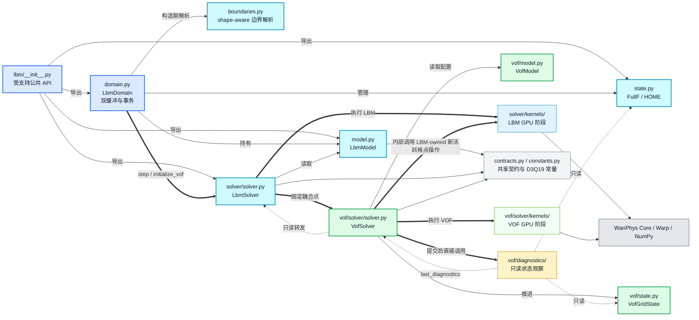
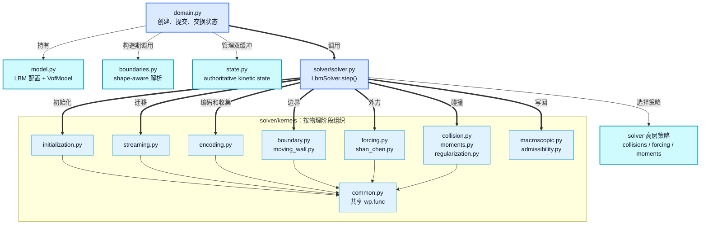
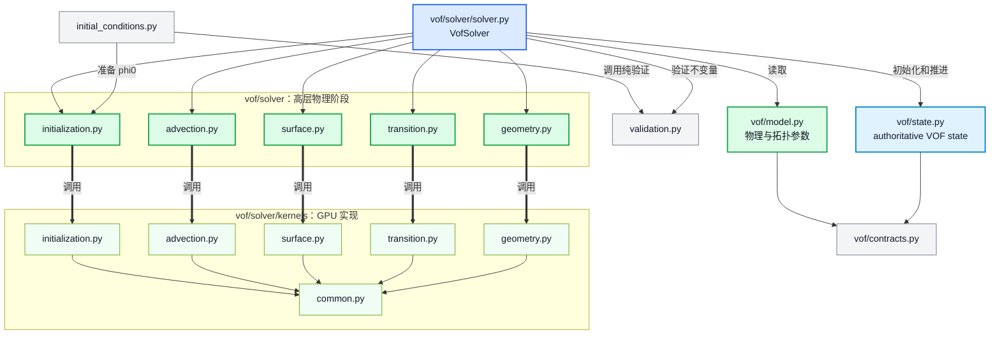
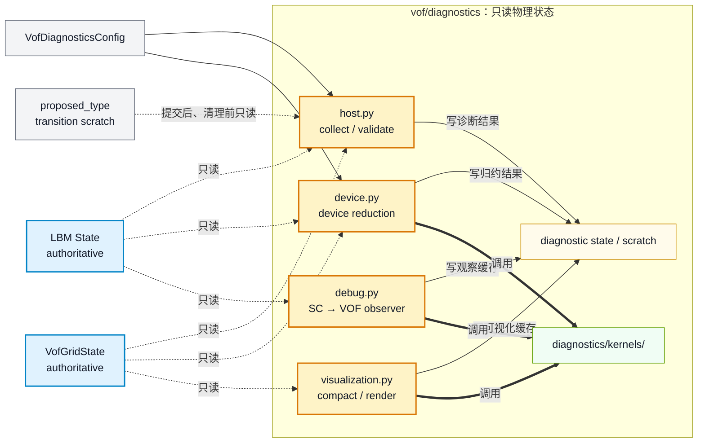
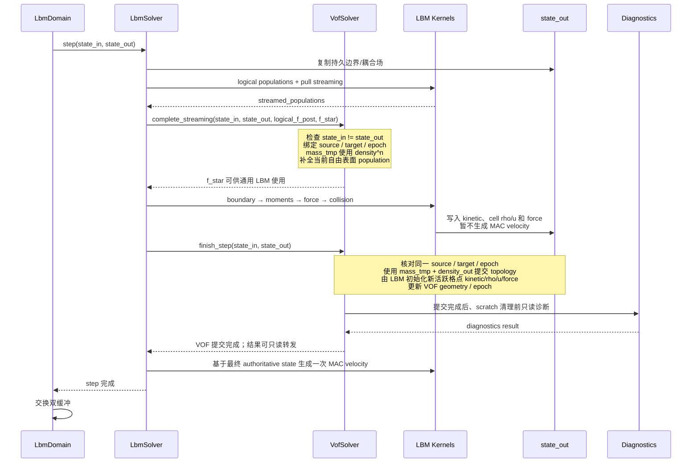

# LBM / VOF 重构最终架构（核对修订版）

本文冻结 LBM 与 VOF 的目标目录、职责边界、支持 API、Kernel 归类规则和 VOF 时间步调用顺序，作为后续重构的结构依据。

## 1. 已确认的架构决策

- `LbmDomain.initialize_vof()` 暂时保留，只做最小化调整；初始化流程以后单独评估。
- Domain 严格封装双缓冲，不为测试暴露 `_state_in`、`_state_out` 等私有实现。
- 需要阶段级测试时，直接构造 `LbmSolver`、`VofSolver` 和 State，不穿透 Domain 私有字段。
- 暂时不引入 lattice descriptor；D3Q19 数据继续集中在 `constants.py`。
- Diagnostics 对 authoritative LBM/VOF State 只读，但可以写入自身持有的 scratch、归约和可视化缓存。
- 从 `LbmModel` 抽取 VOF 必需的物理参数形成独立 `VofModel`。
- `VofDiagnosticsConfig` 独立于 `VofModel`。
- 最新 VOF diagnostics 由 `LbmSolver.last_vof_diagnostics` 提供只读访问。
- 只有包入口主动导出的对象属于受支持 API；具体物理阶段实现不从 `lbm/__init__.py` 导出。
- 重构后不保留旧内部模块导入路径，源码、测试、示例和文档在同一重构中同步更新。
- 高层模块不得包含 `@wp.kernel`。
- `@wp.kernel` 全部进入所属子系统的 `kernels/`，按物理阶段分组。
- 只被某一阶段 Kernel 使用的 `wp.func` 与对应 Kernel 放在同一文件。
- 被多个 Kernel 阶段共享的 `wp.func` 放在该子系统的 `kernels/common.py`。
- NumPy 和纯 Python 数学函数保留在高层模块。
- `VofSolver` 只公开 `initialize()`、`complete_streaming()`、`finish_step()` 三个业务方法。
- `complete_streaming()` 接收但不写入 `state_out`，只用于提前绑定本步的 source/target 状态对。
- 状态结构、shape、device、VOF storage、数组不别名和初始一致性只在创建或初始化双缓冲时完整检查一次。
- 每步仅保留 `state_in is not state_out` 和 VOF 跨阶段事务匹配等低成本保护。
- Diagnostics 由 `VofSolver.finish_step()` 在提交完成后、清理 topology scratch 前直接执行；`LbmSolver` 只读转发结果。
- 自由表面 GAS 是非活跃区域；新活跃格点的 kinetic、密度、速度和力初始化属于 LBM，不属于 VOF geometry。
- 每步只在最终 authoritative 状态形成后生成一次 MAC 速度。
- 不允许同一事务重复调用 `complete_streaming()`。
- VOF 调用顺序错误或事务不匹配时采用最简策略：直接 `raise RuntimeError`，不引入额外 Context、Coupler 或自动恢复协议。

## 2. 最终文件架构

```text
wanphys/_src/fluid/fluid_grid/lbm/
├── __init__.py                         # LBM 顶层受支持 API
├── domain.py                           # LbmDomain；双缓冲和生命周期
├── model.py                            # LbmModel；静态配置/边界规范化，组合 VofModel
├── state.py                            # LBM authoritative State；FullF / HOME
├── contracts.py                        # LBM 公共枚举、能力和碰撞契约
├── constants.py                        # D3Q19 host 常量及兼容常量
├── boundaries.py                       # 依赖 shape 的六面边界解析与冲突检查
│
├── solver/
│   ├── __init__.py                     # 只导出 LbmSolver
│   ├── solver.py                       # LbmSolver；LBM 时间步总调度
│   ├── collisions.py                   # 碰撞后端选择和 relaxation policy
│   ├── forcing.py                      # ForceProvider 和外力策略
│   ├── moments.py                      # NumPy 矩阵、relaxation rates 等 host 数学
│   ├── active_cells.py                 # 新活跃/退休格点的 LBM kinetic 发布策略
│   │
│   └── kernels/
│       ├── __init__.py                 # 不主动聚合所有 Kernel
│       ├── common.py                   # 多阶段共享方向、权重、平衡分布等 wp.func
│       ├── initialization.py           # equilibrium、持久编码和新活跃格点初始化
│       ├── streaming.py                # FullF / HOME pull streaming、cut-link
│       ├── encoding.py                 # FullF / HOME 转换与 populations 收集
│       ├── collision.py                # SRT / TRT / NOCM population collision
│       ├── moments.py                  # raw / central moment 变换和 MRT collision
│       ├── forcing.py                  # force density 组合与 hydrodynamic closure
│       ├── boundary.py                 # 开放边界和通用边界补全
│       ├── moving_wall.py              # moving-wall transport
│       ├── shan_chen.py                # Shan-Chen force 和相关 closure
│       ├── macroscopic.py              # density、velocity、MAC observable 写回
│       ├── regularization.py           # regularized TRT
│       └── admissibility.py            # population positivity / admissibility
│
└── vof/
    ├── __init__.py                     # 仅叶级 VOF API；不提前导入 VofSolver
    ├── model.py                        # VofModel；VOF 物理和拓扑静态参数
    ├── state.py                        # VofGridState；authoritative 动态状态
    ├── contracts.py                    # VofCellType、VofMassScheme 等公共契约
    ├── initial_conditions.py           # phi0 规范化、分类和纯 Python 初始条件
    ├── validation.py                   # 初始化、状态、缓冲和拓扑不变量
    │
    ├── solver/
    │   ├── __init__.py                 # 导出 VofSolver
    │   ├── solver.py                   # VofSolver；三个业务生命周期方法
    │   ├── initialization.py           # VOF state 初始化编排
    │   ├── advection.py                # 质量输运编排和 scratch 所有权
    │   ├── surface.py                  # 自由表面 population 补全和 GAS 恢复
    │   ├── transition.py               # 拓扑转换和质量重分配编排
    │   ├── geometry.py                 # PLIC、法向和曲率高层对象及纯 Python 数学
    │   │
    │   └── kernels/
    │       ├── __init__.py
    │       ├── common.py               # VOF 多阶段共享 wp.func
    │       ├── initialization.py       # mass / phi / cell type 初始化
    │       ├── advection.py            # fixed-topology mass exchange
    │       ├── surface.py              # GAS → INTERFACE population 补全、GAS 恢复
    │       ├── transition.py           # propose / resolve / redistribute / finalize
    │       └── geometry.py             # authoritative normal / PLIC / curvature
    │
    └── diagnostics/
        ├── __init__.py                 # 诊断子包受支持 API
        ├── config.py                   # VofDiagnosticsConfig
        ├── state.py                    # DebugMockScToVofState 等诊断专用状态
        ├── host.py                     # VofDiagnostics、host collect / validate
        ├── device.py                   # device metrics 和归约编排
        ├── debug.py                    # Shan-Chen → VOF 只读观察器
        ├── visualization.py            # 可视化数据对象和渲染编排
        │
        └── kernels/
            ├── __init__.py
            ├── common.py               # 诊断 Kernel 共享 wp.func
            ├── classification.py       # bounded fill fraction 分类
            ├── geometry.py             # debug-only solid-aware normal
            ├── reduction.py            # device diagnostics 归约
            └── visualization.py        # 界面数据压缩
```

目录中的文件按实际代码量创建；如果某个候选文件最终只有极少量代码，应合并到相邻物理阶段，避免为了目录对称制造空抽象。

## 3. 总体分层关系

### 颜色含义

- 蓝色：公共入口与生命周期。
- 青色：LBM 模型、状态与求解器。
- 绿色：VOF authoritative 物理子系统。
- 浅绿色：GPU Kernel。
- 黄色：只读 diagnostics。
- 灰色：共享契约、常量与外部基础设施。

### 箭头含义

- `==>`：运行时主调用。
- `-->`：静态依赖或所有权。
- `-.->`：只读观察或结果转发。



## 4. LBM 模块关系



## 5. VOF 模块关系



## 6. VOF diagnostics 只读边界

直接调用链固定为 `LbmDomain.step() → LbmSolver.step() → VofSolver.finish_step() → diagnostics`。Diagnostics 只读已经提交的 authoritative state；它可以读取尚未清理的 `proposed_type`，但该数组仍是 topology transition scratch，不是 `state_out` 的组成部分。



## 7. `LbmSolver.step()` 与 `VofSolver` 的固定调用点

`complete_streaming()` 只准备固定拓扑质量草案并补全当前 streaming。质量交换与普通 pull streaming 都只读旧时间层，彼此无数据依赖；把质量交换放在普通 streaming 后并入该方法不会改变时间层语义。下一步拓扑必须等待 `state_out.density` 产生，因此在 `finish_step()` 中计算。`state_out` 在准备阶段仅用于绑定事务，不允许被 VOF 写入。



## 8. `VofSolver` 最终业务接口

```python
class VofSolver:
    def initialize(
        self,
        state: LbmStateBase,
        phi0: np.ndarray,
    ) -> None:
        """初始化一个既有 LBM state 中的 authoritative VOF 状态。"""

    def complete_streaming(
        self,
        state_in: LbmStateBase,
        state_out: LbmStateBase,
        logical_f_post: wp.array,
        streamed_populations: wp.array,
    ) -> None:
        """绑定状态对，准备质量草案并补全当前自由表面 streaming。"""

    def finish_step(
        self,
        state_in: LbmStateBase,
        state_out: LbmStateBase,
    ) -> None:
        """使用 density_out 计算、初始化并提交下一步 VOF topology。"""
```

事务与检查规则：

- 双缓冲创建或初始化时，一次性完整检查类型、shape、device、VOF storage、数组不别名和初始状态一致性。
- 正常时间步不重复上述结构检查，只检查 `state_in is not state_out` 和事务标记。
- `complete_streaming()` 不写 `state_out`；成功后记录 source identity、target identity 和 source VOF epoch。
- 已存在未完成事务时，再次调用 `complete_streaming()` 直接抛出 `RuntimeError`。
- `finish_step()` 只接受准备阶段登记的同一 source/target 对；identity 或 epoch 不匹配时直接抛出 `RuntimeError`。
- `finish_step()` 未成功完成时不清除事务标记，阻止 Solver 继续误用 scratch。
- `initialize()` 成功后显式清除事务标记与 `last_diagnostics`，作为唯一的显式恢复起点。
- 不引入公开 `VofStepContext`、自动回滚或额外 Coupler。

若未来 `VofSolver` 完全私有且 `LbmSolver` 已把调用顺序封死，上述运行时保护还可简化；本轮先保留最低成本的双缓冲和跨阶段事务保护。

## 9. 初始化职责

`LbmDomain.initialize_vof()` 暂时作为受支持入口保留，但缩减为双缓冲事务协调：

```text
LbmDomain.initialize_vof()
├── 创建 candidate_in
├── 调用 LbmSolver.initialize_vof(candidate_in, ...)
├── clone 得到 candidate_out
├── 调用 LbmSolver.validate_state_pair_once(candidate_in, candidate_out)
└── 成功后原子替换 Domain 双缓冲
```

实际状态初始化由 Solver 层完成：

```text
LbmSolver.initialize_vof()
├── initialize_equilibrium()
└── VofSolver.initialize()
```

一次性状态对验证由 `LbmSolver` 的受控构造/初始化路径拥有；Domain 不导入 VOF initialization/validation 的具体阶段实现，也不穿透调用物理阶段私有方法。正常 `step()` 不再重复结构扫描。

## 10. 支持 API

### `lbm/__init__.py`

保持最小用户入口，主动导出：

```text
LbmDomain
LbmModel
LbmSolver
LbmStateBase
FullFLbmState
HomeLbmState
必要的 LBM 公共 contracts
```

### `lbm/solver/__init__.py`

```text
LbmSolver
```

### `lbm/vof/__init__.py`

```text
VofModel
VofGridState
VofCellType
VofMassScheme
```

该入口不 eager-import `VofSolver`，避免 `LBM state ↔ VOF solver` 导入环。Solver 从独立子包入口导入：

### `lbm/vof/solver/__init__.py`

```text
VofSolver
```

### `lbm/vof/diagnostics/__init__.py`

```text
VofDiagnostics
VofDiagnosticsConfig
VofRuntimeProfile
```

### 不从包入口导出的内部实现

```text
VofMassTransport
VofSurfaceBoundary
VofTopologyTransition
VofInterfaceGeometry
阶段 Result 类型
Kernel 和阶段验证辅助函数
```

内部实现仍可由对应模块的单元测试直接导入；它们不承诺跨重构兼容。

## 11. `VofModel` 与诊断配置

```python
@dataclass(frozen=True)
class VofModel:
    mass_scheme: VofMassScheme
    atmosphere_pressure: float
    surface_tension: float
    transition_epsilon: float


@dataclass(frozen=True)
class VofDiagnosticsConfig:
    runtime_profile: VofRuntimeProfile
    validation_interval: int
```

以下仍属于 LBM，并由 `LbmSolver` 在构造 `VofSolver` 时显式提供，不复制进 `VofModel`：

```text
shape / device / periodic
gravity
max_lattice_speed
enforce_population_positivity
population_floor
```

`VofDiagnosticsConfig` 只保存 authoritative VOF 的验证策略。Shan-Chen debug observer 的参数本轮继续留在 `LbmModel`，不塞入 `VofModel`，也不与 authoritative validation policy 混成一份配置。`diagnostics/host.py` 显式持有需要的 `VofModel`/诊断配置，不通过 `state.model.vof_*` 反向取配置。

## 12. 边界职责拆分

当前 `boundaries.py` 既不应整体进入 `solver/`，也不应整体并入 `model.py`。最终按以下边界拆分：

| 职责 | 归属 |
|---|---|
| 名称规范化、静态配置合法性 | `lbm/model.py` |
| 依赖网格 shape 的六面展开、索引解析、冲突检测 | `lbm/boundaries.py` |
| population 边界执行 | `lbm/solver/kernels/boundary.py` |
| moving-wall transport | `lbm/solver/kernels/moving_wall.py` |

同时执行以下清理：

- 删除未使用的 `SurfaceCompletion` / `UnavailableSurfaceCompletion` 占位体系和 `model.surface_completion`。
- `SURFACE` 不再作为普通六面边界类型；自由表面由 VOF topology 决定。
- `MOVING_WALL` 与 `CUT_LINK` 重新建模为几何/链路能力，不继续伪装成普通 per-face 枚举值。
- 在碰撞前复制或发布持久边界场的时机保持不变，不能因文件移动而漏掉或提前覆盖。

## 13. 宏观状态与新活跃格点

自由表面模式下，GAS 是非活跃区域，不是被 LBM 求解的第二气相。职责固定为：

- VOF geometry 只负责 `phi / cell_type / normal / curvature`，不求解速度。
- topology 判断主要使用候选密度；VOF 产生 `final_type / new_active / retired_active / mass / phi` 等变化信息。
- `GAS → INTERFACE` 所需 populations/moments、密度、速度和力由 LBM-owned active-cell 初始化实现完成，设备 Kernel 放在 `lbm/solver/kernels/initialization.py`。
- VOF 的 `finish_step()` 仍是原子提交入口；本轮通过 Solver 内部注入的 LBM active-cell 操作完成上述步骤，不增加公开 Coupler 或第四个业务方法。

近期最简实现保留现有 cell-centered `rho/u` 写回和旧 GAS/新界面的局部修正，但删除 VOF 修正前的第一次 MAC `vel_u/v/w` 计算。`finish_step()` 完成后，`LbmSolver` 基于最终 authoritative state 只生成一次 MAC 速度。

`finish_step()` 内部提交顺序固定为：恢复旧 GAS storage → 计算 transition → 调用 LBM-owned 新活跃/退休格点操作 → 提交 VOF mass/phi/type/epoch → 重算 geometry → 验证 target → diagnostics → 清理 scratch。任一步失败都不交换 Domain 双缓冲，并保留 prepared 标记进入 fail-stop 状态。

更长期若由 `LbmSolver` 统一提交 topology，则 VOF 只输出内部 topology delta；LBM 统一发布旧活跃格点候选结果、初始化新活跃格点、退休旧格点，再一次性发布宏观状态和 MAC。届时 diagnostics 也随提交所有权移动到“VOF 与 LBM 状态均完成”后的统一验收点。

## 14. D3Q19 常量

暂时不建立 lattice descriptor。D3Q19 host 数据集中在 `lbm/constants.py`，并采用不可变结构：

```python
D3Q19_DIRECTIONS = tuple(zip(CX, CY, CZ))
D3Q19_MOVING_DIRECTIONS = D3Q19_DIRECTIONS[1:]
D3Q19_UNIQUE_LINK_INDICES = tuple(
    q for q in range(1, NUM_DIRS)
    if q < OPPOSITE[q]
)
```

示例和测试不得自行复制 D3Q19 方向表。Warp 设备端需要的方向、权重和反向方向函数放在 `lbm/solver/kernels/common.py`。

## 15. 迁移前删留清单

文件重排前先做调用点审计，避免把死代码原样搬进新目录：

- 优先确认并删除未使用的 `epc_collision_kernel`、`compute_moments_kernel`、`collide_stream_bounceback_kernel`、`apply_guo_force_kernel`、`restore_physical_velocity_kernel`、`moment_velocity_kernel`。
- 优先确认并删除不再进入最终流程的 `VofMassTransport.finalize_fixed_topology`、`finalize_fixed_topology_vof_kernel`。
- `home_nocm_collision_kernel`、`stream_fullf_to_moments`、`stream_home_to_moments` 若仅被测试使用，应明确标为测试基元或随测试迁移，不默认视为生产 API。
- host/device PLIC 数学的重复是有意的执行端实现，不机械合并；用 parity tests 保证一致性。

## 16. 重构执行约束

- 每一步保持 authoritative 数值流程不变，结构移动与算法修改分开提交。
- 旧模块路径不保留，因此移动文件时必须一次性更新所有静态导入和字符串形式的 mock/patch 路径。
- Domain 集成测试只使用公开生命周期；阶段测试直接测试 Solver/State。
- Kernel 移动后检查 Warp 编译、CPU 测试和至少一组可用的 CUDA smoke test。
- 不为了测试暴露 scratch、双缓冲或内部阶段对象。
- 不为了目录对称增加只转发一次、没有独立职责的类或文件。
- VOF 模块只在 `TYPE_CHECKING` 或局部导入中引用 LBM state 类型，防止 `vof/__init__.py` 形成 eager import cycle。
- `initial_conditions.py` 可以调用 `validation.py`；`validation.py` 不反向依赖 initial conditions。
- `VofSolver` 自己确定本事务是否执行完整验证，并把该决定与 prepared source/target/epoch 一起记录，`finish_step()` 不重新推导 cadence。
- `VofSolver.last_diagnostics` 是唯一结果缓存；`LbmSolver.last_vof_diagnostics` 只是只读 property，不复制结果。
- 增加状态对测试：同一对象、错 target、错 epoch、重复 prepare、跳过 prepare、finish 失败后重入都必须稳定 raise。
- 增加 diagnostics 写保护测试：authoritative arrays 的指针和值在诊断前后不变，只允许诊断自有 buffer 改变。
- 增加时序回归测试：确认边界场复制早于 force/collision，新活跃格点初始化早于 swap，MAC Kernel 每个分量每步只启动一次。
- 增加导入 smoke test：`lbm`、`lbm.solver`、`lbm.vof`、`lbm.vof.solver`、`lbm.vof.diagnostics` 可独立导入且无循环。

## 17. 与当前实现的核对结论

本架构保持当前数值主链的必要先后关系，但明确修复当前实现中的职责混合和重复工作：

| 当前实现事实 | 核对结论 | 重构动作 |
|---|---|---|
| 质量交换和 pull streaming 都读取 `state_in` | 两者可交换顺序 | 合并到 streaming 后的 `complete_streaming()`，不改变时间层 |
| `state_out.density` 在 moments/force/collision 后才可用 | topology 不得在此之前最终判定 | topology proposal/commit 保留在 `finish_step()` |
| `_copy_boundary_fields()` 在 streaming 前执行 | 时机属于耦合不变量 | 文件移动后仍在 streaming 前复制 |
| `_write_observables()` 内生成 MAC，VOF 修正后又生成一次 | 第二次是必要覆盖，第一次是冗余 | 拆开 cell observable 与 MAC，最终只生成一次 MAC |
| 新界面 kinetic 初始化由 `vof/kinetic_init.py` 实现 | 物理所有权错误，但执行时点基本正确 | 实现迁入 LBM active-cell 初始化；仍在 topology 确认后、交换前完成 |
| diagnostics 由 `LbmSolver.step()` 直接收集 | 会迫使 LBM 了解 VOF scratch | 移入 `VofSolver.finish_step()` 的提交后/清理前位置 |
| `_validate_vof_transaction_source()` 每步扫描 storage alias/reference mass | 正确但成本与职责过重 | 完整结构检查移至双缓冲创建/初始化；每步只保留最小事务门禁 |
| `vof/__init__.py` eager-export 几乎全部阶段对象 | API 过宽且容易形成导入环 | 根入口只导出叶级模型/状态/契约，Solver 和 diagnostics 从各自子包入口导出 |
| `boundaries.py` 同时包含解析、占位抽象和边界映射 | 既不是纯 model，也不是纯 solver | 按静态配置、shape-aware 解析、Kernel 执行三层拆分 |

因此，重构不是重写算法：固定拓扑质量交换、自由表面 population 补全、通用 LBM、topology 提交、新活跃格点初始化、geometry、diagnostics、MAC、双缓冲交换的依赖顺序保持明确。结构提交与数值变更必须分批，先用等价移动建立新边界，再分别删除冗余 MAC、收窄检查和迁移 active-cell 所有权。
