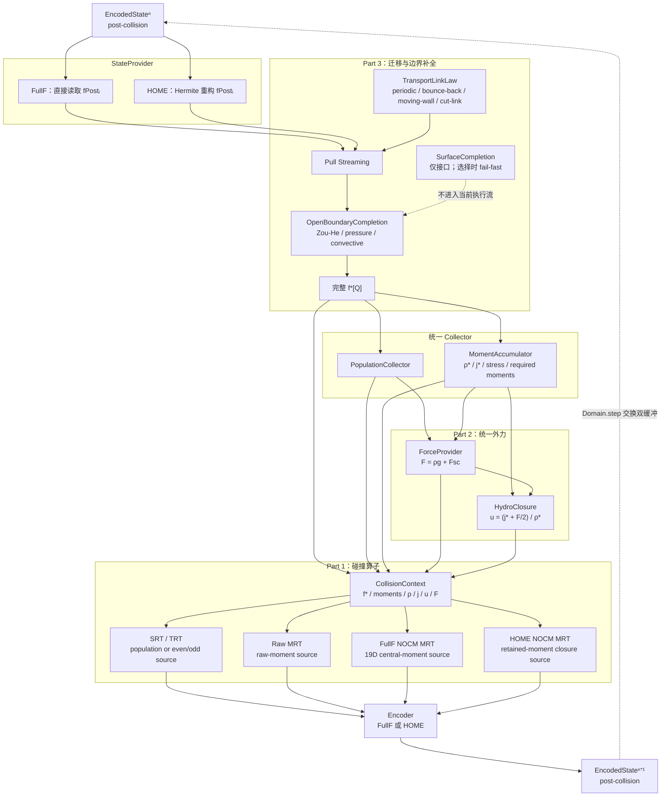

# 01 · LBM 统一一步流水线（post-collision 时间语义）

> 对应代码：`LbmSolver.step()`、`streaming.py`、`boundaries.py`、
> `forcing.py`、`moments.py`、`collisions.py`、`encoding.py`。

## 数据流



## 强制时序

```text
post-collision state n
→ streaming / transport link law
→ open-boundary population completion
→ 完整 f*[Q]
→ population / moment collection
→ force computation
→ hydro closure
→ collision-space force injection + collision
→ encode post-collision state n+1
```

因此边界只负责补齐 population；它不查询 CollisionSpace。Zou-He、pressure、
convective 的结果先进入 Collector，随后才计算宏观量、外力和碰撞。

## 模块职责

| 模块 | 负责 | 不负责 |
|---|---|---|
| StateProvider | FullF 读取或 HOME 重构 | 边界与碰撞 |
| TransportLinkLaw | 周期、反弹、移动壁面、cut-link | 开口宏观条件 |
| OpenBoundaryCompletion | 补齐未知 incoming population | 碰撞基底 |
| Collector | 由完整 `f*[Q]` 统计状态 | 修改边界 |
| ForceProvider | 计算统一力密度 `F` | 决定注入基底 |
| HydroClosure | 计算半步物理速度 | 重复施加外力 |
| CollisionOperator | 把 `F` 翻译到自身基底并碰撞 | 选择持久编码 |
| Encoder | 保存为 FullF 或 HOME | 重新解释碰撞公式 |
