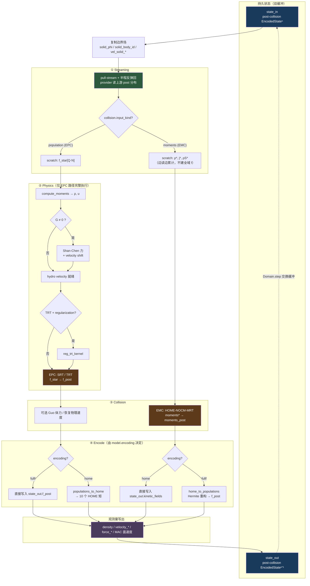

# 01 · LBM 核心一步流水线（post-collision 时间语义）

> 对应代码：`LbmSolver.step()`、`streaming.py`、`collisions.py`、`encoding.py`  
> 目的：说明重整后「持久状态 → stream → physics → collide → encode」的时间语义与数据流。

## 图含义

旧实现把 collision 与 streaming 融合成单一 kernel，活动缓冲语义接近 *pre-collision*。  
新架构统一持久化 **post-collision** 状态，把一步拆成四个可组合阶段。



## 阅读要点

| 阶段 | 负责 | 不负责 |
|------|------|--------|
| Streaming | 上游寻址、周期回绕、bounce-back、population 获取 | 碰撞、SC 力、编码 |
| Physics | 矩、力、水动力学速度、可选正则化 | 刚体栅格化 |
| Collision | EPC 输出 `f_post`；EMC 输出 HOME 矩 | 持久编码选择 |
| Encode | 把碰撞结果写成 `model.encoding` 指定的持久格式 | 观测量以外的副作用 |

时间语义对照：

```text
旧:  fⁿ (≈ pre-collision)  --[collide+stream]-->  fⁿ⁺¹
新:  EncodedStateⁿ (post-collision)
       --stream--> f* / moments*
       --collide--> collision_output
       --encode--> EncodedStateⁿ⁺¹ (post-collision)
```
