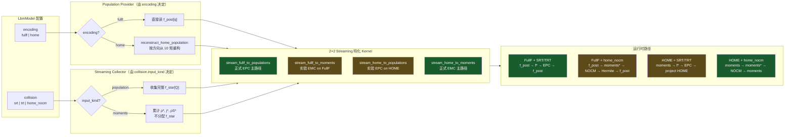
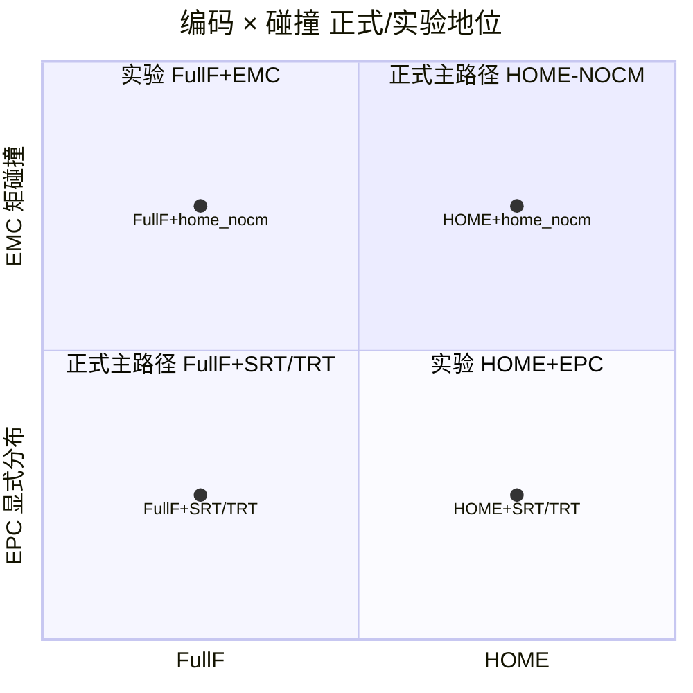

# 02 · FullF/HOME × EPC/EMC 组合矩阵

> 对应代码：`LbmModel.encoding/collision`、`streaming.py` 四特化 kernel、`collisions.py`、`encoding.py`  
> 目的：说明两个正交选择如何决定 streaming 特化、scratch 分配与 encode 路径。

## 图含义

持久编码与碰撞形态是 **正交** 的：

1. **encoding**：`fullf | home` —— 决定持久状态布局与 population provider；
2. **collision**：`srt | trt`（EPC） / `home_nocm`（EMC） —— 决定 streaming 后 collector 需要什么。



## 组合地位矩阵



> 注：部分 Mermaid 渲染器对 `quadrantChart` 支持有限；上表逻辑与下表一致，以下表为准。

| 持久编码 \\ 碰撞 | EPC：SRT / TRT | EMC：HOME-NOCM-MRT |
|---|---|---|
| **FullF** | **正式主路径** | 实验：闭式矩碰撞后 Hermite 重构 FullF |
| **HOME** | 实验：显式碰撞后投影 HOME | **正式主路径** |

## Provider × Collector 数据契约

```mermaid
sequenceDiagram
    participant State as EncodedState (post)
    participant Prov as Provider
    participant Coll as Collector
    participant Out as Collision 输入

    loop 每个方向 q = 0..18
        State->>Prov: 请求上游格点 post 信息
        alt encoding = fullf
            Prov->>Prov: 读 f_post[q, source]
        else encoding = home
            Prov->>Prov: Hermite 重构 f_q(ρ,ρu,ρS)
        end
        Note over Prov: 含周期回绕 / halfway BB
        Prov->>Coll: f_q*
        alt EPC (population)
            Coll->>Out: 写入 f_star[q]
        else EMC (moments)
            Coll->>Out: ρ+=f; j+=c·f; ρS+=(cc-cs²I)f
        end
    end
```

## 配置与校验（fail-fast）

| 规则 | 行为 |
|------|------|
| `encoding ∉ {fullf, home}` | 构造 Model 时报错 |
| `collision ∈ {raw_mrt, nocm_mrt}` | `NotImplementedError` |
| `home + G ≠ 0` | 暂不支持 |
| `use_regularization` | 仅 TRT EPC |
| HOME + rigid/moving-wall | coupling / legacy step 拒绝 |
| `collision is None` | `λ_TRT==0 → srt`，否则 `trt` |
