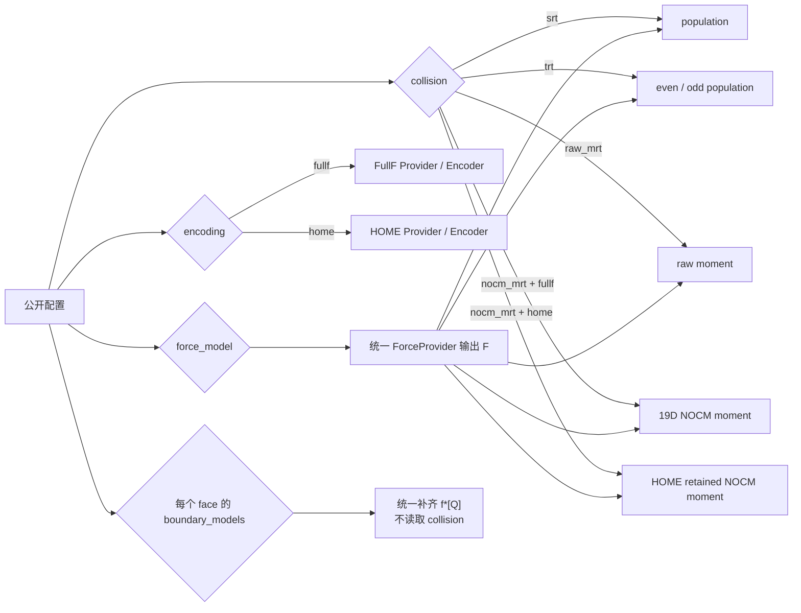

# 02 · Encoding × Collision × Force 能力矩阵

LBM 配置拆为四个互不混名的轴：

```text
encoding       = fullf | home
collision      = srt | trt | raw_mrt | nocm_mrt
force_model    = none | gravity | shan_chen | gravity+shan_chen
boundary_models[face] = periodic | bounce_back | zou_he | pressure |
                        convective | moving_wall | cut_link
```

`home_nocm` 只作为 deprecated collision 别名，规范化为 `nocm_mrt`；调用者
显式选择的 `encoding` 不会被别名暗中改写。



## 碰撞说明书

| encoding | collision | pre-collision 输入 | 内部空间 | 原生结果 |
|---|---|---|---|---|
| fullf/home | srt | 完整 `f*[Q]` | population | `fPost[Q]`，再由 Encoder 保存 |
| fullf/home | trt | 完整 `f*[Q]` | even/odd population | `fPost[Q]`，再由 Encoder 保存 |
| fullf | raw_mrt | 完整 `f*[Q]` | 19D raw moment | inverse transform → FullF |
| fullf | nocm_mrt | 完整 `f*[Q]` | 19D non-orthogonal central moment | inverse transforms → FullF |
| home | nocm_mrt | 完整 `f*[Q]` 累计的保留矩 | HOME/NOCM closure | post retained moments → HOME |

`home + raw_mrt` 不在声明矩阵中，初始化时 fail-fast，不会回退到其他算子。

## 状态语义

| 状态 | 含义 |
|---|---|
| `supported` | 已实现并完成规定验收 |
| `planned` | 已规划但尚未完成 |
| `fail-fast` | 明确不支持，初始化立即报错 |
| `research` | 有实现路径，但不承诺生产稳定性 |
| `deprecated` | 兼容旧名，准备移除 |

当前工作区已写入 Part 0～3 实现和独立测试源码；在测试未按要求执行之前，
“代码存在”不能单独作为 `supported` 验收证据。Shan-Chen 与 HOME/MRT 组合
保持 `research`，SurfaceCompletion 保持 `planned` 且运行选择 fail-fast。
