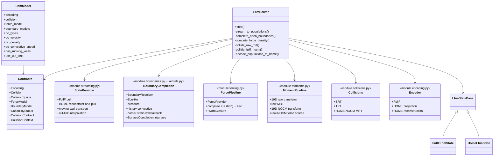

# 03 · LBM 模块与契约结构



## 依赖方向

```text
LbmModel / contracts
        ↓
StateProvider → BoundaryCompletion → Collector
                                      ↓
                            ForceProvider → HydroClosure
                                      ↓
                              CollisionOperator
                                      ↓
                                   Encoder
```

边界模块只输出完整 population，不依赖 `CollisionSpace`。碰撞模块消费统一
`CollisionContext`，并负责把同一个物理力 `F` 翻译为 population、raw moment、
NOCM moment 或 HOME closure source。
