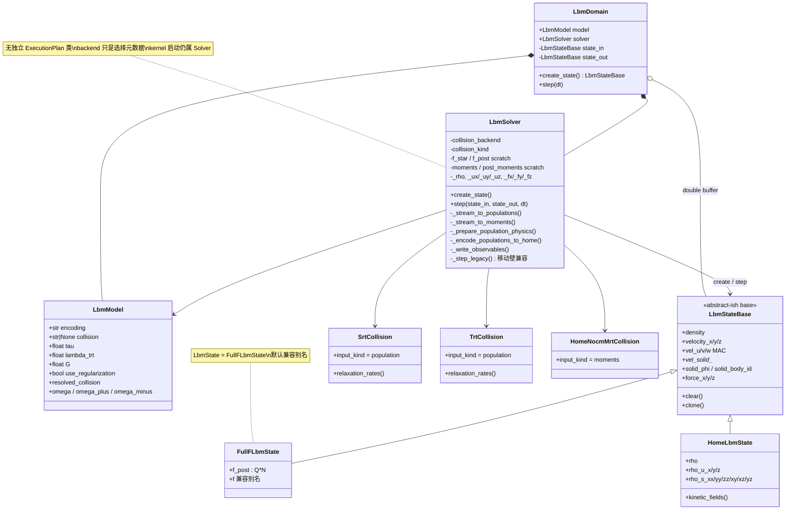
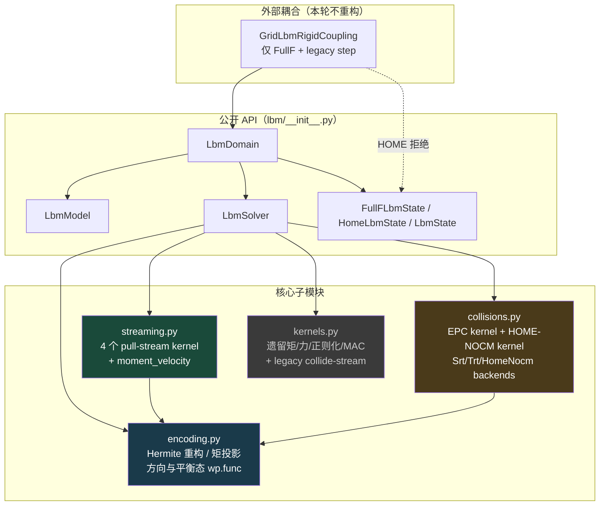
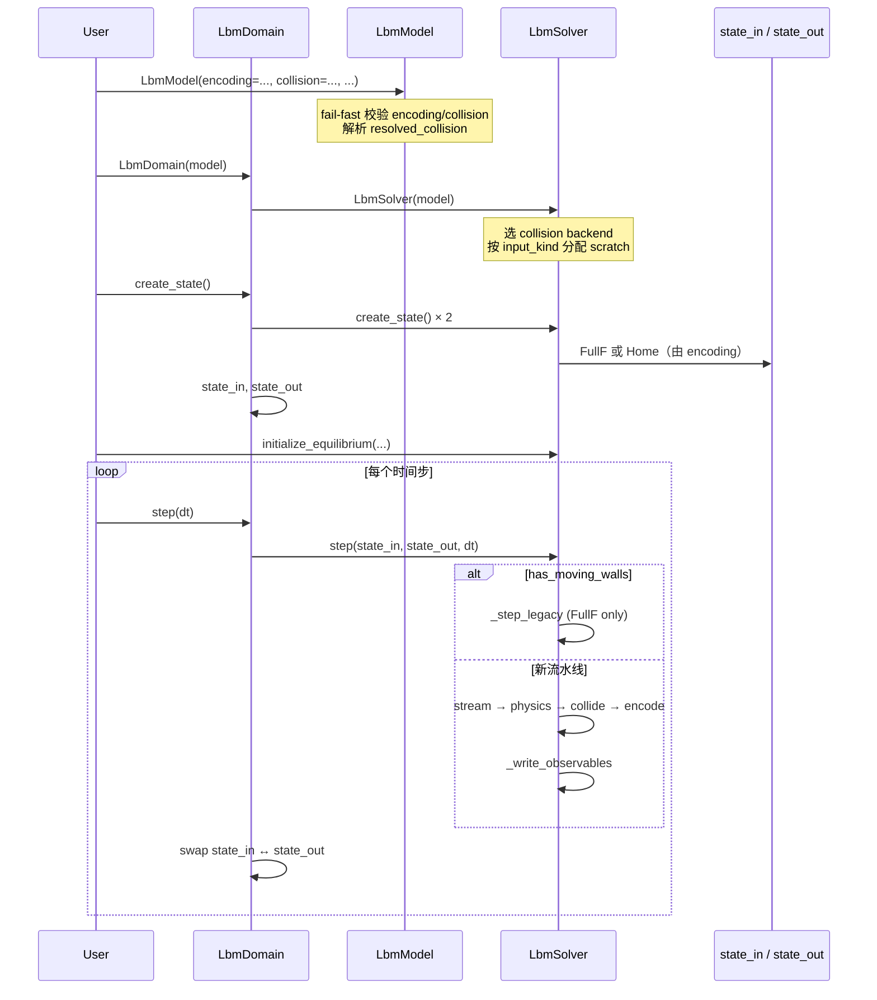

# 03 · 模块与类结构（Domain / Model / State / Solver）

> 对应代码：`lbm/__init__.py`、`domain.py`、`model.py`、`state.py`、`solver.py` 及新增子模块  
> 目的：说明生命周期归属、状态类型拆分、Solver 如何缓存 backend 与 scratch。

## 图含义

本轮重整 **保留单一 Domain / Model / Solver**，只把 State 按内存布局拆成两个具体类型；  
新增 `streaming` / `collisions` / `encoding` 三个正交子模块，由 Solver 在 `__init__` 中根据配置装配。

## 模块依赖与职责

## 对象生命周期

## Solver scratch 分配规则

| collision.input_kind | encoding | 分配的 scratch |
|---|---|---|
| `population` | `fullf` | `_f_star`；碰撞直接写 `state_out.f_post` |
| `population` | `home` | `_f_star` + `_f_post`；再投影到 HOME 矩 |
| `moments` | `home` | `_moments`；碰撞直接写 `state_out.kinetic_fields` |
| `moments` | `fullf` | `_moments` + `_post_moments`；再 Hermite 重构 `f_post` |

## 设计决策摘要

1. **不拆 Domain/Model/Solver 两套实现** —— 配置驱动单一路径。  
2. **State 必须拆类型** —— FullF 的 `Q·N` 与 HOME 的 10 矩布局不同。  
3. **无 `output_encoding`** —— 输出编码始终等于 `model.encoding`。  
4. **无独立 ExecutionPlan 类** —— `Solver.__init__` 缓存调用约定即可。  
5. **coupling 暂走 legacy** —— 移动壁 / MEM 仍用旧 FullF 融合路径。
